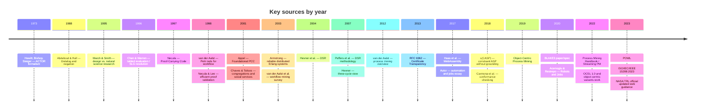

# Research Backbone for a Combinatorial-Maximalist MCP+, wasm4pm, Prolog8, and MCPP Program

## Executive summary

The most defensible research base for your program is not a single literature stream but a braided stack of seven streams: design-science governance, systems-engineering life-cycle control, process mining and object-centric workflow evidence, actor-oriented route execution, proof-carrying and tamper-evident integrity, bounded logic and counterfactual decision procedures, and socio-technical work on automation displacement and local service provision. The reason this braid fits your architecture is straightforward: your program is simultaneously a research method, a life-cycle system, a process-evidence engine, a proof-and-receipt system, a bounded reasoning kernel, a high-speed runtime, and a civic deployment pattern. The papers below are the ones most likely to survive serious academic, technical, and operational scrutiny.

If I compress the result to the five most load-bearing anchors, they are these: Hevner et al. for design-science legitimacy, ISO/IEC/IEEE 15288 for life-cycle governance, van der Aalst for process-evidence science, Necula/Appel for proof-carrying admissibility, and Haas et al. for the WebAssembly execution substrate. Around those anchors, OCEL 2.0, POWL, SLG/tabling, bounded model checking, s(CASP), Certificate Transparency, BLAKE3, and the automation/congregational-service literature turn your program from an architecture idea into a researchable, auditable, benchmarkable, and eventually deployable socio-technical system.

The practical implication is that wasm4pm should be framed academically as an evidence-and-kernel contribution at the intersection of process mining, stream processing, and portable high-performance runtimes; Prolog8 should be framed as a bounded admissibility and justification engine drawing from proof-carrying code, append-only integrity, Datalog/SLG-style evaluation, and counterfactual/ASP justifications; MCPP should be framed as the full-stack orchestrator that binds those layers using route-law constructs such as POWL and supervised actor topologies. The church/community dimension is not metaphorical in this frame: the cited congregational-service and automation-displacement literature supports treating local institutions as provision networks that may become more important as labor-displacing technologies scale.

## Evaluation frame and project-layer map

I score sources against seven project layers:

| Layer | Meaning in your program |
|---|---|
| **L1 Governance** | DSR method, case-study validation, 15288 life-cycle control, TRL scoring |
| **L2 Process evidence** | event logs, OCEL, process discovery, conformance, drift, workflow evidence |
| **L3 Route law** | POWL, workflow nets, actors, supervised execution topologies |
| **L4 Admissibility and integrity** | proof-carrying artifacts, receipts, append-only logs, hash-root chains |
| **L5 Bounded decision engine** | Datalog/Prolog-style reasoning, tabling, ASP, counterfactual and bounded checks |
| **L6 High-speed kernels** | WebAssembly, streaming discovery, SIMD-era execution assumptions |
| **L7 Civic deployment** | automation displacement, local provision networks, congregational service capacity |

I also use your evidence ranking standard. **Rank 1** means formal theorem/semantics/proof. **Rank 2** means standard, framework, or domain contract. **Rank 3** means measured benchmark or empirical study. **Rank 4** means implementation/system evidence. **Rank 5** means historical analogy. **Rank 6** means strategic inference.

## Top prioritized sources

### Top 25 prioritized sources

| Priority | Source | DOI / official source | Summary | Project relevance | Evidence rank |
|---|---|---|---|---|---|
| 1 | **Hevner, A. R., March, S. T., Park, J., & Ram, S. (2004). Design Science in Information Systems Research. _MIS Quarterly_, 28(1), 75–105.** | DOI: 10.2307/25148625; official MISQ page | The foundational DSR paper defines the artifact-centered research paradigm and gives seven widely used guidelines for rigor, relevance, design, evaluation, and communication. It remains the cleanest legitimacy source for treating your software artifacts as research outputs rather than merely engineering deliverables. | **L1.** This is the main warrant for positioning MCP+/wasm4pm/Prolog8/MCPP as a design-science program with build-and-evaluate cycles. | **Rank 2** |
| 2 | **Peffers, K., Tuunanen, T., Rothenberger, M. A., & Chatterjee, S. (2007). A Design Science Research Methodology for Information Systems Research. _Journal of Management Information Systems_, 24(3), 45–77.** | DOI: 10.2753/MIS0742-1222240302; official article page | Peffers et al. operationalize DSR into a stepwise methodology: problem identification, objectives, design/development, demonstration, evaluation, and communication. This is especially useful when converting a large architecture vision into publishable cycles with explicit artifacts and evaluation stages. | **L1.** Best source for structuring work packages and publication cadence around successive artifact releases. | **Rank 2** |
| 3 | **ISO/IEC/IEEE 15288:2023. Systems and software engineering — System life cycle processes.** | Official ISO/IEEE standard pages and preview text | 15288 defines the canonical life-cycle process frame for systems engineering, including technical, technical-management, and agreement/organizational processes. It is not a research method; it is the process backbone that turns a research artifact family into a managed system-of-systems program. | **L1.** This is the correct governing frame for requirements, architecture, verification, validation, transition, operation, and disposal across MCPP layers. | **Rank 2** |
| 4 | **NASA. Technology Readiness Level Definitions.** | Official NASA TRL definitions and overview | NASA’s TRL framework provides the simplest credible technology maturity scale from basic principles to proven operational use. For your program, TRL can coexist with DSR by turning artifact maturity into an explicit scoring rubric for each subsystem. | **L1.** Best fit for maturity scoring of wasm4pm kernels, Prolog8 proof cells, actor routing, and production case studies. | **Rank 2** |
| 5 | **Yin, R. K. (2018). _Case Study Research and Applications: Design and Methods_ (6th ed.). Sage.** | Official Sage page and book metadata | Yin remains the most established methodological anchor for analytic case studies, replication logic, and evidence triangulation. This is your cleanest source for validating real deployments without pretending they are controlled experiments. | **L1.** Ideal for Port of Los Angeles, church service network, hospital-school, or enterprise workflow case portfolios. | **Rank 2** |
| 6 | **van der Aalst, W. M. P. (2012). Process Mining: Overview and Opportunities. _ACM Transactions on Management Information Systems_, 3(2), 1–17.** | Official university/publication page | This paper is a concise, canonical statement of process mining’s purpose: discovering, checking, and improving processes from event data. It is still one of the best short “why process mining exists” sources for non-specialist reviewers. | **L2.** Strong umbrella citation for wasm4pm’s core claim that process evidence can directly drive diagnosis, control, and improvement. | **Rank 2** |
| 7 | **van der Aalst, W. M. P. (2022). Process Mining: A 360 Degree Overview. In _Process Mining Handbook_.** | DOI: 10.1007/978-3-031-08848-3_1; Springer chapter | This handbook chapter updates the field map, placing process mining at the intersection of process science and data science. It is broader and more current than the 2012 overview and is particularly useful for positioning discovery, conformance, monitoring, and automation in one frame. | **L2.** Best modern umbrella citation for the full wasm4pm layer and for linking evidence to action. | **Rank 2** |
| 8 | **van der Aalst, W. M. P. (2019). Object-Centric Process Mining: Dealing with Divergence and Convergence in Event Data.** | DOI: 10.1007/978-3-030-30446-1_1; Springer/ACM page | This is the decisive bridge from case-centric logs to real-world many-object execution data. It addresses the exact distortion that occurs when complex operational systems are flattened into single-case traces. | **L2.** Central to your “combinatorial maximalist” stance because it lets evidence follow real object interaction instead of single-case simplifications. | **Rank 2** |
| 9 | **OCEL 2.0 — Object-Centric Event Log 2.0 Standard.** | Official OCEL 2.0 standard site | OCEL 2.0 formalizes a more expressive interchange format for object-centric event data, including richer object relationships and object changes. It is the right source when reviewers ask whether your evidence layer rests on a recognized interchange standard. | **L2.** Best contractual base for object-centric ingestion, case reconstruction, and interoperable process evidence in wasm4pm/MCPP. | **Rank 2** |
| 10 | **Carmona, J., van Dongen, B., Solti, A., & Weidlich, M. (2018). _Conformance Checking: Relating Processes and Models_. Springer.** | DOI: 10.1007/978-3-319-99414-7; official book page | This book is the clearest comprehensive source on how recorded behavior is compared to modeled behavior. For a program centered on admissibility, constraint enforcement, and “deny with evidence,” this literature is closer to your heart than generic workflow automation papers. | **L2 + L4.** Supplies the process-evidence side of “admit / deny / explain” and supports receipt-backed refusals. | **Rank 2** |
| 11 | **Kourani, H., & van Zelst, S. J. (2023). POWL: Partially Ordered Workflow Language. In _BPM 2023_.** | DOI: 10.1007/978-3-031-41620-0_6; official Springer/RWTH metadata | POWL introduces a workflow notation that extends partial orders with explicit choice and loop constructs. This offers a much closer theoretical home for “route law” than flat workflow diagrams or purely imperative orchestration. | **L3.** Most directly aligned source for your POWL-actor routing layer and route-level admissibility compilation. | **Rank 1** |
| 12 | **Burattin, A. (2022). Streaming Process Mining. In _Process Mining Handbook_.** | DOI: 10.1007/978-3-031-08848-3_11; official chapter pages | This chapter surveys real-time processing of event streams rather than static logs and categorizes the principal problems and solutions. It is helpful because your wasm4pm vision is not archival mining but operational, repeated, rapid evaluation. | **L2 + L6.** Strong fit for live evidence loops, watch-mode evaluation, and near-real-time policy checks. | **Rank 2** |
| 13 | **Haas, A., Rossberg, A., Schuff, D. L., Titzer, B. L., Holman, M., Gohman, D., Wagner, L., Zakai, A., & Bastien, J.-F. (2017). Bringing the Web Up to Speed with WebAssembly. _PLDI 2017_.** | DOI: 10.1145/3062341.3062363; official ACM/author PDF pages | This is the core paper that positions WebAssembly as a safe, portable, efficient execution format for near-native performance. For your purposes, it justifies wasm as a serious systems substrate, not a browser novelty. | **L6.** Primary academic anchor for wasm4pm and any claim that compiled kernels can execute portably across browser, edge, fog, and cloud targets. | **Rank 3** |
| 14 | **Hewitt, C., Bishop, P., & Steiger, R. (1973). A Universal Modular ACTOR Formalism for Artificial Intelligence.** | Archival PDF mirror of original paper | This is the classical actor-model origin point: independent computational agents communicating through message passing. It matters because your route-law and admissions system increasingly looks like a supervised, message-driven topology rather than a monolithic workflow engine. | **L3.** Foundational source for decoupled execution units, distributed routing, and message-based orchestration. | **Rank 2** |
| 15 | **Armstrong, J. (2003). _Making Reliable Distributed Systems in the Presence of Software Errors_. PhD thesis, KTH.** | Official Erlang thesis PDF | Armstrong’s thesis is the deepest practical source on fault isolation, supervision, and reliability in actor-style distributed systems. It is particularly important for any topology where units fail, restart, escalate, or quarantine under supervision. | **L3 + L6.** Best source for supervised actor topologies that must keep route execution alive under faults. | **Rank 4** |
| 16 | **Necula, G. C. (1997). Proof-Carrying Code. _POPL ’97_.** | DOI: 10.1145/263699.263712; official ACM page and accessible PDF | PCC’s central idea is that code consumers can require machine-checkable proof artifacts that guarantee safety properties before execution. Your receipt-and-admissibility layer is conceptually far closer to PCC than to generic logging. | **L4.** Primary source for “proof must accompany consequence” and for treating denials/admits as checkable artifacts rather than opaque decisions. | **Rank 1** |
| 17 | **Necula, G. C., & Lee, P. (1998). Efficient Representation and Validation of Proofs. _LICS 1998_.** | DOI / official record pages | This paper addresses proof representation and validation efficiency, which is crucial once proof-carrying ideas move from concept to runtime systems. For bounded proof cells and receipt chains, proof-size and validation cost are not implementation trivia; they are architectural constraints. | **L4 + L5.** Directly relevant to compact, byte-capped proof cells and cheap proof validation. | **Rank 1** |
| 18 | **Appel, A. W. (2001). Foundational Proof-Carrying Code. _LICS 2001_.** | Princeton PDF and ACM records | Appel’s FPCC moves PCC toward smaller trusted bases by grounding proofs in foundational logic rather than specialized proof systems. For your project, this is the best source when arguing for minimal trust kernels and durable proof semantics. | **L4.** Excellent theoretical support for keeping Prolog8 proof cells bounded while minimizing what must be trusted. | **Rank 1** |
| 19 | **Laurie, B., Langley, A., & Kasper, E. (2013). RFC 6962: Certificate Transparency.** | Official RFC page and CT explainer | Certificate Transparency defines append-only, publicly auditable certificate logs using Merkle trees and audit paths. This is one of the best official sources for translating “receipt chains” into a recognized integrity architecture. | **L4.** Strong model for append-only receipt roots, tamper-evident audit paths, and independently checkable admission evidence. | **Rank 2** |
| 20 | **O’Connor, J., Aumasson, J.-P., Neves, S., & Wilcox-O’Hearn, Z. (2020). The BLAKE3 paper: specifications, analysis, and design rationale.** | Official BLAKE3 team spec repository and PDF | BLAKE3 is important here not merely as a hash, but as an example of modern hash design focused on speed, parallelism, and portability. If your receipt system depends on pervasive hashing and root composition, this is the most directly relevant contemporary source. | **L4 + L6.** Supports high-throughput integrity operations for receipts, roots, and content-addressed evidence. | **Rank 3** |
| 21 | **Abiteboul, S., & Hull, R. (1988). Data Functions, Datalog and Negation. _SIGMOD ’88_.** | DOI: 10.1145/50202.50218; official ACM pages | This is one of the classical sources for a bounded, database-oriented logic language sitting near but not identical to Prolog. It is highly relevant to any system that wants decidable, operationally disciplined logic over structured data and rules. | **L5.** Strong foundation for bounded Prolog8 fragments, explicit data functions, and admissible rule evaluation. | **Rank 1** |
| 22 | **Chen, W., & Warren, D. S. (1996). Tabled Evaluation with Delaying for General Logic Programs. _Journal of the ACM_, 43(1), 20–74.** | DOI: 10.1145/227595.227597; official ACM and record pages | This is the core SLG/tabling source for terminating and reusing subcomputations under negation and recursion. For bounded proof cells, this matters because repeated subgoal evaluation is exactly where naive logic engines degrade. | **L5.** Best classical source for memoized, explainable logic evaluation with controlled recursion. | **Rank 1** |
| 23 | **Clarke, E., Biere, A., Raimi, R., & Zhu, Y. (2001). Bounded Model Checking Using Satisfiability Solving. _Formal Methods in System Design_, 19(1), 7–34.** | DOI: 10.1023/A:1011276507260; official pages | BMC matters because it operationalizes the principle that bounded state-space exploration can expose violations early and economically. Your AAT/counterfactual work is philosophically closer to bounded model checking than to unconstrained theorem proving. | **L5.** Useful warrant for bounded counterfactual search, policy refutation, and failure-case discovery in Prolog8/AAT. | **Rank 1** |
| 24 | **Arias, J., Carro, M., & Gupta, G. (2018). Constraint Answer Set Programming without Grounding.** | arXiv / system description pages | This paper introduces s(CASP), a query-driven ASP execution model with constraints that avoids grounding and preserves logical variables. Its importance for your program is that it shows a concrete path toward explanation-rich, bounded, non-ground reasoning. | **L5.** Very close to your justification-oriented, counterfactual, bounded reasoning ambitions for Prolog8. | **Rank 4** |
| 25 | **Acemoglu, D., & Restrepo, P. (2020). Robots and Jobs: Evidence from U.S. Labor Markets. _Journal of Political Economy_, 128(6), 2188–2244.** | DOI: 10.1086/705716; official JPE/NBER/Yale pages | This is the strongest empirical anchor in your corpus for labor-displacing automation. It shows that robot exposure is associated with employment and wage declines in exposed labor markets, giving your civilizational concern a far better base than anecdote. | **L7.** Key evidence for the claim that large-scale automation can outpace institutional absorption capacity and push local provision networks into a larger role. | **Rank 3** |
| 26 | **Chaves, M., & Tsitsos, W. (2001). Congregations and Social Services: What They Do, How They Do It, and with Whom. _Nonprofit and Voluntary Sector Quarterly_, 30(4).** | Official Sage page | This paper is one of the strongest academic sources for treating congregations as substantive local service providers rather than merely worship sites. It is especially relevant for your idea of church-as-local-distribution-and-support network. | **L7.** Best direct source for grounding the church/community service layer of your program in existing social-science evidence. | **Rank 3** |

## Secondary works and reading order

### Additional related works

| Secondary source | Why it still matters |
|---|---|
| **March, S. T., & Smith, G. F. (1995). Design and Natural Science Research on Information Technology.** DOI: 10.1016/0167-9236(94)00041-2. | Classic build/evaluate/theorize/justify frame; useful for dissertation architecture and paper design. |
| **Gregor, S., & Hevner, A. R. (2013). Positioning and Presenting Design Science Research for Maximum Impact.** DOI: 10.25300/MISQ/2013/37.2.01. | Helps package artifact contribution level, abstraction level, and publication strategy. |
| **Hevner, A. R. (2007). A Three Cycle View of Design Science Research.** | Best diagrammatic source for relevance, rigor, and design cycles. |
| **van der Aalst, W. M. P., Weijters, A. J. M. M., & Măruşter, L. (2003). Workflow Mining: A Survey of Issues and Approaches.** | Useful historical survey for positioning discovery problems and log issues. |
| **van der Aalst, W. M. P. (1998). The Application of Petri Nets to Workflow Management.** | Essential classical workflow-net source behind formal routing and soundness claims. |
| **van der Aalst et al. (2011). Soundness of Workflow Nets: Classification, Decidability, and Analysis.** | Important if you want stronger correctness and analyzability claims for route-law notations. |
| **Process Mining Manifesto (2012).** | Strong field-defining community statement; often useful in literature reviews and introductions. |
| **Adams, J. N. et al. (2022). Defining Cases and Variants for Object-Centric Event Data.** | Excellent for translating OCEL evidence into variants, coverage, and operational analytics. |
| **OCEL 1.0 standard (2022).** | Helpful when reviewers ask about the lineage from first to second object-centric standard. |
| **van Zelst, S. J. et al. (2018). Event Stream-Based Process Discovery Using Abstract Representations.** DOI: 10.1007/s10115-017-1060-2. | Stronger than a survey when you need a concrete online-discovery algorithm citation. |
| **Burattin, A. et al. (2018). Online Conformance Checking Using Behavioural Patterns.** | Useful for streaming “deny with evidence” and online conformance enforcement. |
| **Evermann, J., Rehse, J.-R., & Fettke, P. (2016). Process Discovery from Event Stream Data in the Cloud.** | Valuable because it ties event-stream mining to distributed/cloud throughput claims. |
| **Hewitt-history / actor retrospectives.** | Helpful for contextualizing actor-model evolution when a reviewer wants historical continuity. |
| **Agha, G. (1986). _Actors: A Model of Concurrent Computation in Distributed Systems_.** | Best deep follow-on to Hewitt for formal and practical actor semantics. |
| **Appel, A. W., & Felten, E. W. (1999). Proof-Carrying Authentication.** | Extremely relevant if you want to connect proofs not only to code but to authorization decisions. |
| **Laurie, B. (2014). Certificate Transparency. _ACM Queue_.** | More readable than the RFC for explaining public auditability to non-cryptographers. |
| **WebAssembly Core Specification 1.0 (W3C Recommendation, 2019).** | Good standards citation when a reviewer wants the formal runtime contract, not just the PLDI paper. |
| **Wasm 2.0 Completed (2025).** | Useful for contemporary status, especially regarding integrated SIMD-era features. |
| **Goal-Directed Execution of Answer Set Programs (2012).** DOI: 10.1145/2370776.2370782. | Important precursor to s(CASP) for top-down, explainable ASP evaluation. |
| **Arias et al. (2020). Justifications for Goal-Directed Constraint Answer Set Programming.** | Especially useful for natural-language explanation trees and human-readable evidence. |
| **Autor, D. H. (2015). Why Are There Still So Many Jobs?** DOI: 10.1257/jep.29.3.3. | Best short historical essay on automation anxiety and task reconfiguration. |
| **Acemoglu, D., & Restrepo, P. (2022). Tasks, Automation, and the Rise in U.S. Wage Inequality.** DOI: 10.3982/ECTA19815. | Strong complement to Robots and Jobs when you need task-level rather than robot-level labor evidence. |
| **Cnaan, R. (1999). Our Hidden Safety Net: Social & Community Work by Urban American Religious Congregations.** | Short but highly on-point for “church as service-delivery infrastructure.” |
| **Cnaan et al. (2004). Congregations as Social Service Providers.** | Broader than the older-adults paper; more direct for civilian provision-network framing. |
| **Abramson et al. (2015). The Resilience Activation Framework.** | Valuable for thinking about how local institutions activate resilience under stress. |
| **Sampson, R. J. (2017). Urban Sustainability in an Age of Enduring Inequalities. _PNAS_.** | Excellent high-level source for fragile civic/social infrastructure under spatial inequality. |
| **Klinenberg, E. (2018). _Palaces for the People_.** | Not a paper, but a major conceptual source for “social infrastructure” as a civic operating layer. |

### Reading order

**Essential 5**

1. **Hevner et al. (2004)** — legitimizes the whole artifact-centered research program.
2. **ISO/IEC/IEEE 15288:2023** — governs how the program is engineered across its life cycle.
3. **van der Aalst (2022) Process Mining: A 360 Degree Overview** — anchors the process-evidence worldview.
4. **Necula (1997) Proof-Carrying Code** — anchors admissibility-by-proof.
5. **Haas et al. (2017) WebAssembly** — anchors the portable, high-speed runtime substrate.

**Next 10**

- Peffers et al. (2007)
- Yin (2018)
- van der Aalst (2019) Object-Centric Process Mining
- OCEL 2.0
- Carmona et al. (2018) Conformance Checking
- Kourani & van Zelst (2023) POWL
- Armstrong (2003)
- Appel (2001) FPCC
- Chen & Warren (1996) SLG/tabling
- Arias et al. (2018) s(CASP)

## Timeline and layer diagrams

### Key-paper timeline



### Entity relationship chart

```mermaid
graph TD
    Governance[Governance cluster]
    ProcessEvidence[Process evidence cluster]
    RouteLaw[Route law cluster]
    Admissibility[Admissibility & integrity cluster]
    Logic[Bounded logic & counterfactual cluster]
    Kernels[High-speed kernel cluster]
    Civic[Civic deployment cluster]

    Governance --> L1[L1 Governance]
    ProcessEvidence --> L2[L2 Process evidence]
    RouteLaw --> L3[L3 Route law]
    Admissibility --> L4[L4 Admissibility and integrity]
    Logic --> L5[L5 Bounded decision engine]
    Kernels --> L6[L6 High-speed kernels]
    Civic --> L7[L7 Civic deployment]

    Hevner[Hevner 2004] --> Governance
    ISO15288[ISO 15288] --> Governance
    Yin[Yin case studies] --> Governance

    PM360[PM overview/360] --> ProcessEvidence
    OCPM[Object-centric PM] --> ProcessEvidence
    OCEL[OCEL 2.0] --> ProcessEvidence
    Conformance[Conformance checking] --> ProcessEvidence

    POWL[POWL] --> RouteLaw
    Actors[Actor model] --> RouteLaw
    Erlang[Armstrong Erlang reliability] --> RouteLaw

    PCC[PCC / FPCC] --> Admissibility
    CT[Certificate Transparency] --> Admissibility
    Blake3[BLAKE3] --> Admissibility

    Datalog[Datalog and negation] --> Logic
    SLG[SLG / tabling] --> Logic
    BMC[Bounded model checking] --> Logic
    sCASP[s(CASP)] --> Logic

    Wasm[WebAssembly] --> Kernels
    StreamingPM[Streaming PM] --> Kernels

    Robots[Robots and Jobs] --> Civic
    Congregations[Congregations and social services] --> Civic
```

## Synthesis for MCP+, wasm4pm, Prolog8, and MCPP

The literature points to a clean research posture for **wasm4pm**. Treat it as a process-evidence and live-kernel system, not merely as a library. The process-mining canon gives you the science of event evidence and object-centric data; streaming process mining gives you the live-evaluation frame; WebAssembly gives you the portable execution substrate that justifies compiling critical kernels into a fast, sandboxed format. The academically strongest sentence is that wasm4pm turns process evidence into portable, repeatable, benchmarkable kernels that can run where the data and action are: browser, edge, fog, or cloud.

The literature also gives **Prolog8** a far stronger identity than “yet another logic engine.” The right framing is a **bounded admissibility and justification engine**. Datalog/negation, SLG tabling, bounded model checking, and s(CASP) together support a research claim that bounded, explainable decision procedures can be both operational and evidence-bearing. PCC/FPCC, CT, and BLAKE3 then add the integrity and proof-carrying side, making it possible to say that decisions are not only derived but packaged as independently checkable receipts.

For **MCPP**, the strongest literature path is to argue that workflow should not be reduced to chat agents, brittle imperative pipelines, or flat BPMN diagrams. Workflow nets, actor systems, and especially POWL support a richer account of route law: partially ordered, explicitly controlled, and analyzable execution under supervision. That is the part of the literature that most cleanly matches your insistence on admissible routes, denials with evidence, and next-action pushing instead of vague conversational orchestration.

The socio-technical literature is what lets you say, without hand-waving, why the church/community layer belongs in a serious technical research program. Autor and Acemoglu–Restrepo make the labor-displacement side legible; Chaves–Tsitsos and Cnaan make the local service-provision side legible; Abramson, Sampson, and Klinenberg provide the broader social-infrastructure and resilience vocabulary. The research-supported inference is not that churches replace the state in every function; it is that under automation stress, institutions already proven to organize local support, trust, space, and volunteer labor become increasingly important nodes in provision networks. That inference is strategic rather than theorem-like, but it is not ad hoc.

Put differently, your full-stack research claim can be written as follows: **MCPP is a design-science program for building receipt-bearing, object-centric, route-law systems whose bounded reasoning and high-speed kernels can support operational work in both enterprise and civic provision contexts.** DSR, 15288, TRL, and Yin tell you how to research it; process mining, OCEL, and POWL tell you how to model and evidence it; PCC, CT, and BLAKE3 tell you how to secure and audit it; Datalog/SLG/BMC/s(CASP) tell you how to reason over it; WebAssembly tells you how to execute it portably; and automation/congregational-service studies tell you why the deployment context matters beyond software fashion.
