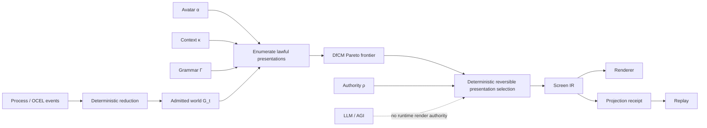
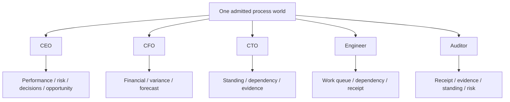
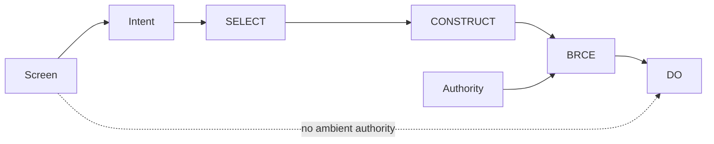
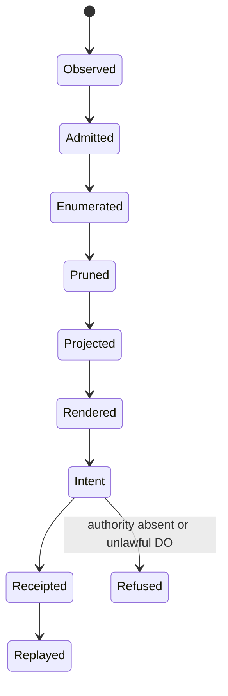

# Deterministic Dynamic UI (DDUI) — DfCM doctrine

## Constitutional definition

Deterministic Dynamic UI is a projection architecture in which a screen is a reversible consequence of an admitted process world, not an independently authored source of truth.

`UI_t = P(G_t, α, κ, ρ, Γ)`

where `G_t` is the admitted process-derived world at time `t`, `α` is avatar, `κ` is context, `ρ` is admitted authority, and `Γ` is the bounded UI grammar. Runtime AI has no render authority and no actuation authority.

For identical admitted inputs and grammar version, canonical projection, receipt, and replay identity MUST be identical. A rendered control manufactures an intent only. SELECT, CONSTRUCT, and DO remain distinct; consequential DO remains behind BRCE.

## Post-AGI inversion

The canonical object is not the screen. It is the lawful projection space.

A conventional UI stack chooses a page first and then fills it with data. DDUI derives one or more lawful presentation candidates from the same world state, preserves reversible candidates, prunes dominated candidates, deterministically chooses a presentation only where that choice is itself reversible, and never turns presentation choice into business authority.



## DfCM law

DDUI applies Combinatorial Maximalism at the presentation boundary:

1. preserve every grammar-valid presentation candidate that is still reversible;
2. evaluate candidates against semantic fit, avatar fit, context fit, evidence fit, materiality, and grammar rank;
3. remove only candidates that are Pareto-dominated under the admitted vector;
4. retain the frontier in the screen IR and receipt consequence;
5. deterministically select one reversible presentation using the declared selection law;
6. record `irreversibleSelections = 0` for UI composition;
7. never infer SELECT, CONSTRUCT, or DO authority from presentation ranking.

A failed or dominated presentation candidate is topology. It does not invalidate the claim, the world, or other lawful candidates.

## Bounded grammar

`prototypes/dd-ui/grammar.mjs` is the executable grammar boundary. It defines the finite component vocabulary, role profiles, contexts, domains, standing vocabularies, consequence classes, executive standing projection, regions, and deterministic grammar descriptor.

The runtime cannot invent a new component type. Unknown avatar, context, domain, standing, consequence, grammar version, malformed metric, malformed action, duplicate event identity, or unknown event is typed REFUSED.

The grammar is intentionally finite while the lawful screen space is combinatorial.

## One world, multiple projections

The current executable grammar admits CEO, CFO, CTO, ENGINEER, and AUDITOR avatars. They all project from the same reduced `G_t`; avatar is a projection parameter, not a separate database or hard-coded page hierarchy.



Additional avatars are extensions to `Γ`; they do not have standing until added to the executable grammar and verified.

## Executive projection law

Executives receive familiar management grammar: status, business impact, variance, risk, decisions, opportunity, forecast, ownership, and no-action-required closure. Internal standing remains richer than the executive projection.

`ALIVE`, `PARTIAL_ALIVE`, `UNKNOWN`, `BLOCKED`, `BUILD_BROKEN`, `UNSUPPORTED`, and typed refusals are not collapsed in the canonical world. They may project to executive states such as `ON_PLAN`, `ATTENTION`, or `ACTION_REQUIRED`, but drill-down preserves the exact source standing.

This enables progressive disclosure:

`Executive KPI → claim standing → process world → evidence → receipt → replay`.

## Authority law

Rendering grants no authority. Every action is projected as an unselected intent.

- `SELECT` means selection intent only.
- `CONSTRUCT` means construction intent only.
- `DO` is representable only when the action requires an explicitly BRCE-shaped authority and that authority is present in the admitted authority set.
- Even then the UI emits intent only; it does not actuate.
- Direct non-BRCE DO is `REFUSED_DIRECT_DO`.
- Missing required authority is `REFUSED_AUTHORITY_MISSING`.



## Process model

The prototype consumes append-only process events and reduces them deterministically. Current event classes include observation, claim standing changes, system-standing changes, metric replacement, action replacement, and claim removal. Event identity is unique and ordering is canonicalized before reduction.



## Receipt and replay

A v2 projection receipt binds:

- grammar digest;
- reduced-world digest;
- normalized-input digest;
- DfCM frontier digest;
- canonical screen digest;
- avatar;
- context;
- grammar version;
- `directActuation = false`;
- `runtimeAiRenderAuthority = false`.

Replay re-manufactures the projection from the normalized input and compares every bound digest. A screen identity without matching grammar, world, input, and frontier identity is not a replay match.

A user interaction can separately manufacture an intent receipt binding the screen digest, claim identity, action identity, consequence class, required authority, selected presentation, and `actuation = false`.

## Responsive and accessible projection

Responsive behavior is a projection of the same semantic IR, not a separate mobile truth. The screen IR declares regions, desktop column count, mobile column count, and deterministic mobile ordering. Rendered controls remain ordinary semantic buttons and the prototype uses a live region for screen replacement.

The semantic graph must remain stable across viewport projections even when layout changes.

## Mermaid-first UIUX

`prototypes/dd-ui/uiux.mmd` is the human-readable topology contract. Mermaid describes the complete interaction geometry before visual polish: world reduction, DfCM frontier, role projection, regions, authority, intent, receipt, replay, executive drill-down, and explicit exclusion of runtime AI authority.

Mermaid is not the canonical runtime source; the executable grammar and projection engine are. The Mermaid file must remain a faithful projection of those executable laws.

## Falsifiers

DDUI is false if any of these boundaries fail:

- identical admitted inputs produce different digests;
- semantically identical event or authority ordering changes output;
- unknown grammar values are silently accepted;
- process reduction depends on hidden clock or entropy;
- one avatar requires a separate source-of-truth world;
- the runtime invents components outside the grammar;
- a dominated candidate is selected over a declared frontier candidate;
- frontier ordering is nondeterministic;
- presentation selection changes business authority;
- an action is preselected by the renderer;
- DO appears without BRCE-shaped admitted authority;
- rendering actuates;
- a receipt omits grammar/world/frontier identity;
- replay fails to reconstruct the exact bound identities;
- HTML rendering allows unescaped claim content;
- mobile projection changes semantic meaning.

## Validation

The dedicated verifier executes the DDUI contract and syntax boundaries with no third-party runtime dependency:

```bash
node --check prototypes/dd-ui/grammar.mjs
node --check prototypes/dd-ui/dd-ui.mjs
node --check prototypes/dd-ui/render.mjs
node --check prototypes/dd-ui/demo-data.mjs
node --check prototypes/dd-ui/app.mjs
node --test prototypes/dd-ui/dd-ui.test.mjs
```

The prototype is a bounded executable specification. It does not claim production browser deployment, live OCEL ingestion, or production BRCE actuation. Those remain separate admission and integration boundaries.
