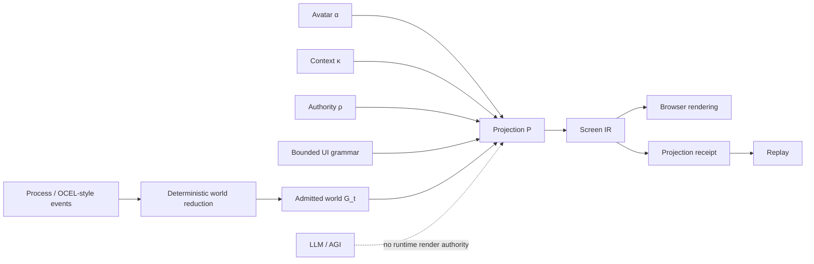
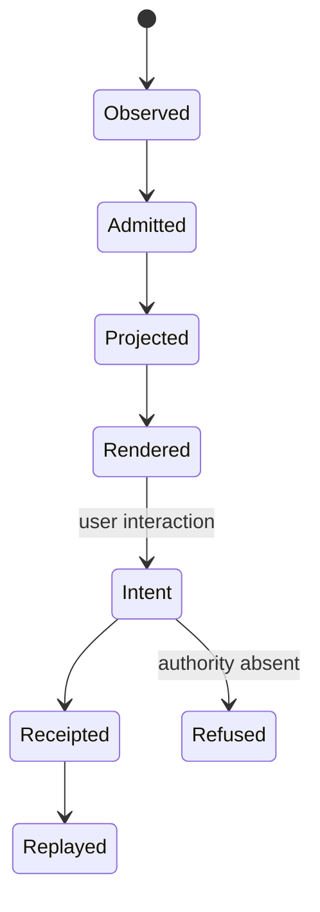
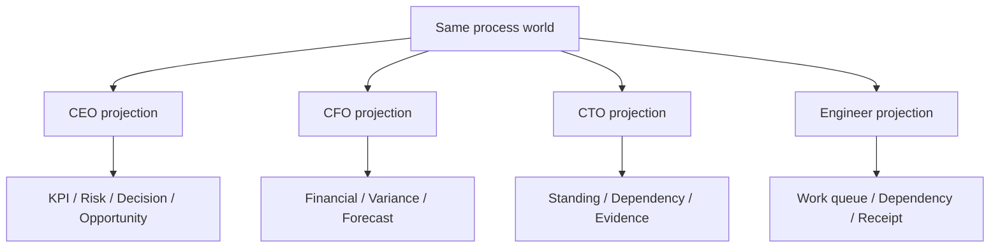
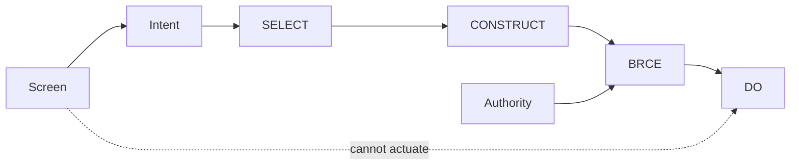
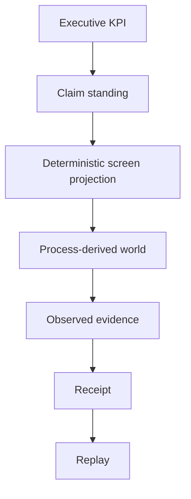

# Deterministic Dynamic UI (DDUI) — wasm4pm doctrine and prototype

## Constitutional definition

DDUI is an interface architecture in which screens are dynamically composed from admitted process state, avatar, context, and authority using deterministic projection laws over a bounded component grammar. No AI model participates in the runtime render path.

`UI_t = P(G_t, α, κ, ρ)`

For identical admitted inputs and grammar version, the canonical screen and screen digest MUST be identical. Rendering grants no authority. UI actions manufacture intents only; consequential DO remains behind BRCE.

## Why wasm4pm

wasm4pm is the process-intelligence substrate. The UI is treated as a projection of an event-derived world, not as a collection of hand-authored role pages. The prototype reduces an ordered process trace into current claims, then projects the same world for CEO, CFO, CTO, or engineer avatars. The resulting projection emits a receipt and can be replayed.



## Process lifecycle



## Bounded grammar

The prototype recognizes a finite vocabulary: `ExecutiveSummary`, `FinancialSummary`, `TechnologyStanding`, `WorkQueue`, `KPI`, `Variance`, `Risk`, `Decision`, `Opportunity`, `Forecast`, `Standing`, `Dependency`, `Evidence`, `Receipt`, and `ClaimBadge`. Avatar and context select/rank these components; they do not create new component types.



## Authority law

A rendered control is not authority. Every projected action is an intent. A candidate with consequence `DO` is only representable when its required authority is explicitly BRCE-shaped (`brce:*`) and present in the admitted authority set. Otherwise the projection records `REFUSED_DIRECT_DO` or `REFUSED_AUTHORITY_MISSING`.



## Receipt and replay

A projection receipt binds the normalized input digest and canonical screen digest to avatar, context, grammar version, and `directActuation=false`. Replay re-runs the projection from the receipted normalized input and requires both digests to match.

## Executive-to-evidence projection



## Falsifiers

The prototype is false if any of the following occur: identical admitted inputs produce different screen digests; input event ordering changes the semantic result; an unknown avatar/context is silently accepted; a `DO` candidate appears without BRCE-shaped admitted authority; rendering itself actuates; replay does not reconstruct screen identity; or an avatar requires a separately hard-coded page rather than projection from the shared world.

## Prototype and validation

Serve `prototypes/dd-ui/` with any static HTTP server and open `index.html`. Avatar/context controls change the projection deterministically. The authority fixture demonstrates that authority changes which intent controls are representable without granting runtime actuation.

Validation requiring no third-party dependencies:

```bash
node --test prototypes/dd-ui/dd-ui.test.mjs
```
