# C4: Component — inside the Next.js app

**Re-verified:** 2026-07-24.

## Source commands executed

```text
GitHub.fetch_file repository_full_name=seanchatmangpt/wasm4pm path=examples/interview-assist/app/page.tsx ref=docs/v26.7.24-planning-diagramming
GitHub.fetch_file repository_full_name=seanchatmangpt/wasm4pm path=examples/interview-assist/lib/domain/reducer.ts ref=docs/v26.7.24-planning-diagramming
GitHub.fetch_file repository_full_name=seanchatmangpt/wasm4pm path=examples/interview-assist/lib/domain/reducer-with-receipts.ts ref=docs/v26.7.24-planning-diagramming
GitHub.fetch_file repository_full_name=seanchatmangpt/wasm4pm path=examples/interview-assist/lib/domain/receipt-emitter.ts ref=docs/v26.7.24-planning-diagramming
GitHub.fetch_file repository_full_name=seanchatmangpt/wasm4pm path=examples/interview-assist/lib/domain/replay.ts ref=docs/v26.7.24-planning-diagramming
GitHub.fetch_file repository_full_name=seanchatmangpt/wasm4pm path=examples/interview-assist/lib/adapters/cognition-adapter.ts ref=docs/v26.7.24-planning-diagramming
GitHub.fetch_file repository_full_name=seanchatmangpt/wasm4pm path=examples/interview-assist/lib/adapters/sandbox-executor.ts ref=docs/v26.7.24-planning-diagramming
GitHub.fetch_file repository_full_name=seanchatmangpt/wasm4pm path=examples/interview-assist/lib/adapters/accessibility-platform-adapter.ts ref=docs/v26.7.24-planning-diagramming
GitHub.fetch_file repository_full_name=seanchatmangpt/wasm4pm path=examples/interview-assist/lib/adapters/persistence-adapter.ts ref=docs/v26.7.24-planning-diagramming
```

```mermaid
flowchart TB
    subgraph Client["Client composition — app/page.tsx"]
        Page["InterviewAssistPage<br/>state + fetch orchestration"]
        Header["SessionHeader"]
        Workspace["SessionWorkspace"]
        CognitionPanel["CognitionPanel"]
        TrackPanel["TrackCandidatePanel"]
        Editor["EditorShell"]
        Result["ExecutionResultCard"]
        Drawer["SessionActivityDrawer"]
        Menu["SessionMenu"]
        A11yDialog["AccessibilityPreferencesDialog"]
    end

    subgraph Domain["Client-safe domain"]
        Reducer["sessionReducer"]
        Replay["replaySession"]
        Selectors["selectors"]
        Rules["COGNITION_RULES"]
    end

    subgraph Server["Server-only routes/adapters"]
        CogRoute["/api/cognition"]
        CogAdapter["cognition-adapter"]
        RunRoute["/api/run"]
        TestRoute["/api/test"]
        Sandbox["sandbox-executor"]
        ReceiptRoute["/api/receipt"]
        Emitter["receipt-emitter"]
        AdmitWrapper["admitWithReceipt<br/>reducer-with-receipts"]
        A11yAdapter["accessibility-platform-adapter"]
        Persistence["filesystem persistence adapter"]
    end

    Page --> Header
    Page --> Workspace
    Workspace --> CognitionPanel
    Workspace --> TrackPanel
    Workspace --> Editor
    Workspace --> Result
    Page --> Drawer
    Page --> Menu
    Page --> A11yDialog

    Page --> Reducer
    TrackPanel --> Selectors
    Replay --> Reducer

    Page -.->|"POST"| CogRoute --> CogAdapter --> Rules
    Page -.->|"POST"| RunRoute --> Sandbox
    Page -.->|"POST"| TestRoute --> Sandbox
    Page -.->|"POST"| ReceiptRoute

    AdmitWrapper --> Reducer
    AdmitWrapper --> Emitter
    CogAdapter --> Emitter
    Sandbox --> Emitter
    A11yAdapter --> Emitter
    Persistence --> Replay
```



## Verified integration state

The receipt-emitting components exist, but the live page does not compose them into one continuous chain:

1. `InterviewAssistPage.dispatch()` calls `sessionReducer()` directly. It does not call `admitWithReceipt()`.
2. The cognition request passes the current last receipt and can append a `cognition-run` receipt.
3. `runCode()` does not pass `prevReceipt` to `/api/run`, so the sandbox receipt starts a new chain head.
4. `runTests()` does pass the current last receipt to `/api/test`.
5. Accessibility preference changes mutate page state directly; the page does not call `buildAnnouncement()` or another accessibility-receipt path.
6. The final `/api/receipt` hash is a separate event-label receipt, not the fifth linked manufacturing-chain receipt.

Therefore the receipt types and emitters are **DONE**, while the live five-step chain is **BUILD_BROKEN**. See [unfinished-work.md](unfinished-work.md).

## Boundary corrections

- `persistence-adapter.ts` is Node filesystem code and is not client-safe browser persistence.
- `cognition-adapter.ts`, `sandbox-executor.ts`, `receipt-emitter.ts`, and their native/Node dependencies stay server-side.
- Dashed arrows above cross the HTTP/client-server boundary. They do not imply direct component imports of server adapters.

## See also

- [C4 container](c4-container.md)
- [Receipt and replay sequence](sequence-receipt-replay.md)
- [Unfinished work](unfinished-work.md)
