# C4: Component (inside the Next.js app)

Source: `ls examples/interview-assist/components/` (20 real components, confirmed this session) and
`ls examples/interview-assist/lib/adapters/` (8 real adapters: cognition, sandbox-executor,
checksum, persistence, policy-check(-adapter/-stub), ollama, monaco, accessibility-platform).

```mermaid
flowchart TB
    subgraph UI["UI components (client)"]
        SH["SessionHeader"]
        SW["SessionWorkspace"]
        SAD["SessionActivityDrawer"]
        CP["CognitionPanel"]
        TCP["TrackCandidatePanel"]
        ES["EditorShell"]
        DP["DiagnosticsPanel"]
        CoP["ConsolePanel"]
        TRV["TestResultView"]
        RP["RefusalPresentation"]
        RFP["ReplayFailurePresentation"]
        AC["AccessibilityControls"]
        APD["AccessibilityPreferencesDialog"]
        SS["SessionSummary"]
        ERC["ExecutionResultCard"]
        SM["SessionMenu"]
    end

    subgraph Domain["Domain (lib/domain)"]
        RED["reducer.ts<br/>sessionReducer"]
        RWR["reducer-with-receipts.ts"]
        PT["phase-transitions.ts"]
        REC["receipt.ts / receipt-emitter.ts"]
        REPLAY["replay.ts<br/>replaySession"]
        SEL["selectors.ts"]
        REF["refusal.ts"]
        CR["cognition-rules.ts<br/>(ggen-generated, COGNITION_RULES)"]
    end

    subgraph Adapters["Adapters (lib/adapters, server-only unless noted)"]
        CogA["cognition-adapter.ts"]
        SandA["sandbox-executor.ts"]
        ChkA["checksum-adapter.ts<br/>(real BLAKE3)"]
        PersA["persistence-adapter.ts<br/>(client-safe: browser storage)"]
        PolA["policy-check-adapter.ts /<br/>policy-check-stub.ts"]
        OllA["ollama-adapter.ts"]
        MonA["monaco-adapter.ts<br/>(client-safe)"]
        A11yA["accessibility-platform-adapter.ts<br/>(client-safe)"]
    end

    SH --> RED
    CP -->|"dispatch HypothesisEvent"| RED
    TCP --> SEL
    ES -->|"dispatch EditorEvent"| RED
    SAD --> REC
    SAD --> SEL

    RED --> PT
    RED --> REF
    RWR --> REC
    REPLAY --> RED

    CP -.->|"POST /api/cognition"| CogA
    ES -.->|"POST /api/run, /api/sandbox/*, /api/test"| SandA
    CogA --> CR
    CogA --> REC
    SandA --> PolA
    SandA --> REC
    PersA --> REPLAY
    Domain -.-> ChkA
```

Dashed arrows cross the client/server or HTTP boundary (component → API route → adapter); solid
arrows are same-process calls. `checksum-adapter.ts`, `cognition-adapter.ts`, `sandbox-executor.ts`,
and `policy-check-adapter.ts` must never be imported by a `"use client"` component — a real
Turbopack client-bundle bug (`node:module`/native BLAKE3 dragged into the client bundle via
`reducer.ts`) was found and fixed this session by splitting the receipt-emitting path into
`reducer-with-receipts.ts`, which nothing client-side imports.

## See Also

- [c4-container.md](c4-container.md) — one level up
- [sequence-cognition.md](sequence-cognition.md), [sequence-sandbox-execution.md](sequence-sandbox-execution.md), [sequence-receipt-replay.md](sequence-receipt-replay.md) — the real runtime flows through this component graph
