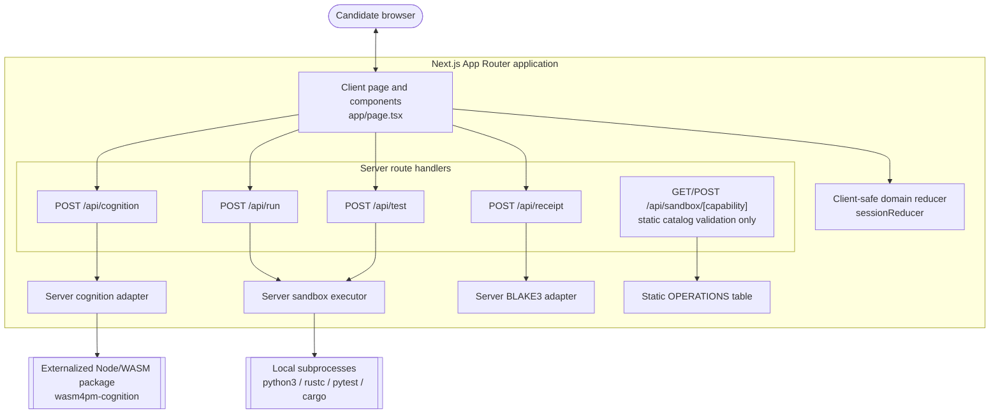

# C4: Container

**Re-verified:** 2026-07-24.

## Source commands executed

```text
GitHub.fetch_file repository_full_name=seanchatmangpt/wasm4pm path=examples/interview-assist/app/page.tsx ref=docs/v26.7.24-planning-diagramming
GitHub.fetch_file repository_full_name=seanchatmangpt/wasm4pm path=examples/interview-assist/app/api/cognition/route.ts ref=docs/v26.7.24-planning-diagramming
GitHub.fetch_file repository_full_name=seanchatmangpt/wasm4pm path=examples/interview-assist/app/api/run/route.ts ref=docs/v26.7.24-planning-diagramming
GitHub.fetch_file repository_full_name=seanchatmangpt/wasm4pm path=examples/interview-assist/app/api/test/route.ts ref=docs/v26.7.24-planning-diagramming
GitHub.fetch_file repository_full_name=seanchatmangpt/wasm4pm path=examples/interview-assist/app/api/receipt/route.ts ref=docs/v26.7.24-planning-diagramming
GitHub.fetch_file repository_full_name=seanchatmangpt/wasm4pm path=examples/interview-assist/app/api/sandbox/[capability]/route.ts ref=docs/v26.7.24-planning-diagramming
GitHub.fetch_file repository_full_name=seanchatmangpt/wasm4pm path=examples/interview-assist/lib/adapters/cognition-adapter.ts ref=docs/v26.7.24-planning-diagramming
GitHub.fetch_file repository_full_name=seanchatmangpt/wasm4pm path=examples/interview-assist/lib/adapters/sandbox-executor.ts ref=docs/v26.7.24-planning-diagramming
GitHub.fetch_file repository_full_name=seanchatmangpt/wasm4pm path=examples/interview-assist/lib/adapters/checksum-adapter.ts ref=docs/v26.7.24-planning-diagramming
```



## Route semantics

| Route | Real behavior re-verified from source |
|---|---|
| `/api/cognition` | Calls `runCognition()` server-side and maps typed outcomes to 200/422/503. |
| `/api/run` | Calls the real subprocess executor with a caller-supplied capability/files request. |
| `/api/test` | Builds visible/hidden pytest files server-side, then calls the same real executor with `run_pytest`. |
| `/api/receipt` | Computes a separate BLAKE3 hash over the supplied session event labels. |
| `/api/sandbox/[capability]` | Looks up a static operation and returns `status: "accepted"`; it does not call `sandbox-executor.ts`. |

## Materialization status

`cognition-adapter.ts` requires `wasm4pm-cognition` by bare package name and `next.config.ts` externalizes it. However, the branch reads for both of these previously cited paths returned 404:

```text
examples/interview-assist/scripts/materialize-wasm-cognition.mjs
examples/interview-assist/lib/wasm/wasm4pm-cognition/package.json
```

`examples/interview-assist/package.json` still names the missing script as `postinstall`. A pre-materialized local environment may contain the package, but fresh-checkout reproducibility is not proven by the tracked branch state inspected here.

## See also

- [C4 context](c4-context.md)
- [C4 component](c4-component.md)
- [Sandbox execution sequence](sequence-sandbox-execution.md)
