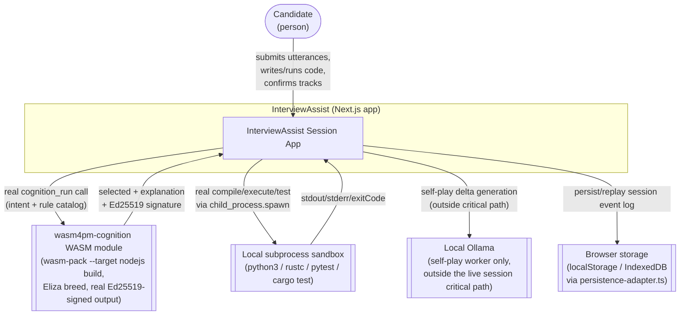

# C4: System Context

Source: `examples/interview-assist/app/api/` (5 real routes), `lib/adapters/` (real external
integrations: `cognition-adapter.ts` → wasm4pm-cognition WASM, `sandbox-executor.ts` → local
subprocess, `ollama-adapter.ts` → local Ollama, `persistence-adapter.ts` → browser storage).

## See Also

- [c4-container.md](c4-container.md) — one level down
- [sequence-cognition.md](sequence-cognition.md) — the cognition boundary crossing in detail
- [sequence-sandbox-execution.md](sequence-sandbox-execution.md) — the sandbox boundary crossing
