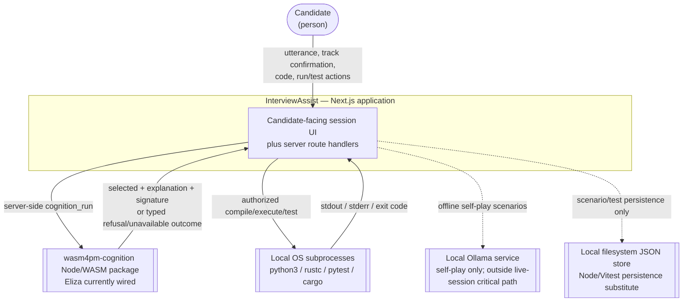

<!-- wasm4pm-doc-status: active; reviewed: 2026-08-02; original: .claude/worktrees/wf_99470ccd-c7b-1/docs/diagrams/c4-context.md; source-sha256: ba9fe9aca6ce0d2044fe2f08f383efae8c0738f75ec1eca1f3fd77ac2a48d6d3; reason: tooling or agent control surface -->

# C4: System Context

**Re-verified:** 2026-07-24.

## Source commands executed

```text
GitHub.fetch_file repository_full_name=seanchatmangpt/wasm4pm path=examples/interview-assist/app/page.tsx ref=docs/v26.7.24-planning-diagramming
GitHub.fetch_file repository_full_name=seanchatmangpt/wasm4pm path=examples/interview-assist/lib/adapters/cognition-adapter.ts ref=docs/v26.7.24-planning-diagramming
GitHub.fetch_file repository_full_name=seanchatmangpt/wasm4pm path=examples/interview-assist/lib/adapters/sandbox-executor.ts ref=docs/v26.7.24-planning-diagramming
GitHub.fetch_file repository_full_name=seanchatmangpt/wasm4pm path=examples/interview-assist/lib/adapters/ollama-adapter.ts ref=docs/v26.7.24-planning-diagramming
GitHub.fetch_file repository_full_name=seanchatmangpt/wasm4pm path=examples/interview-assist/lib/adapters/persistence-adapter.ts ref=docs/v26.7.24-planning-diagramming
```



## Boundary corrections

- The persistence adapter is explicitly implemented with Node filesystem I/O as a stand-in. It is **not** current `localStorage` or IndexedDB integration.
- The live page does not call the persistence adapter. Filesystem persistence is exercised by scenario tests.
- The cognition adapter requires the bare package name `wasm4pm-cognition`. This diagram treats it as a runtime dependency, not a proven tracked in-repository artifact; the previously cited materialization script/package paths were absent from this branch when fetched.
- Ollama remains outside the candidate-facing request path. The self-play scenario conditionally calls it when the local service is reachable.

## See also

- [C4 container](c4-container.md)
- [Cognition sequence](sequence-cognition.md)
- [Sandbox sequence](sequence-sandbox-execution.md)
- [Unfinished work](unfinished-work.md)
