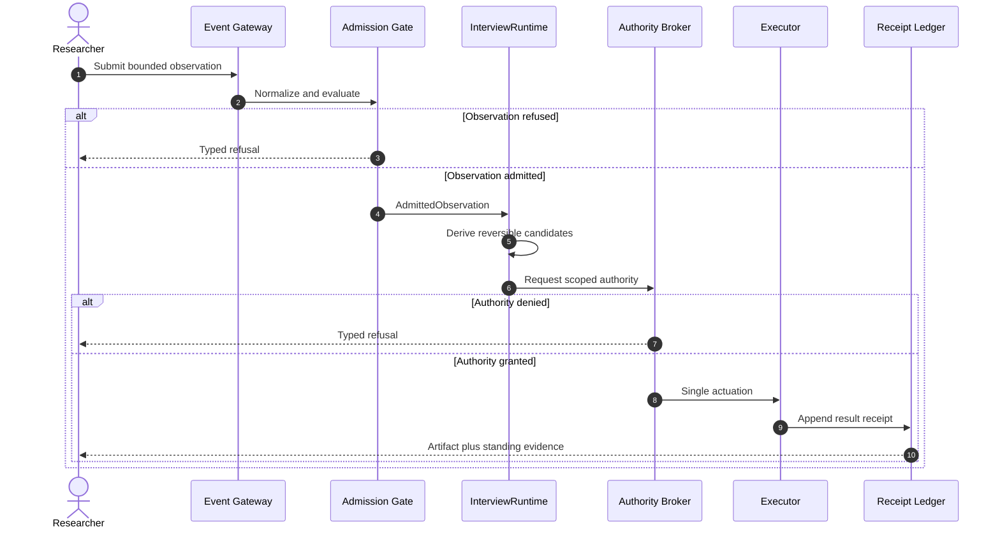

# Sequence Diagram: Temporal Contract

**Pattern ID:** `03-sequence`  
**Mermaid standing:** Stable Mermaid grammar  
**Architecture view:** current, target, diagnostic, or doctrine as stated below

> **Pattern statement:** Use a sequence diagram when correctness depends on the exact order of requests, refusals, effects, and receipts.

## Context

The same components can be composed lawfully or unlawfully depending on call order. In wasm4pm, authority must be decided before actuation, and the receipt must bind the result after the effect.

## Problem

Static architecture diagrams do not prove that the runtime calls the authority broker before the executor or that refusals short-circuit later messages.

## Forces

- Order must be explicit.
- Alternative outcomes must remain visible.
- The verifier must not trust executor claims.
- The sequence must distinguish a target design from an observed trace.

The forces should not be resolved by deleting one of them. The purpose of the pattern is to hold them in a stable relationship. When one force dominates, select a neighboring diagram that restores the missing dimension.

## Solution

Use participants for boundaries, not every class. Use alt blocks for admission and authority refusals. Number the messages and include the evidence carrier returned at each stage.

Apply the solution in four passes:

1. State the primary question in one sentence.
2. Select only entities needed to answer that question.
3. Label every relationship with its semantic type or evidence status.
4. Write the falsifier before treating the diagram as an architectural claim.

## wasm4pm case

The target InterviewRuntime sequence exposes the composition root needed to join the Rust interview components into one law-complete runtime.

The case is not automatically a claim about the current repository. Target components, diagnostic values, and illustrative scenarios are deliberately retained because they expose the next law-complete design. Their standing must remain visible in reviews and generated reports.

## Mermaid source

The canonical standalone source is [`diagrams/03-sequence.mmd`](../diagrams/03-sequence.mmd).

## Reading the diagram

Read this diagram from the perspective of **temporal contract**. Do not infer class ownership from a behavioral diagram, runtime order from a structural diagram, or measured performance from a planning diagram. The pattern becomes stronger when paired with neighbors that answer those adjacent questions explicitly.

## Falsifier

A trace in which the executor receives a request before a scoped grant, or the ledger records a success without the executor result, invalidates the sequence.

A falsifier is not a warning label. It is the test that gives the diagram standing. Where the evidence cannot be obtained, the diagram remains `BLOCKED` or `UNKNOWN`; it does not become true by repetition.

## Evidence checklist

- Identify the exact source files, traces, datasets, or decisions supporting each nontrivial relationship.
- Record whether the diagram describes current code, a target composition, or a diagnostic hypothesis.
- Verify that refusal, authority, and evidence boundaries are not hidden for visual simplicity.
- Re-run the relevant proof ladder after source drift.
- Bind renderer results to the exact `.mmd` source and Mermaid version.

## Neighboring patterns

Combine with [01-flowchart](../patterns/01-flowchart.md), [02-swimlanes](../patterns/02-swimlanes.md), [16-c4-dynamic](../patterns/16-c4-dynamic.md), [28-event-modeling](../patterns/28-event-modeling.md).

The combination should be monotonic: the neighboring pattern may add a dimension, but it must not silently change the meaning of existing entities or edges. When two views disagree, treat the disagreement as an architecture defect or a standing mismatch, not as stylistic variation.

## Extension questions

- What information is intentionally absent from this view?
- Which edge is most likely to be aspirational rather than observed?
- What typed carrier crosses each boundary?
- Which proof, test, receipt, or trace would promote this view to `ALIVE`?
- Which neighboring pattern would reveal a bypass that this grammar cannot show?
