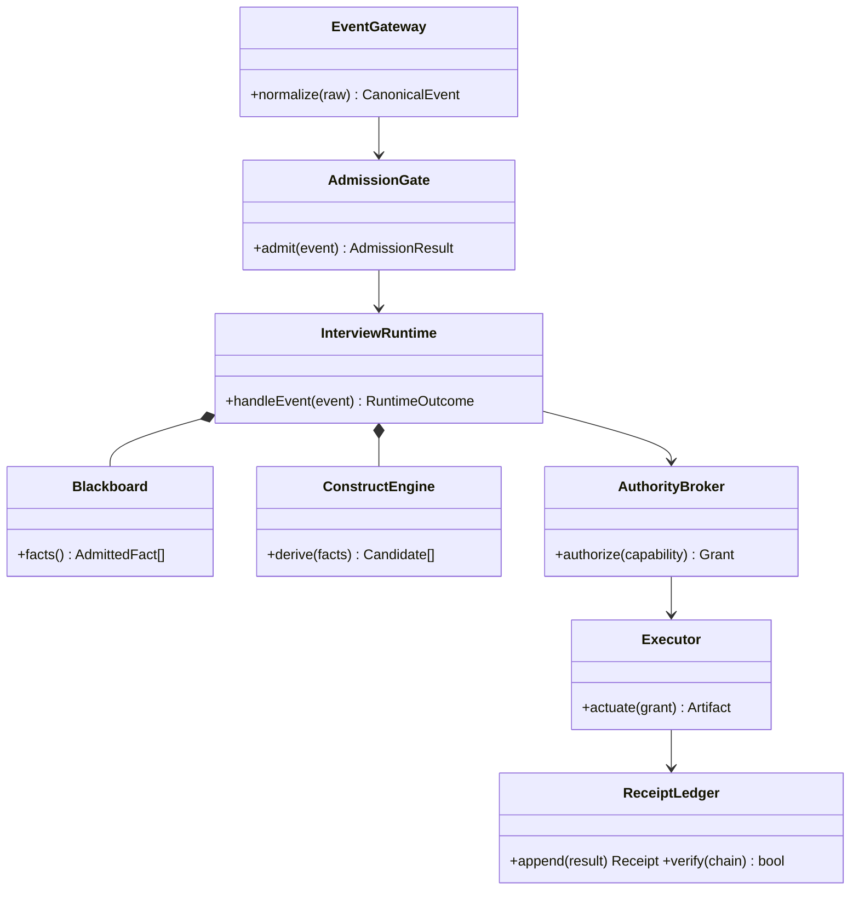

# Class Diagram: Type-Level Obligation

**Pattern ID:** `04-class`  
**Mermaid standing:** Stable Mermaid grammar  
**Architecture view:** current, target, diagnostic, or doctrine as stated below

> **Pattern statement:** Use a class diagram when the design question is which types own invariants and which relationships must be impossible to bypass.

## Context

wasm4pm relies on typed carriers such as CanonicalEvent, AdmittedObservation, AuthorityGrant, Artifact, and Receipt. Their relationships determine whether law is structural or merely conventional.

## Problem

Module lists do not show whether a RawObservation can reach the blackboard without event normalization, or whether a capability can execute without an authority token.

## Forces

- Types should encode obligations rather than comments.
- Composition roots must own orchestration.
- Public mutation APIs should be minimized.
- Evidence objects must be distinct from status labels.

The forces should not be resolved by deleting one of them. The purpose of the pattern is to hold them in a stable relationship. When one force dominates, select a neighboring diagram that restores the missing dimension.

## Solution

Model the required carriers and aggregations. Use composition for invariant-owning internals, dependency arrows for requests, and no direct relationship between unauthorized callers and executors.

Apply the solution in four passes:

1. State the primary question in one sentence.
2. Select only entities needed to answer that question.
3. Label every relationship with its semantic type or evidence status.
4. Write the falsifier before treating the diagram as an architectural claim.

## wasm4pm case

The target InterviewRuntime aggregates the blackboard and construction engine and depends on the broker. This closes the gap identified in the current interview component inventory.

The case is not automatically a claim about the current repository. Target components, diagnostic values, and illustrative scenarios are deliberately retained because they expose the next law-complete design. Their standing must remain visible in reviews and generated reports.

## Mermaid source

The canonical standalone source is [`diagrams/04-class.mmd`](../diagrams/04-class.mmd).

## Reading the diagram

Read this diagram from the perspective of **type-level obligation**. Do not infer class ownership from a behavioral diagram, runtime order from a structural diagram, or measured performance from a planning diagram. The pattern becomes stronger when paired with neighbors that answer those adjacent questions explicitly.

## Falsifier

If code permits arbitrary verification status recording or public graph insertion without admission, the type model is aspirational and must be marked target-state.

A falsifier is not a warning label. It is the test that gives the diagram standing. Where the evidence cannot be obtained, the diagram remains `BLOCKED` or `UNKNOWN`; it does not become true by repetition.

## Evidence checklist

- Identify the exact source files, traces, datasets, or decisions supporting each nontrivial relationship.
- Record whether the diagram describes current code, a target composition, or a diagnostic hypothesis.
- Verify that refusal, authority, and evidence boundaries are not hidden for visual simplicity.
- Re-run the relevant proof ladder after source drift.
- Bind renderer results to the exact `.mmd` source and Mermaid version.

## Neighboring patterns

Combine with [06-er](../patterns/06-er.md), [15-c4-component](../patterns/15-c4-component.md), [11-requirement](../patterns/11-requirement.md), [23-block](../patterns/23-block.md).

The combination should be monotonic: the neighboring pattern may add a dimension, but it must not silently change the meaning of existing entities or edges. When two views disagree, treat the disagreement as an architecture defect or a standing mismatch, not as stylistic variation.

## Extension questions

- What information is intentionally absent from this view?
- Which edge is most likely to be aspirational rather than observed?
- What typed carrier crosses each boundary?
- Which proof, test, receipt, or trace would promote this view to `ALIVE`?
- Which neighboring pattern would reveal a bypass that this grammar cannot show?
