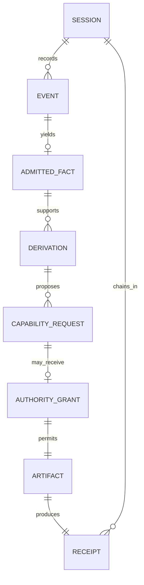

# Entity Relationship Diagram: Evidence Data Model

**Pattern ID:** `06-er`  
**Mermaid standing:** Stable Mermaid grammar  
**Architecture view:** current, target, diagnostic, or doctrine as stated below

> **Pattern statement:** Use an ER diagram when persistence, identity, cardinality, and provenance are the central design concerns.

## Context

Receipts, sessions, events, admitted facts, grants, artifacts, and derivations are persistent evidence objects. Their cardinalities determine replay and audit correctness.

## Problem

A receipt chain can look correct in prose while the data model omits session binding, event identity, policy scope, or the relation between grants and artifacts.

## Forces

- Identity must survive replay.
- One artifact must have an accountable grant.
- Events may be refused and produce no fact.
- Receipts belong to a session and form an ordered chain.

The forces should not be resolved by deleting one of them. The purpose of the pattern is to hold them in a stable relationship. When one force dominates, select a neighboring diagram that restores the missing dimension.

## Solution

Model facts and receipts as independent entities, not fields on mutable session state. Encode optional admission and mandatory artifact-to-receipt relationships.

Apply the solution in four passes:

1. State the primary question in one sentence.
2. Select only entities needed to answer that question.
3. Label every relationship with its semantic type or evidence status.
4. Write the falsifier before treating the diagram as an architectural claim.

## wasm4pm case

The ER model reveals why a fact hash that omits confidence, policy, or session cannot serve as complete admission evidence.

The case is not automatically a claim about the current repository. Target components, diagnostic values, and illustrative scenarios are deliberately retained because they expose the next law-complete design. Their standing must remain visible in reviews and generated reports.

## Mermaid source

The canonical standalone source is [`diagrams/06-er.mmd`](../diagrams/06-er.mmd).

## Reading the diagram

Read this diagram from the perspective of **evidence data model**. Do not infer class ownership from a behavioral diagram, runtime order from a structural diagram, or measured performance from a planning diagram. The pattern becomes stronger when paired with neighbors that answer those adjacent questions explicitly.

## Falsifier

If multiple artifacts can be produced from one unscoped grant without an explicit cardinality or nonce, the model under-specifies authority.

A falsifier is not a warning label. It is the test that gives the diagram standing. Where the evidence cannot be obtained, the diagram remains `BLOCKED` or `UNKNOWN`; it does not become true by repetition.

## Evidence checklist

- Identify the exact source files, traces, datasets, or decisions supporting each nontrivial relationship.
- Record whether the diagram describes current code, a target composition, or a diagnostic hypothesis.
- Verify that refusal, authority, and evidence boundaries are not hidden for visual simplicity.
- Re-run the relevant proof ladder after source drift.
- Bind renderer results to the exact `.mmd` source and Mermaid version.

## Neighboring patterns

Combine with [04-class](../patterns/04-class.md), [24-packet](../patterns/24-packet.md), [28-event-modeling](../patterns/28-event-modeling.md), [29-treemap](../patterns/29-treemap.md).

The combination should be monotonic: the neighboring pattern may add a dimension, but it must not silently change the meaning of existing entities or edges. When two views disagree, treat the disagreement as an architecture defect or a standing mismatch, not as stylistic variation.

## Extension questions

- What information is intentionally absent from this view?
- Which edge is most likely to be aspirational rather than observed?
- What typed carrier crosses each boundary?
- Which proof, test, receipt, or trace would promote this view to `ALIVE`?
- Which neighboring pattern would reveal a bypass that this grammar cannot show?
