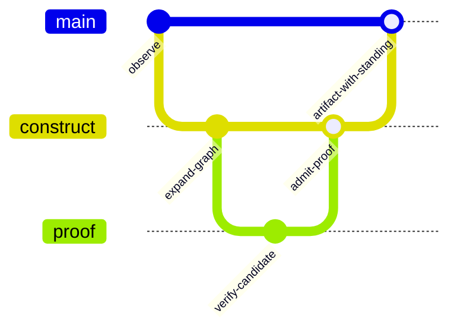

# GitGraph: Admission History

**Pattern ID:** `12-gitgraph`  
**Mermaid standing:** Stable Mermaid grammar  
**Architecture view:** current, target, diagnostic, or doctrine as stated below

> **Pattern statement:** Use GitGraph when the shape of parallel construction, proof, merge, and release history carries design meaning.

## Context

DCM encourages parallel reversible exploration and deliberate admission. Git branches can mirror that doctrine when proof branches return evidence before a candidate reaches main.

## Problem

A plain commit list does not show which work was exploratory, which supplied evidence, and where admission occurred.

## Forces

- History must remain truthful.
- Merge points should correspond to admission decisions.
- Generated and proof changes may evolve independently.
- The graph should not imply that Git alone proves correctness.

The forces should not be resolved by deleting one of them. The purpose of the pattern is to hold them in a stable relationship. When one force dominates, select a neighboring diagram that restores the missing dimension.

## Solution

Use branches to separate construction and proof, and label merges with the admission event they represent.

Apply the solution in four passes:

1. State the primary question in one sentence.
2. Select only entities needed to answer that question.
3. Label every relationship with its semantic type or evidence status.
4. Write the falsifier before treating the diagram as an architectural claim.

## wasm4pm case

The example shows a proof branch merging into construction before the construction branch is admitted to main as an artifact with standing.

The case is not automatically a claim about the current repository. Target components, diagnostic values, and illustrative scenarios are deliberately retained because they expose the next law-complete design. Their standing must remain visible in reviews and generated reports.

## Mermaid source

The canonical standalone source is [`diagrams/12-gitgraph.mmd`](../diagrams/12-gitgraph.mmd).

## Reading the diagram

Read this diagram from the perspective of **admission history**. Do not infer class ownership from a behavioral diagram, runtime order from a structural diagram, or measured performance from a planning diagram. The pattern becomes stronger when paired with neighbors that answer those adjacent questions explicitly.

## Falsifier

If the actual repository history bypasses the proof branch or force-rewrites the evidence boundary, the diagram becomes historical fiction.

A falsifier is not a warning label. It is the test that gives the diagram standing. Where the evidence cannot be obtained, the diagram remains `BLOCKED` or `UNKNOWN`; it does not become true by repetition.

## Evidence checklist

- Identify the exact source files, traces, datasets, or decisions supporting each nontrivial relationship.
- Record whether the diagram describes current code, a target composition, or a diagnostic hypothesis.
- Verify that refusal, authority, and evidence boundaries are not hidden for visual simplicity.
- Re-run the relevant proof ladder after source drift.
- Bind renderer results to the exact `.mmd` source and Mermaid version.

## Neighboring patterns

Combine with [08-gantt](../patterns/08-gantt.md), [25-kanban](../patterns/25-kanban.md), [19-timeline](../patterns/19-timeline.md), [28-event-modeling](../patterns/28-event-modeling.md).

The combination should be monotonic: the neighboring pattern may add a dimension, but it must not silently change the meaning of existing entities or edges. When two views disagree, treat the disagreement as an architecture defect or a standing mismatch, not as stylistic variation.

## Extension questions

- What information is intentionally absent from this view?
- Which edge is most likely to be aspirational rather than observed?
- What typed carrier crosses each boundary?
- Which proof, test, receipt, or trace would promote this view to `ALIVE`?
- Which neighboring pattern would reveal a bypass that this grammar cannot show?
