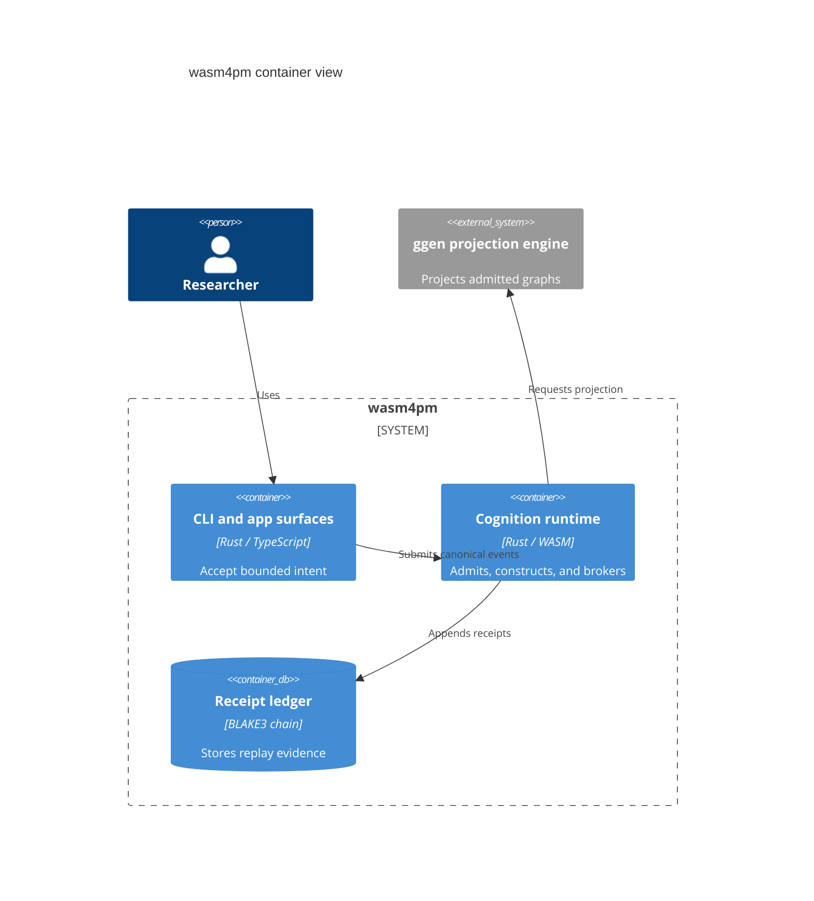

# C4 Container: Runtime Responsibility Partition

**Pattern ID:** `14-c4-container`  
**Mermaid standing:** Experimental or beta grammar  
**Architecture view:** current, target, diagnostic, or doctrine as stated below

> **Pattern statement:** Use C4 Container to partition deployable or executable responsibilities without descending into class detail.

## Context

wasm4pm spans UI surfaces, Rust/WASM cognition, projection engines, executors, and receipt stores.

## Problem

A system context is too coarse to expose client/server boundaries, while a component graph is too detailed for deployment reasoning.

## Forces

- Containers must correspond to executable responsibility.
- Client and server boundaries must be honest.
- Stores and external engines must be visible.
- A container relationship must map to a real or explicitly target interface.

The forces should not be resolved by deleting one of them. The purpose of the pattern is to hold them in a stable relationship. When one force dominates, select a neighboring diagram that restores the missing dimension.

## Solution

Draw the human-facing surface, cognition runtime, projection engine, executor, and evidence store as separate containers.

Apply the solution in four passes:

1. State the primary question in one sentence.
2. Select only entities needed to answer that question.
3. Label every relationship with its semantic type or evidence status.
4. Write the falsifier before treating the diagram as an architectural claim.

## wasm4pm case

The InterviewAssist review showed why direct arrows from client components to server adapters are misleading; the container view inserts HTTP route boundaries.

The case is not automatically a claim about the current repository. Target components, diagnostic values, and illustrative scenarios are deliberately retained because they expose the next law-complete design. Their standing must remain visible in reviews and generated reports.

## Mermaid source

The canonical standalone source is [`diagrams/14-c4-container.mmd`](../diagrams/14-c4-container.mmd).

## Reading the diagram

Read this diagram from the perspective of **runtime responsibility partition**. Do not infer class ownership from a behavioral diagram, runtime order from a structural diagram, or measured performance from a planning diagram. The pattern becomes stronger when paired with neighbors that answer those adjacent questions explicitly.

## Falsifier

If a container has no executable identity or interface and exists only as a conceptual label, it belongs in another diagram type.

A falsifier is not a warning label. It is the test that gives the diagram standing. Where the evidence cannot be obtained, the diagram remains `BLOCKED` or `UNKNOWN`; it does not become true by repetition.

## Evidence checklist

- Identify the exact source files, traces, datasets, or decisions supporting each nontrivial relationship.
- Record whether the diagram describes current code, a target composition, or a diagnostic hypothesis.
- Verify that refusal, authority, and evidence boundaries are not hidden for visual simplicity.
- Re-run the relevant proof ladder after source drift.
- Bind renderer results to the exact `.mmd` source and Mermaid version.

## Neighboring patterns

Combine with [13-c4-context](../patterns/13-c4-context.md), [15-c4-component](../patterns/15-c4-component.md), [17-c4-deployment](../patterns/17-c4-deployment.md), [26-architecture](../patterns/26-architecture.md).

The combination should be monotonic: the neighboring pattern may add a dimension, but it must not silently change the meaning of existing entities or edges. When two views disagree, treat the disagreement as an architecture defect or a standing mismatch, not as stylistic variation.

## Extension questions

- What information is intentionally absent from this view?
- Which edge is most likely to be aspirational rather than observed?
- What typed carrier crosses each boundary?
- Which proof, test, receipt, or trace would promote this view to `ALIVE`?
- Which neighboring pattern would reveal a bypass that this grammar cannot show?
