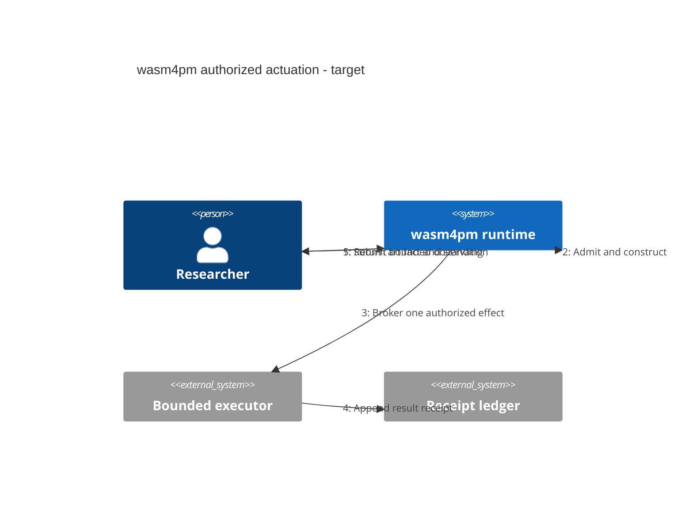

# C4 Dynamic: Numbered Runtime Scenario

**Pattern ID:** `16-c4-dynamic`  
**Mermaid standing:** Experimental or beta grammar  
**Architecture view:** current, target, diagnostic, or doctrine as stated below

> **Pattern statement:** Use C4 Dynamic to narrate one architecture scenario with numbered relationships while retaining C4 boundaries.

## Context

A static component view cannot show which interaction occurs first in a bounded actuation.

## Problem

Sequence diagrams are precise but may lose architecture hierarchy; C4 Dynamic preserves system identities while showing a scenario.

## Forces

- The scenario must be singular and bounded.
- Relationship numbers must be monotonic.
- The diagram must not claim unobserved runtime order.
- Evidence return must be represented.

The forces should not be resolved by deleting one of them. The purpose of the pattern is to hold them in a stable relationship. When one force dominates, select a neighboring diagram that restores the missing dimension.

## Solution

Select one scenario, number each relationship, and stop after the artifact and standing return.

Apply the solution in four passes:

1. State the primary question in one sentence.
2. Select only entities needed to answer that question.
3. Label every relationship with its semantic type or evidence status.
4. Write the falsifier before treating the diagram as an architectural claim.

## wasm4pm case

The target authorized-actuation scenario bridges the C4 architecture family and the sequence pattern.

The case is not automatically a claim about the current repository. Target components, diagnostic values, and illustrative scenarios are deliberately retained because they expose the next law-complete design. Their standing must remain visible in reviews and generated reports.

## Mermaid source

The canonical standalone source is [`diagrams/16-c4-dynamic.mmd`](../diagrams/16-c4-dynamic.mmd).

## Reading the diagram

Read this diagram from the perspective of **numbered runtime scenario**. Do not infer class ownership from a behavioral diagram, runtime order from a structural diagram, or measured performance from a planning diagram. The pattern becomes stronger when paired with neighbors that answer those adjacent questions explicitly.

## Falsifier

Observed traces that reorder authority and execution invalidate the numbered scenario.

A falsifier is not a warning label. It is the test that gives the diagram standing. Where the evidence cannot be obtained, the diagram remains `BLOCKED` or `UNKNOWN`; it does not become true by repetition.

## Evidence checklist

- Identify the exact source files, traces, datasets, or decisions supporting each nontrivial relationship.
- Record whether the diagram describes current code, a target composition, or a diagnostic hypothesis.
- Verify that refusal, authority, and evidence boundaries are not hidden for visual simplicity.
- Re-run the relevant proof ladder after source drift.
- Bind renderer results to the exact `.mmd` source and Mermaid version.

## Neighboring patterns

Combine with [03-sequence](../patterns/03-sequence.md), [15-c4-component](../patterns/15-c4-component.md), [17-c4-deployment](../patterns/17-c4-deployment.md), [28-event-modeling](../patterns/28-event-modeling.md).

The combination should be monotonic: the neighboring pattern may add a dimension, but it must not silently change the meaning of existing entities or edges. When two views disagree, treat the disagreement as an architecture defect or a standing mismatch, not as stylistic variation.

## Extension questions

- What information is intentionally absent from this view?
- Which edge is most likely to be aspirational rather than observed?
- What typed carrier crosses each boundary?
- Which proof, test, receipt, or trace would promote this view to `ALIVE`?
- Which neighboring pattern would reveal a bypass that this grammar cannot show?
