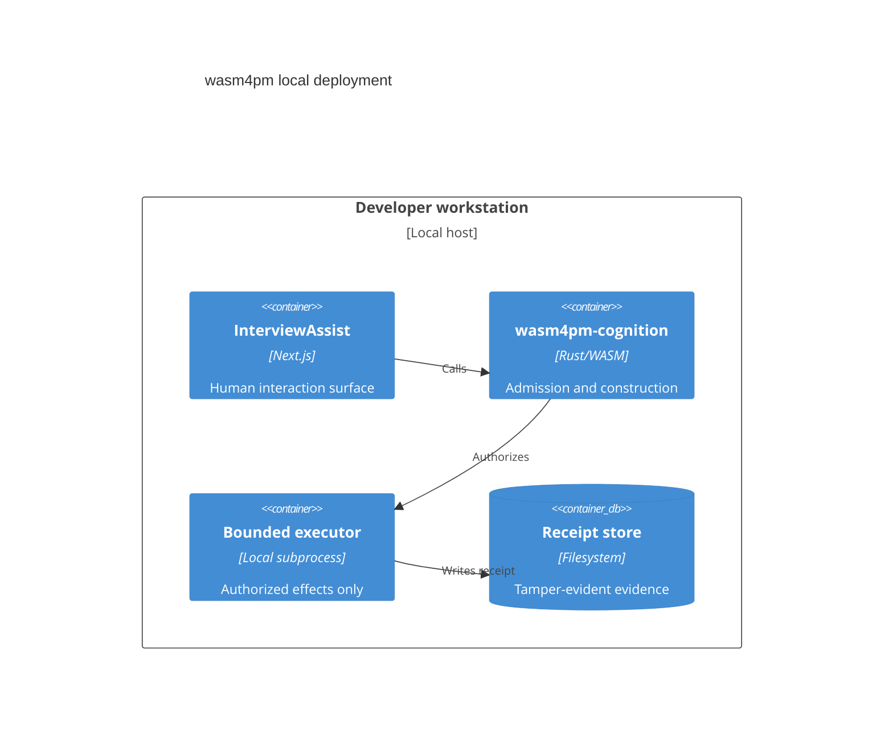

# C4 Deployment: Runtime Placement And Trust Zone

**Pattern ID:** `17-c4-deployment`  
**Mermaid standing:** Experimental or beta grammar  
**Architecture view:** current, target, diagnostic, or doctrine as stated below

> **Pattern statement:** Use C4 Deployment when placement, process isolation, and storage location affect authority or evidence.

## Context

A local Next.js app, Rust/WASM module, subprocess executor, and filesystem ledger may share one workstation while still requiring trust boundaries.

## Problem

Logical diagrams hide whether the executor and verifier share mutable state or whether browser and server code are accidentally bundled together.

## Forces

- Nodes must be real deployment environments.
- Containers must be placed where they execute.
- Trust zones and process boundaries must be inferable.
- Deployment must not invent infrastructure.

The forces should not be resolved by deleting one of them. The purpose of the pattern is to hold them in a stable relationship. When one force dominates, select a neighboring diagram that restores the missing dimension.

## Solution

Place containers inside explicit deployment nodes and draw runtime relationships across node boundaries.

Apply the solution in four passes:

1. State the primary question in one sentence.
2. Select only entities needed to answer that question.
3. Label every relationship with its semantic type or evidence status.
4. Write the falsifier before treating the diagram as an architectural claim.

## wasm4pm case

The local deployment shows InterviewAssist, cognition, executor, and ledger on one workstation but as distinct execution responsibilities.

The case is not automatically a claim about the current repository. Target components, diagnostic values, and illustrative scenarios are deliberately retained because they expose the next law-complete design. Their standing must remain visible in reviews and generated reports.

## Mermaid source

The canonical standalone source is [`diagrams/17-c4-deployment.mmd`](../diagrams/17-c4-deployment.mmd).

## Reading the diagram

Read this diagram from the perspective of **runtime placement and trust zone**. Do not infer class ownership from a behavioral diagram, runtime order from a structural diagram, or measured performance from a planning diagram. The pattern becomes stronger when paired with neighbors that answer those adjacent questions explicitly.

## Falsifier

If a named node or materialized WASM package does not exist in the deployment, mark it target or remove it.

A falsifier is not a warning label. It is the test that gives the diagram standing. Where the evidence cannot be obtained, the diagram remains `BLOCKED` or `UNKNOWN`; it does not become true by repetition.

## Evidence checklist

- Identify the exact source files, traces, datasets, or decisions supporting each nontrivial relationship.
- Record whether the diagram describes current code, a target composition, or a diagnostic hypothesis.
- Verify that refusal, authority, and evidence boundaries are not hidden for visual simplicity.
- Re-run the relevant proof ladder after source drift.
- Bind renderer results to the exact `.mmd` source and Mermaid version.

## Neighboring patterns

Combine with [14-c4-container](../patterns/14-c4-container.md), [24-packet](../patterns/24-packet.md), [26-architecture](../patterns/26-architecture.md), [32-wardley](../patterns/32-wardley.md).

The combination should be monotonic: the neighboring pattern may add a dimension, but it must not silently change the meaning of existing entities or edges. When two views disagree, treat the disagreement as an architecture defect or a standing mismatch, not as stylistic variation.

## Extension questions

- What information is intentionally absent from this view?
- Which edge is most likely to be aspirational rather than observed?
- What typed carrier crosses each boundary?
- Which proof, test, receipt, or trace would promote this view to `ALIVE`?
- Which neighboring pattern would reveal a bypass that this grammar cannot show?
