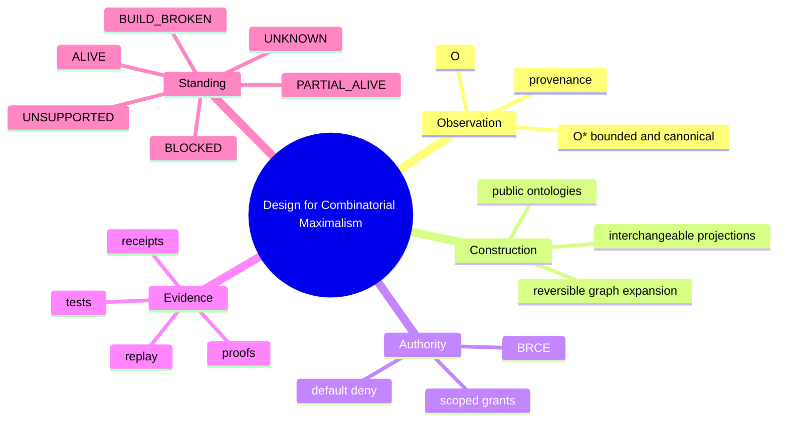

# Mindmap: Conceptual Neighborhood

**Pattern ID:** `18-mindmap`  
**Mermaid standing:** Stable Mermaid grammar  
**Architecture view:** current, target, diagnostic, or doctrine as stated below

> **Pattern statement:** Use a mindmap to expose the conceptual vocabulary and generative neighborhoods of DCM before imposing process order.

## Context

Design for Combinatorial Maximalism spans observation, construction, authority, evidence, standing, ontology, and projection.

## Problem

Linear documents force an early sequence and hide the fact that concepts can be entered from multiple directions.

## Forces

- The center must be one generative idea.
- Branches should be orthogonal.
- Depth should reveal vocabulary, not implementation detail.
- The map must connect to more formal patterns.

The forces should not be resolved by deleting one of them. The purpose of the pattern is to hold them in a stable relationship. When one force dominates, select a neighboring diagram that restores the missing dimension.

## Solution

Put DCM at the root and use major branches for Observation, Construction, Authority, Evidence, and Standing.

Apply the solution in four passes:

1. State the primary question in one sentence.
2. Select only entities needed to answer that question.
3. Label every relationship with its semantic type or evidence status.
4. Write the falsifier before treating the diagram as an architectural claim.

## wasm4pm case

The mindmap serves as the book’s conceptual index and a workshop prompt for discovering missing vocabulary.

The case is not automatically a claim about the current repository. Target components, diagnostic values, and illustrative scenarios are deliberately retained because they expose the next law-complete design. Their standing must remain visible in reviews and generated reports.

## Mermaid source

The canonical standalone source is [`diagrams/18-mindmap.mmd`](../diagrams/18-mindmap.mmd).

## Reading the diagram

Read this diagram from the perspective of **conceptual neighborhood**. Do not infer class ownership from a behavioral diagram, runtime order from a structural diagram, or measured performance from a planning diagram. The pattern becomes stronger when paired with neighbors that answer those adjacent questions explicitly.

## Falsifier

If branches overlap heavily or encode temporal order, another diagram type is more appropriate.

A falsifier is not a warning label. It is the test that gives the diagram standing. Where the evidence cannot be obtained, the diagram remains `BLOCKED` or `UNKNOWN`; it does not become true by repetition.

## Evidence checklist

- Identify the exact source files, traces, datasets, or decisions supporting each nontrivial relationship.
- Record whether the diagram describes current code, a target composition, or a diagnostic hypothesis.
- Verify that refusal, authority, and evidence boundaries are not hidden for visual simplicity.
- Re-run the relevant proof ladder after source drift.
- Bind renderer results to the exact `.mmd` source and Mermaid version.

## Neighboring patterns

Combine with [01-flowchart](../patterns/01-flowchart.md), [07-user-journey](../patterns/07-user-journey.md), [29-treemap](../patterns/29-treemap.md), [34-treeview](../patterns/34-treeview.md).

The combination should be monotonic: the neighboring pattern may add a dimension, but it must not silently change the meaning of existing entities or edges. When two views disagree, treat the disagreement as an architecture defect or a standing mismatch, not as stylistic variation.

## Extension questions

- What information is intentionally absent from this view?
- Which edge is most likely to be aspirational rather than observed?
- What typed carrier crosses each boundary?
- Which proof, test, receipt, or trace would promote this view to `ALIVE`?
- Which neighboring pattern would reveal a bypass that this grammar cannot show?
