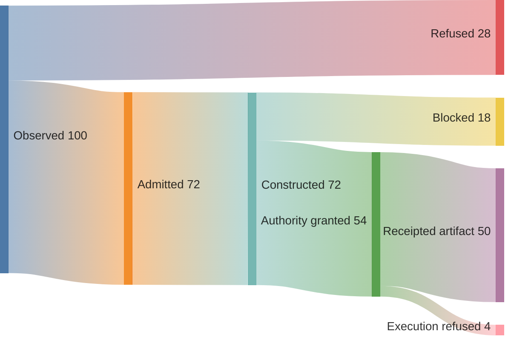

# Sankey Diagram: Flow Volume And Loss

**Pattern ID:** `21-sankey`  
**Mermaid standing:** Stable Mermaid grammar  
**Architecture view:** current, target, diagnostic, or doctrine as stated below

> **Pattern statement:** Use a Sankey diagram when the question is how quantities split, transform, or terminate across a bounded flow.

## Context

Candidate observations may be admitted, refused, constructed, verified, or blocked. Counts can expose where a pipeline loses volume.

## Problem

A flowchart shows possible routes but not how much work follows each route.

## Forces

- Every flow must share a unit.
- Input and output totals must reconcile.
- Refusal is a legitimate terminal flow.
- Illustrative values must not be presented as telemetry.

The forces should not be resolved by deleting one of them. The purpose of the pattern is to hold them in a stable relationship. When one force dominates, select a neighboring diagram that restores the missing dimension.

## Solution

Choose one unit such as observations per run and connect stages with measured quantities.

Apply the solution in four passes:

1. State the primary question in one sentence.
2. Select only entities needed to answer that question.
3. Label every relationship with its semantic type or evidence status.
4. Write the falsifier before treating the diagram as an architectural claim.

## wasm4pm case

The example is a diagnostic allocation showing observations splitting into refused, constructed, admitted, and blocked paths.

The case is not automatically a claim about the current repository. Target components, diagnostic values, and illustrative scenarios are deliberately retained because they expose the next law-complete design. Their standing must remain visible in reviews and generated reports.

## Mermaid source

The canonical standalone source is [`diagrams/21-sankey.mmd`](../diagrams/21-sankey.mmd).

## Reading the diagram

Read this diagram from the perspective of **flow volume and loss**. Do not infer class ownership from a behavioral diagram, runtime order from a structural diagram, or measured performance from a planning diagram. The pattern becomes stronger when paired with neighbors that answer those adjacent questions explicitly.

## Falsifier

Non-reconciling totals or mixed units invalidate the diagram.

A falsifier is not a warning label. It is the test that gives the diagram standing. Where the evidence cannot be obtained, the diagram remains `BLOCKED` or `UNKNOWN`; it does not become true by repetition.

## Evidence checklist

- Identify the exact source files, traces, datasets, or decisions supporting each nontrivial relationship.
- Record whether the diagram describes current code, a target composition, or a diagnostic hypothesis.
- Verify that refusal, authority, and evidence boundaries are not hidden for visual simplicity.
- Re-run the relevant proof ladder after source drift.
- Bind renderer results to the exact `.mmd` source and Mermaid version.

## Neighboring patterns

Combine with [01-flowchart](../patterns/01-flowchart.md), [09-pie](../patterns/09-pie.md), [22-xychart](../patterns/22-xychart.md), [29-treemap](../patterns/29-treemap.md).

The combination should be monotonic: the neighboring pattern may add a dimension, but it must not silently change the meaning of existing entities or edges. When two views disagree, treat the disagreement as an architecture defect or a standing mismatch, not as stylistic variation.

## Extension questions

- What information is intentionally absent from this view?
- Which edge is most likely to be aspirational rather than observed?
- What typed carrier crosses each boundary?
- Which proof, test, receipt, or trace would promote this view to `ALIVE`?
- Which neighboring pattern would reveal a bypass that this grammar cannot show?
