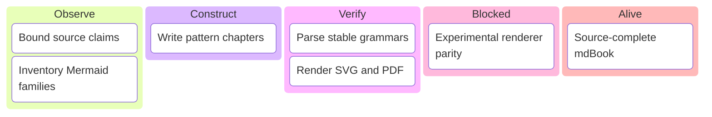

# Kanban: Standing-Aware Work State

**Pattern ID:** `25-kanban`  
**Mermaid standing:** Stable Mermaid grammar  
**Architecture view:** current, target, diagnostic, or doctrine as stated below

> **Pattern statement:** Use Kanban when flow state, work limits, and evidence blockers must remain visible during execution.

## Context

A DCM backlog includes exploration, proof, repair, blocked evidence, and admitted work.

## Problem

Generic To Do / Doing / Done columns collapse BUILD_BROKEN, BLOCKED, and ALIVE into ambiguous labels.

## Forces

- Columns should correspond to meaningful state.
- Evidence blockers must be visible.
- Work in progress must remain bounded.
- Done must mean a defined standing.

The forces should not be resolved by deleting one of them. The purpose of the pattern is to hold them in a stable relationship. When one force dominates, select a neighboring diagram that restores the missing dimension.

## Solution

Use columns such as Observe, Construct, Verify, Repair, Blocked, and ALIVE. Cards carry evidence links and standing.

Apply the solution in four passes:

1. State the primary question in one sentence.
2. Select only entities needed to answer that question.
3. Label every relationship with its semantic type or evidence status.
4. Write the falsifier before treating the diagram as an architectural claim.

## wasm4pm case

The atlas itself moves from source-complete to parser verification to PDF export rather than from writing to done.

The case is not automatically a claim about the current repository. Target components, diagnostic values, and illustrative scenarios are deliberately retained because they expose the next law-complete design. Their standing must remain visible in reviews and generated reports.

## Mermaid source

The canonical standalone source is [`diagrams/25-kanban.mmd`](../diagrams/25-kanban.mmd).

## Reading the diagram

Read this diagram from the perspective of **standing-aware work state**. Do not infer class ownership from a behavioral diagram, runtime order from a structural diagram, or measured performance from a planning diagram. The pattern becomes stronger when paired with neighbors that answer those adjacent questions explicitly.

## Falsifier

A card in ALIVE without its proof ladder or a blocked card hidden in progress invalidates the board.

A falsifier is not a warning label. It is the test that gives the diagram standing. Where the evidence cannot be obtained, the diagram remains `BLOCKED` or `UNKNOWN`; it does not become true by repetition.

## Evidence checklist

- Identify the exact source files, traces, datasets, or decisions supporting each nontrivial relationship.
- Record whether the diagram describes current code, a target composition, or a diagnostic hypothesis.
- Verify that refusal, authority, and evidence boundaries are not hidden for visual simplicity.
- Re-run the relevant proof ladder after source drift.
- Bind renderer results to the exact `.mmd` source and Mermaid version.

## Neighboring patterns

Combine with [05-state](../patterns/05-state.md), [08-gantt](../patterns/08-gantt.md), [12-gitgraph](../patterns/12-gitgraph.md), [33-cynefin](../patterns/33-cynefin.md).

The combination should be monotonic: the neighboring pattern may add a dimension, but it must not silently change the meaning of existing entities or edges. When two views disagree, treat the disagreement as an architecture defect or a standing mismatch, not as stylistic variation.

## Extension questions

- What information is intentionally absent from this view?
- Which edge is most likely to be aspirational rather than observed?
- What typed carrier crosses each boundary?
- Which proof, test, receipt, or trace would promote this view to `ALIVE`?
- Which neighboring pattern would reveal a bypass that this grammar cannot show?
