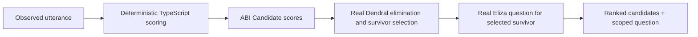

# Sequence: cognition-run flow

**Re-verified:** 2026-07-24.

## Source commands executed

```text
GitHub.fetch_file repository_full_name=seanchatmangpt/wasm4pm path=examples/interview-assist/app/page.tsx ref=docs/v26.7.24-planning-diagramming
GitHub.fetch_file repository_full_name=seanchatmangpt/wasm4pm path=examples/interview-assist/app/api/cognition/route.ts ref=docs/v26.7.24-planning-diagramming
GitHub.fetch_file repository_full_name=seanchatmangpt/wasm4pm path=examples/interview-assist/lib/adapters/cognition-adapter.ts ref=docs/v26.7.24-planning-diagramming
GitHub.fetch_file repository_full_name=seanchatmangpt/wasm4pm path=examples/interview-assist/lib/domain/cognition-rules.ts ref=docs/v26.7.24-planning-diagramming
GitHub.fetch_file repository_full_name=seanchatmangpt/wasm4pm path=examples/interview-assist/lib/domain/receipt-emitter.ts ref=docs/v26.7.24-planning-diagramming
```

## Current production path

```mermaid
sequenceDiagram
    actor Candidate
    participant Page as app/page.tsx
    participant Route as POST /api/cognition
    participant Adapter as cognition-adapter.ts
    participant Wasm as wasm4pm-cognition / Eliza
    participant Receipt as receipt-emitter.ts

    Candidate->>Page: submit observed utterance
    Page->>Route: intent + current last receipt
    Route->>Adapter: runCognition(intent, prevReceipt)

    alt empty or whitespace intent
        Adapter-->>Route: refused; no WASM call; no receipt
        Route-->>Page: 422
    else package cannot load
        Adapter->>Wasm: require bare package name
        Wasm-->>Adapter: module-load error
        Adapter-->>Route: unavailable; no receipt
        Route-->>Page: 503
    else real Eliza call has no keyword match
        Adapter->>Wasm: cognition_run(breed=eliza, rules=COGNITION_RULES)
        Wasm-->>Adapter: fail-closed empty-inference-trace error
        Adapter->>Receipt: emit cognition-run failure receipt
        Receipt-->>Adapter: TransitionReceipt
        Adapter-->>Route: no-track-matched + reason + receipt
        Route-->>Page: 422
    else real Eliza call matches one rule
        Adapter->>Wasm: cognition_run(breed=eliza, rules=COGNITION_RULES)
        Wasm-->>Adapter: selected + explanation + signature + run id
        Adapter->>Receipt: emit cognition-run matched receipt
        Receipt-->>Adapter: TransitionReceipt
        Adapter-->>Route: matched outcome + receipt
        Route-->>Page: 200
    end

    Page-->>Candidate: CognitionPanel with question and Yes / No / Correct
```

## Verified current contract

- The adapter passes `candidates: []` and one generated rule catalog to Eliza.
- A successful call returns one `selected` value and one `explanation`; it does not return a ranked candidate list.
- A real Eliza call receives a transition receipt whether it matches or fails closed with no track.
- Empty input and package-load failure receive no receipt because the breed did not run.
- The route maps `matched` to 200, `unavailable` to 503, and other typed outcomes to 422.

## Ranked-candidate decision

[ADR-001](../jira/v26.7.24/DECISIONS.md) chooses this future sequence:



TypeScript remains responsible for deriving free-text scores. Dendral supplies real breed provenance for elimination and highest-scoring-survivor selection. Eliza remains responsible for conversational question text. The ADR is accepted documentation only; this branch does not implement it.

## See also

- [ADR-001](../jira/v26.7.24/DECISIONS.md)
- [C4 component](c4-component.md)
- [Receipt and replay sequence](sequence-receipt-replay.md)
