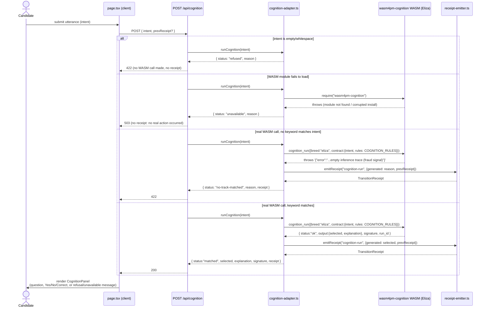

# Sequence: cognition-run flow

Source: `examples/interview-assist/lib/adapters/cognition-adapter.ts` (`runCognition`,
`loadCognitionModule`, `mapThrownToOutcome`) and `app/api/cognition/route.ts`, both read directly
this session. Four real outcome branches; only two of them attach a `TransitionReceipt`.

Notes (grounded, not inferred):
- Eliza's real `run()` requires a **non-empty `rules` array** — an empty one falls back to the
  1966 Rogerian wildcard, not a real interview-relevant response. `runCognition` always passes the
  full `COGNITION_RULES` set (ggen-generated from `packs/wasm4pm-interview-assist-pack/ontology/
  90-cognition-bridge.ttl` Part B).
- The thrown WASM error is a bare JS **string** (not an `Error` instance) containing JSON —
  `mapThrownToOutcome` parses it and checks for the literal substring
  `"postcondition failed: empty inference trace"` to distinguish "no-track-matched" from any other
  real refusal.
- HTTP status convention: 200 matched, 422 no-track-matched/refused (well-formed request, no
  admitted hypothesis — a disclosed non-match, not a server error), 503 unavailable (real
  infrastructure failure — the WASM dependency itself didn't load).
- A receipt is emitted whenever a **real WASM call actually happened**, whether it succeeded or
  threw — matching `sandbox-executor.ts`'s same discipline for non-zero exit codes. No receipt is
  fabricated for the pre-flight empty-intent check or a module-load failure, since no real
  cognition action occurred in either case.

## See Also

- [c4-component.md](c4-component.md) — where `cognition-adapter.ts` sits in the component graph
- [sequence-receipt-replay.md](sequence-receipt-replay.md) — how this step's receipt chains with
  the others
