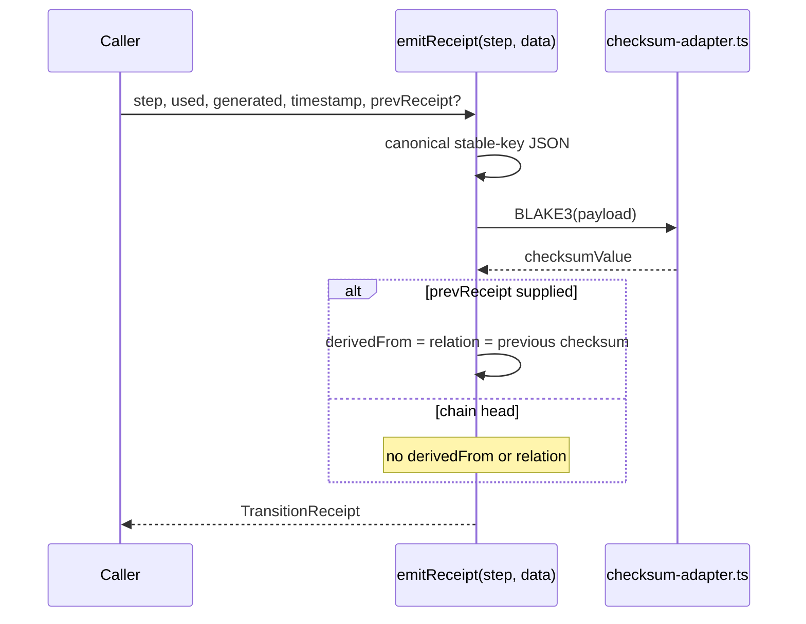
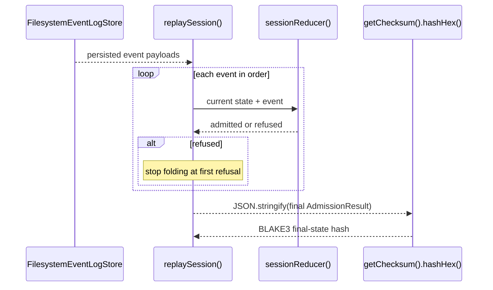

# Sequence: receipt primitives, live-chain gaps, and replay

**Re-verified:** 2026-07-24.

## Source commands executed

```text
GitHub.fetch_file repository_full_name=seanchatmangpt/wasm4pm path=examples/interview-assist/app/page.tsx ref=docs/v26.7.24-planning-diagramming
GitHub.fetch_file repository_full_name=seanchatmangpt/wasm4pm path=examples/interview-assist/app/api/receipt/route.ts ref=docs/v26.7.24-planning-diagramming
GitHub.fetch_file repository_full_name=seanchatmangpt/wasm4pm path=examples/interview-assist/lib/domain/receipt.ts ref=docs/v26.7.24-planning-diagramming
GitHub.fetch_file repository_full_name=seanchatmangpt/wasm4pm path=examples/interview-assist/lib/domain/receipt-emitter.ts ref=docs/v26.7.24-planning-diagramming
GitHub.fetch_file repository_full_name=seanchatmangpt/wasm4pm path=examples/interview-assist/lib/domain/reducer-with-receipts.ts ref=docs/v26.7.24-planning-diagramming
GitHub.fetch_file repository_full_name=seanchatmangpt/wasm4pm path=examples/interview-assist/lib/domain/replay.ts ref=docs/v26.7.24-planning-diagramming
GitHub.fetch_file repository_full_name=seanchatmangpt/wasm4pm path=examples/interview-assist/tests/scenarios/persistence-and-replay.test.ts ref=docs/v26.7.24-planning-diagramming
GitHub.fetch_file repository_full_name=seanchatmangpt/wasm4pm path=examples/interview-assist/tests/scenarios/tamper-detection.test.tsx ref=docs/v26.7.24-planning-diagramming
```

## Receipt primitive



The primitive is deterministic with respect to its arguments. The caller supplies the timestamp and prior receipt.

## Current live wiring — not one continuous chain

```mermaid
flowchart LR
    A["Admission<br/>page calls sessionReducer directly"]
    C["Cognition<br/>prevReceipt = current last receipt"]
    S["Sandbox run<br/>/api/run receives no prevReceipt"]
    T["Tests<br/>/api/test receives current last receipt"]
    X["Accessibility settings<br/>page mutates state directly"]
    F["Finish session<br/>separate event-label BLAKE3 hash"]

    A -.->|"no admission receipt"| C
    C -->|"cognition receipt may append"| S
    S -.->|"new chain head"| T
    T -->|"test receipt may chain from sandbox head"| X
    X -.->|"no accessibility receipt"| F
```



The intended ontology order is:

```text
admission → cognition-run → sandbox-execution → test-result → accessibility-projection
```

The receipt types and emitters support that order, but `app/page.tsx` does not currently actuate it end to end. TICKET-056 is therefore **BUILD_BROKEN at integration**, not merely unverified.

## Replay and tamper detection actually exercised by the scenarios



The persistence and tamper scenarios compare BLAKE3 hashes of the replayed final `AdmissionResult`. A single-field tamper that makes a transition illegal causes replay to return `refused`, which changes that final-state hash. The scenarios do **not** replay or independently validate a `TransitionReceipt` chain.

## Terminology fence

- **Transition receipt chain:** the `emitReceipt()` structure with `derivedFrom`/`relation` links. The live five-step chain is not currently complete.
- **Replay final-state hash:** a BLAKE3 digest over `JSON.stringify(replaySession(...))`, computed inside the scenario tests. This is the current tamper-detection mechanism.
- **Finish-session receipt:** `/api/receipt` hashes the page's event-label list. It is separate from both mechanisms above.

## See also

- [Sandbox execution sequence](sequence-sandbox-execution.md)
- [C4 component](c4-component.md)
- [Unfinished work](unfinished-work.md)
