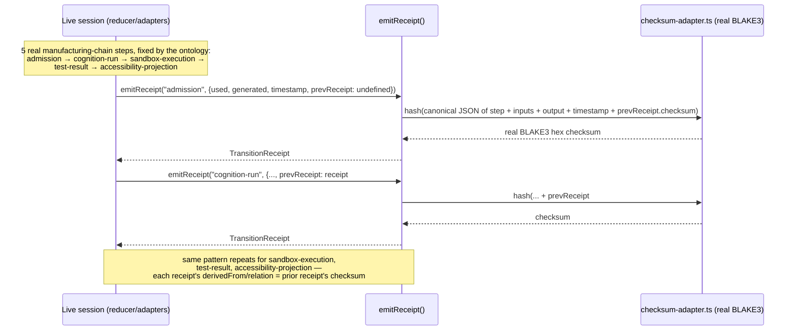
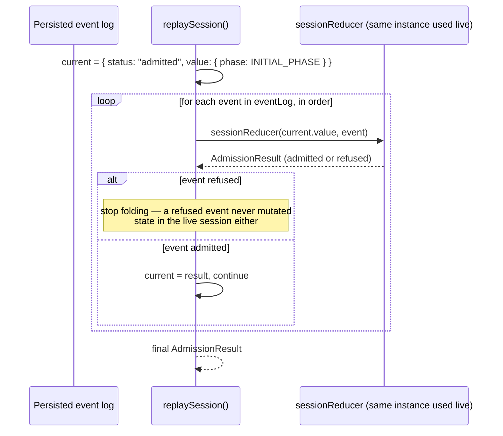

# Sequence: receipt chain emission and replay

Source: `examples/interview-assist/lib/domain/receipt-emitter.ts` and `lib/domain/replay.ts`, read
directly this session.

## Emission (live session)

`emitReceipt` is a pure function of its arguments — it never reads `Date.now()` internally, so it's
deterministically unit-testable. The caller supplies a real timestamp and the immediately-prior
receipt at the moment the real action happened.

## Replay (re-derivation, never trust)

Given an **untampered** log, `replaySession`'s output exactly reproduces the live session's final
state (acceptance-step/3, acceptance-step/4). Given a log with **any** event payload altered,
re-running `isLegalTransition` (via `sessionReducer`) independently re-derives a result that
diverges from the untampered replay whenever the alteration changes an admitted transition's
legality or the final phase reached — this divergence is the exact mechanism TICKET-049 (tamper
detection) depends on: the replayed final receipt's checksum won't match the original's.

No separate replay-specific transition table exists — `replaySession` reuses the same
`sessionReducer`/`isLegalTransition` the live session used, per Architecture Decision 12: replay
must independently revalidate every transition, never trust a persisted final state.

## See Also

- [sequence-cognition.md](sequence-cognition.md), [sequence-sandbox-execution.md](sequence-sandbox-execution.md) — the two steps that emit into this chain
- [unfinished-work.md](unfinished-work.md) — item 2 (TICKET-056 hardening: full end-to-end chain
  emission for one real session not yet re-confirmed) and item 1 (048/049, which depend on this
  replay/tamper mechanism, not yet confirmed passing)
