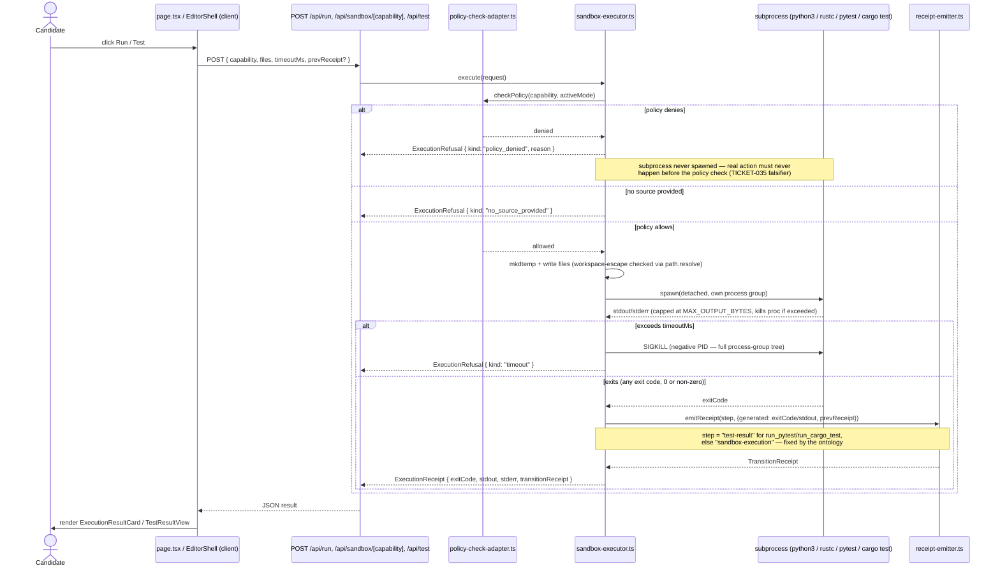

# Sequence: sandbox code execution flow

Source: `examples/interview-assist/lib/adapters/sandbox-executor.ts`, read directly this session.
Patterns reused verbatim (per that file's own module doc) from `examples/interview-sandbox/lib/
executor-contract.ts`: workspace-escape prevention, output-size capping, process-group cleanup.

Notes (grounded, not inferred):
- The policy check happens **before** any subprocess spawns — the real action (spawning) must
  never occur before authorization, per TICKET-035's own stated falsifier.
- A `TransitionReceipt` is attached on **any** real completed execution — success (exit 0) and
  real failure (non-zero exit, e.g. a syntax error) both count as a real action that occurred, so
  both get receipted. Only `ExecutionRefusal` (no real action ran: policy denial, no source,
  timeout) never carries one.
- The manufacturing-chain step name is fixed by the capability, not chosen ad hoc:
  `run_pytest`/`run_cargo_test` → `"test-result"`; every other capability → `"sandbox-execution"`.

## See Also

- [c4-component.md](c4-component.md) — where `sandbox-executor.ts` sits in the component graph
- [sequence-receipt-replay.md](sequence-receipt-replay.md) — how this step's receipt chains with
  the others
