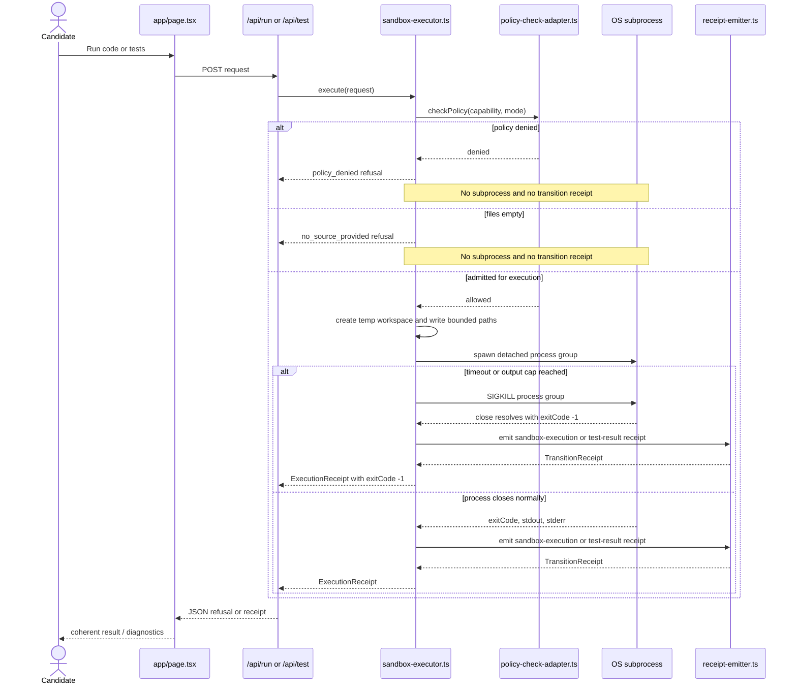
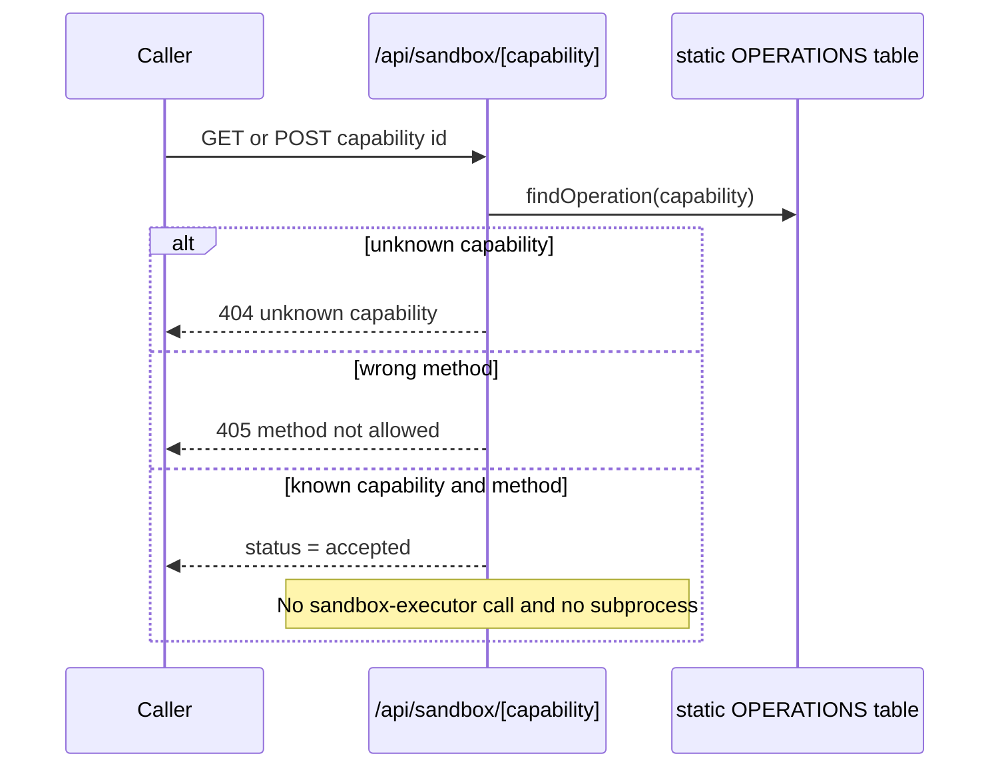

# Sequence: sandbox execution and capability catalog

**Re-verified:** 2026-07-24.

## Source commands executed

```text
GitHub.fetch_file repository_full_name=seanchatmangpt/wasm4pm path=examples/interview-assist/app/page.tsx ref=docs/v26.7.24-planning-diagramming
GitHub.fetch_file repository_full_name=seanchatmangpt/wasm4pm path=examples/interview-assist/app/api/run/route.ts ref=docs/v26.7.24-planning-diagramming
GitHub.fetch_file repository_full_name=seanchatmangpt/wasm4pm path=examples/interview-assist/app/api/test/route.ts ref=docs/v26.7.24-planning-diagramming
GitHub.fetch_file repository_full_name=seanchatmangpt/wasm4pm path=examples/interview-assist/app/api/sandbox/[capability]/route.ts ref=docs/v26.7.24-planning-diagramming
GitHub.fetch_file repository_full_name=seanchatmangpt/wasm4pm path=examples/interview-assist/lib/adapters/sandbox-executor.ts ref=docs/v26.7.24-planning-diagramming
GitHub.fetch_file repository_full_name=seanchatmangpt/wasm4pm path=examples/interview-assist/lib/adapters/policy-check-adapter.ts ref=docs/v26.7.24-planning-diagramming
```

## Real execution path



## Static capability-catalog path



## Current behavior and exclusions

- `/api/run` and `/api/test` are the real execution routes.
- `/api/sandbox/[capability]` is a static catalog/validation endpoint. Calling it is not evidence that code executed.
- Policy denial and empty-file input return typed refusals before process creation.
- The `ExecutionRefusal` type declares `timeout` and `payload_too_large`, but the current `runCommand()` implementation does not return those variants. It kills the process and resolves an execution result with `exitCode: -1`; `execute()` then emits a transition receipt because a real process ran.
- `run_pytest` and `run_cargo_test` emit step `test-result`; other real capabilities emit `sandbox-execution`.
- `runCode()` currently omits `prevReceipt`, so its emitted receipt is a chain head even when cognition already emitted a receipt. This is part of TICKET-056's confirmed integration break.

## See also

- [C4 container](c4-container.md)
- [Receipt and replay sequence](sequence-receipt-replay.md)
- [Unfinished work](unfinished-work.md)
