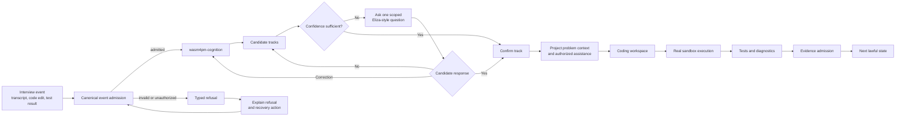
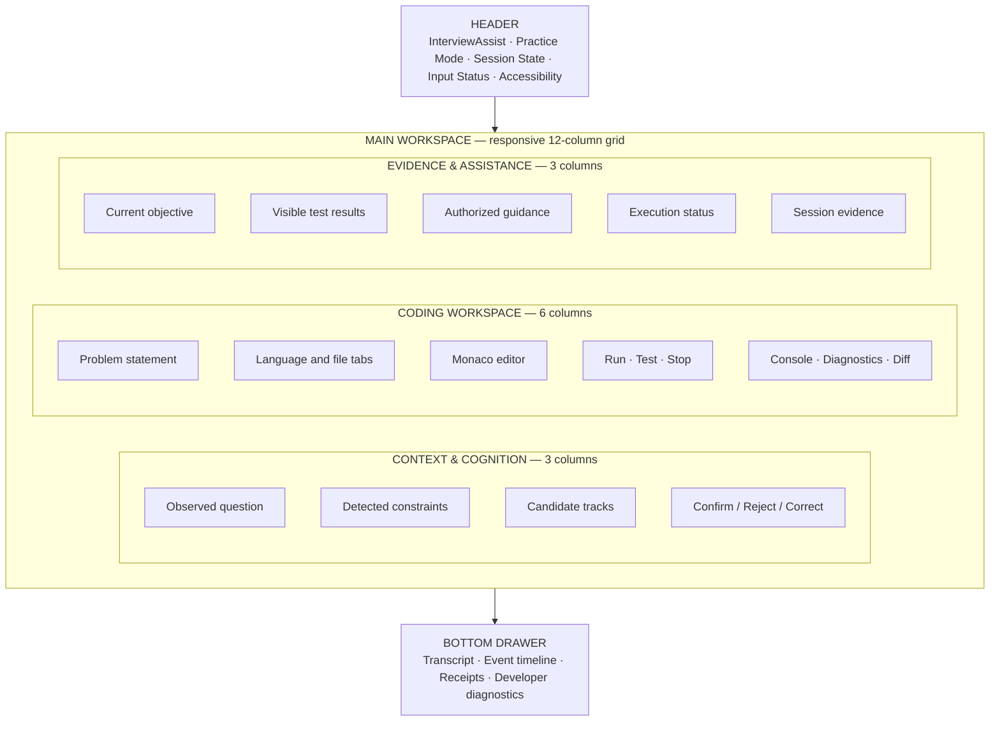
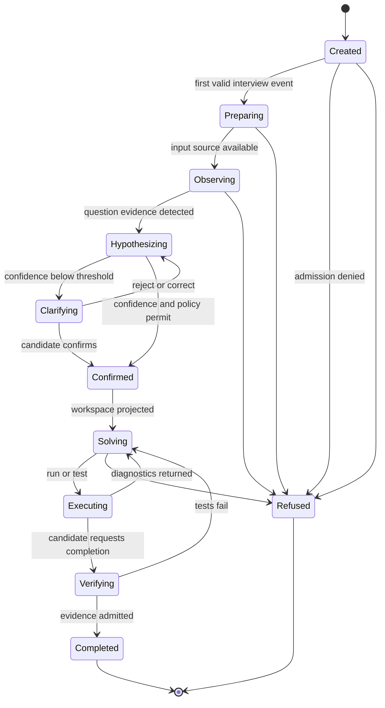
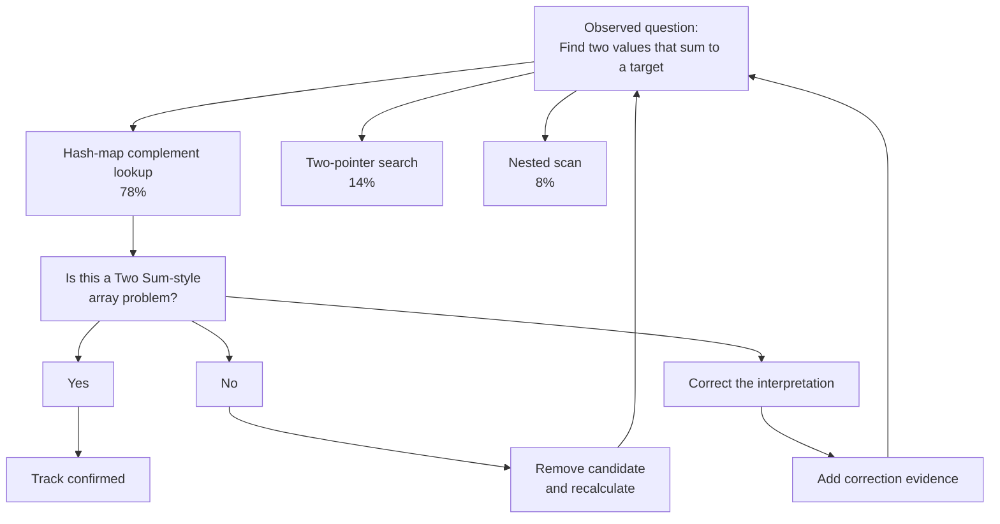
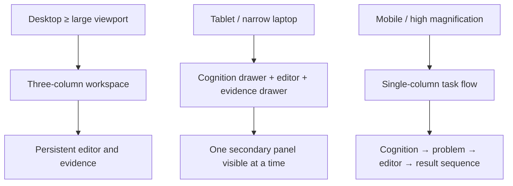

# UI/UX redesign spec

Canonical UI/UX specification for InterviewAssist, authored directly by the project owner. The specification diagrams remain the target interaction model; source-grounded corrections are fenced explicitly rather than silently rewriting the target.

**Re-verified:** 2026-07-24.

## Source commands executed for the grounded corrections

```text
GitHub.fetch_file repository_full_name=seanchatmangpt/wasm4pm path=examples/interview-assist/app/page.tsx ref=docs/v26.7.24-planning-diagramming
GitHub.fetch_file repository_full_name=seanchatmangpt/wasm4pm path=examples/interview-assist/lib/adapters/cognition-adapter.ts ref=docs/v26.7.24-planning-diagramming
GitHub.fetch_file repository_full_name=seanchatmangpt/wasm4pm path=examples/interview-assist/lib/domain/cognition-rules.ts ref=docs/v26.7.24-planning-diagramming
GitHub.fetch_file repository_full_name=seanchatmangpt/wasm4pm path=crates/wasm4pm-cognition/src/breeds/mod.rs ref=docs/v26.7.24-planning-diagramming
GitHub.fetch_file repository_full_name=seanchatmangpt/wasm4pm path=crates/wasm4pm-cognition/src/breeds/dendral.rs ref=docs/v26.7.24-planning-diagramming
```

The structural shell (`SessionHeader`, `SessionWorkspace`, `SessionActivityDrawer`, and `CognitionPanel`) is present in `examples/interview-assist/app/page.tsx`. Runtime completion and scenario standing remain tracked separately in [unfinished-work.md](unfinished-work.md).

## 1. Primary interaction model

The normal interface is driven by observed interview events and cognition — not manual state-transition buttons.



`Advance to PREPARING` and `Add track candidate` are not user actions. They are state-machine and cognition actions, and should not appear in the normal interface.

## 2. Professional desktop layout

A stable three-region workspace with a session timeline beneath it.



| Region | User-facing purpose |
|---|---|
| Header | Orientation: mode, state, audio/transcript status, accessibility |
| Left | What InterviewAssist thinks is happening |
| Center | Where the candidate solves the problem |
| Right | What happened, what is authorized, and what to do next |
| Bottom drawer | Transcript, event history, receipts, and technical diagnostics |

Raw capability identifiers shown as buttons belong in the developer diagnostics drawer, not the interview workspace.

## 3. Proposed screen structure

```mermaid
flowchart TD
    PAGE["InterviewAssist Session"]

    PAGE --> HEADER["SessionHeader"]
    PAGE --> MAIN["SessionWorkspace"]
    PAGE --> DRAWER["SessionActivityDrawer"]

    HEADER --> MODE["ModeBadge"]
    HEADER --> STATE["SessionState"]
    HEADER --> INPUT["InputStatus"]
    HEADER --> ACCESS["AccessibilityMenu"]

    MAIN --> COG["CognitionPanel"]
    MAIN --> EDITOR["CodingPanel"]
    MAIN --> EVIDENCE["EvidencePanel"]

    COG --> PROMPT["ObservedPrompt"]
    COG --> TRACKS["TrackCandidateList"]
    COG --> CONFIRM["TrackConfirmation"]
    COG --> WHY["WhyThisTrack"]

    EDITOR --> PROBLEM["ProblemHeader"]
    EDITOR --> TABS["WorkspaceTabs"]
    EDITOR --> MONACO["MonacoEditor"]
    EDITOR --> TOOLBAR["ExecutionToolbar"]
    EDITOR --> OUTPUT["OutputTabs"]

    EVIDENCE --> OBJECTIVE["CurrentObjective"]
    EVIDENCE --> TESTS["TestResults"]
    EVIDENCE --> GUIDANCE["AuthorizedGuidance"]
    EVIDENCE --> STATUS["ExecutionStatus"]

    DRAWER --> TRANSCRIPT["Transcript"]
    DRAWER --> EVENTS["EventTimeline"]
    DRAWER --> RECEIPTS["ReceiptInspector"]
    DRAWER --> DEBUG["DeveloperDiagnostics"]
```



## 4. Session state machine

Visible, but not manually operated.



Compact indicator: `Observing → Hypothesizing → Confirming → Solving → Verifying`. Only the current state and immediately relevant next action should be emphasized.

## 5. Eliza-style cognition panel

Instead of `Add track candidate`, a meaningful cognition surface:



### Grounded correction and decision

The currently wired Eliza call returns one keyword-matched `selected`/`explanation` pair, not a percentage-ranked candidate list. The 78%/14%/8% values above remain the target UX, not current runtime behavior. The current `CognitionPanel` renders one proposed track with Yes/No/Correct.

[ADR-001](../jira/v26.7.24/DECISIONS.md) resolves the implementation design:

```text
deterministic TypeScript scoring
  → ABI Candidate[]
  → real Dendral elimination and highest-survivor selection
  → real Eliza clarification question
```

TypeScript derives scores from admitted free-text evidence. Dendral supplies real breed provenance for elimination and survivor selection. Eliza supplies the scoped question text. This branch documents the decision but does not implement it.

## 6. Keyboard and screen-reader flow

```mermaid
flowchart LR
    A["Skip to current task"] --> B["Session status"]
    B --> C["Cognition question"]
    C --> D["Track choices"]
    D --> E["Problem statement"]
    E --> F["Editor"]
    F --> G["Run / Test / Stop"]
    G --> H["Execution result"]
    H --> I["Visible tests"]
    I --> J["Authorized guidance"]
    J --> K["Session actions"]
```



Accessibility contract — semantic landmarks:

```text
<header>   session identity and state
<nav>      workspace files and sections
<main>     active interview task
<aside>    cognition and evidence panels
<footer>   session controls
```

Behavioral requirements: visible focus indicator on every interactive control; no state change triggered by focus alone; execution results announced through a polite live region; refusals and fatal execution errors announced as alerts; focus returns to the initiating control after ordinary actions; after a track question appears, focus moves to its heading — not directly to Yes; editor shortcuts do not trap keyboard-only users; motion/density/contrast/captions/audio controls live in one accessible preferences dialog altering the same canonical state projection, not a parallel workflow.

## 7. Control-replacement table

| Current surface | Production replacement |
|---|---|
| `Advance to PREPARING` | Automatic transition after an admitted event |
| `Refuse session` | Session menu → End or refuse session |
| `Trigger admission refusal (demo)` | Developer diagnostics only |
| `No problem data yet` | Empty-state card explaining what input is awaited |
| `Add track candidate` | Automatic cognition output |
| Raw `editor/*` buttons | Editor toolbar, command palette, or diagnostics drawer |
| Plain textarea | Monaco with a plain-text accessibility fallback |
| Separate contradictory exit messages | One authoritative execution-result card |
| Sixteen inline accessibility checkboxes | Accessibility preferences dialog with profiles |
| `Finish session` | Contextual Submit for verification or End practice session |

## 8. Responsive behavior



## Immediate UI acceptance test

The redesigned first slice is complete when a user can:

1. Open InterviewAssist in practice mode.
2. Submit or replay an interview utterance.
3. See a track proposed by real `wasm4pm-cognition`.
4. Confirm or reject the track using keyboard only.
5. Receive the projected Python problem.
6. Write and run Python.
7. Read a single coherent execution result.
8. See tests and diagnostics.
9. Complete the session without using any manual phase-transition control.
10. Replay the session and reproduce the same visible state.

The professional interface is built around **cognition → confirmation → coding → evidence**, not around the internal capability inventory.

## See also

- [ADR-001](../jira/v26.7.24/DECISIONS.md)
- [Unfinished work](unfinished-work.md)
- [Cognition sequence](sequence-cognition.md)
- [Priority matrix](../jira/v26.7.24/README.md)
