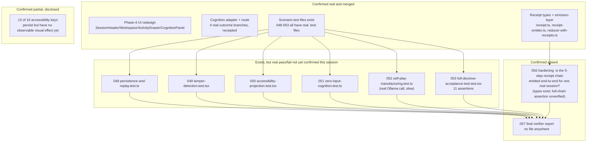

# Unfinished work

Grounded in `docs/jira/v26.7.24/README.md` §2 (re-verified this session via `grep`/`ls` against the
real filesystem, not the stale ggen ticket statuses, which marked several of these `PLANNED` while
real code/tests already existed on disk).

## Status map

## What "unfinished" concretely means right now

1. **Confirm 048–053 actually pass.** A `vitest run` across all six scenario files was started this
   session and did not complete within the observation window (self-play calls a real local Ollama
   model). Until that run's real output is read, none of the six may be marked ALIVE — they are
   `Unverified`, not `Done` and not `PLANNED`.
2. **TICKET-056 hardening.** The receipt *types* and emission *functions* are real (`receipt.ts`,
   `receipt-emitter.ts`), but whether the full 5-step chain (admission → cognition-run →
   sandbox-execution → test-result → accessibility-projection) is actually emitted end-to-end for
   one real session, with each step's `derivedFrom`/`relation` correctly chaining to the previous
   step's checksum, has not been re-confirmed this session.
3. **TICKET-057 final verifier report.** Confirmed absent by `find`. Cannot be honestly written
   until items 1–2 above produce real, quotable evidence — a report citing unverified claims would
   itself be an overclaim.
4. **Accessibility control effects.** Already-disclosed partial (per the ggen-side executive
   summary, re-affirmed here): 13 of 16 accessibility keys persist as state but don't yet drive an
   observable effect. Each remaining key needs either a real wired effect + test, or an explicit
   negative test asserting "persists, no visual effect yet" — not silence either way.

## See Also

- `docs/jira/v26.7.24/README.md` — the scored backlog and DoD rubrics these items map to
- [ui-ux-redesign.md](ui-ux-redesign.md) — the spec this work realizes
- [sequence-receipt-replay.md](sequence-receipt-replay.md) — the receipt chain item 2 concerns
