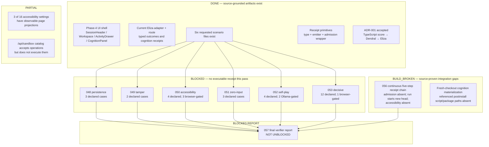

# Unfinished work

**Re-verified:** 2026-07-24.

This map separates source existence from executable standing. The local runtime could not obtain a checkout, so none of the six requested scenario files was executed in this pass.

## Verification commands executed

```text
cd ~/wasm4pm && git fetch origin && git checkout docs/v26.7.24-planning-diagramming && git status --short
# Failed: /home/oai/wasm4pm did not exist.

git clone --branch docs/v26.7.24-planning-diagramming --single-branch --depth 1 https://github.com/seanchatmangpt/wasm4pm.git /home/oai/wasm4pm
# Failed: Could not resolve host: github.com.

gh --version
# Failed: gh was not installed.

GitHub.fetch_commit_workflow_runs repo_full_name=seanchatmangpt/wasm4pm commit_sha=05b33494e0a181302f7ffb2c63944a288c662f7d
# Result: no workflow runs.
```

The source files and integration paths were read with `GitHub.fetch_file` against `ref=docs/v26.7.24-planning-diagramming`; the exact source ledger is in `docs/jira/v26.7.24/README.md` §0.

## Status map



## Scenario execution state

| Ticket/file | Declared cases from source | Exact pass/fail/skip count | Classification |
|---|---:|---|---|
| 048 `persistence-and-replay.test.ts` | 3 | unavailable — command did not run | BLOCKED |
| 049 `tamper-detection.test.tsx` | 2 | unavailable — command did not run | BLOCKED |
| 050 `accessibility-projection.test.tsx` | 4 | unavailable — command did not run | BLOCKED |
| 051 `zero-input-cognition.test.ts` | 3 | unavailable — command did not run | BLOCKED |
| 052 `self-play-manufacturing.test.ts` | 4 | unavailable — command did not run | BLOCKED |
| 053 `full-decisive-acceptance-test.test.tsx` | 12 | unavailable — command did not run | BLOCKED |

Required next command from a runnable checkout:

```bash
cd examples/interview-assist
npx vitest run \
  tests/scenarios/persistence-and-replay.test.ts \
  tests/scenarios/tamper-detection.test.tsx \
  tests/scenarios/accessibility-projection.test.tsx \
  tests/scenarios/zero-input-cognition.test.ts \
  tests/scenarios/self-play-manufacturing.test.ts \
  tests/scenarios/full-decisive-acceptance-test.test.tsx
```

Each file must then move independently to DONE, FAILING, or remain BLOCKED/SKIPPED. A green process summary is insufficient if environment-gated cases were skipped.

## Confirmed integration work

### TICKET-056 — continuous receipt chain

The intended chain is:

```text
admission → cognition-run → sandbox-execution → test-result → accessibility-projection
```

Source reads confirm these breaks:

- The page calls `sessionReducer()` instead of `admitWithReceipt()`, so admission has no live receipt.
- Cognition can chain from the current last receipt.
- `runCode()` omits `prevReceipt`, so sandbox execution starts a new chain head.
- Tests can chain from the current last receipt, but that may already be the broken sandbox head.
- Accessibility preference changes bypass the receipt-producing accessibility adapter.
- Finish session creates a separate event-label hash rather than closing the manufacturing chain.

TICKET-056 is therefore BUILD_BROKEN, not UNKNOWN.

### TICKET-057 — final verifier report

**TICKET-057 is not unblocked.** It remains gated on:

1. exact per-file scenario execution output; and
2. one real, continuous five-step receipt chain with replayable checksum links.

The report was intentionally not written.

## Additional drift found

- `/api/sandbox/[capability]` is a static operation catalog/validator, not a subprocess route.
- The persistence adapter uses filesystem JSON, not browser localStorage/IndexedDB.
- The current timeout/output-cap implementation kills the process and returns a receipted `exitCode: -1`; it does not emit the declared typed timeout/payload refusal variants.
- `full-decisive-acceptance-test.test.tsx` contains absolute `/Users/sac/ggen` paths and asserts that `next build` fails with an earlier regression; both facts require reconciliation before the file can be portable evidence in `wasm4pm`.
- `package.json` references a WASM materialization postinstall script whose cited tracked path was absent from this branch.

## See also

- [Priority matrix and evidence ledger](../jira/v26.7.24/README.md)
- [ADR-001](../jira/v26.7.24/DECISIONS.md)
- [Receipt/replay sequence](sequence-receipt-replay.md)
- [Sandbox sequence](sequence-sandbox-execution.md)
