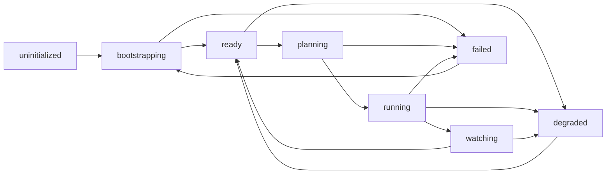

# Architecture Overview

wasm4pm is a process mining platform with a real Rust cognition kernel. High-performance algorithms compile to WebAssembly. **55** cognition breeds (including abductive reasoning, temporal logic, Bayesian networks, Autoinstinct, and ILP variants) run natively in Rust, exposed through a thin TypeScript boundary, surfaced through a single CLI binary (`wpm`).

The doctrine: **Old AI is the factory. LLMs are the brochure.**

## System Layers

```mermaid
graph TB
  CLI[wpm CLI] --> Kernel[packages/kernel]
  Kernel --> Engine[@wasm4pm/engine]
  Engine --> WASM[wasm4pm/pkg WASM]
  WASM --> Rust[crates/wasm4pm-algos]
  CLI --> Cognition[cognition breeds Rust-native]
  CLI --> Truex[truex verify BLAKE3]
```

| Layer | Responsibility |
|-------|----------------|
| **`apps/wasm4pm`** | CLI commands, OTEL spans, output formatting, config resolution |
| **`packages/kernel`** | Versioned API boundary — `Kernel.discover()`, registry, receipt hashing |
| **`packages/engine`** | WASM loader, init lifecycle, backend selection |
| **`wasm4pm/` (Cargo)** | Algorithm implementations, Truex canonicalization, cognition kernel |
| **`packages/contracts`** | Algorithm registry templates, alias resolution, typed failure codes |

**Rule:** CLI logic must not import Rust directly. All algorithm dispatch goes through `packages/kernel/src/api.ts` so validation, OTEL, and error taxonomies apply uniformly.

## Engine State Machine

The `@wasm4pm/engine` lifecycle is governed by a state machine that handles bootstrapping, execution, and self-healing.



**Key Transitions:**
- **bootstrap()**: `uninitialized` → `ready`. Loads WASM, initializes registry.
- **plan(config)**: `ready` → `planning` → `ready`. Validates config, selects algorithm.
- **run(plan)**: `ready` → `running` → `ready`. Dispatches to WASM.
- **watch(plan)**: `ready` → `watching`. Continuous execution on source change.
- **degrade(error)**: Transitions to `degraded` state for soft recovery.
- **recover()**: Attempts to return to `ready` from `failed` or `degraded`.

## Verified Integrity

wasm4pm is built with **Combinatorial Maximalism**. Every release is sealed with a **Release Certificate** that binds to the current commit and recomputes all evidence hashes.

- **Zero Suppression:** The Rust kernel passes `cargo clippy --workspace -- -D warnings` with zero `allow` attributes or suppressions.
- **Naturally Clean:** 100% of public items are documented to satisfy the `missing_docs` gate.
- **Adversarial Gates:** 8 runtime detectors (Stub, Authority, Replay, etc.) prevent false-pass patterns.
- **BLAKE3 Receipts:** CLI runs, cognition contracts, and Truex envelopes produce verifiable cryptographic receipts.

Evidence discipline: [AGENTS.md](../../AGENTS.md).

## Deployment Profiles

wasm4pm provides optimized WASM bundles for different deployment environments by gating features during compilation.

| Profile | Target | Actual Size | Use case |
|---------|--------|-------------|----------|
| `mobile` | Mobile devices | ~5.4MB | Mobile / low bandwidth |
| `iot` | IoT devices, embedded | ~5.4MB | Embedded |
| `edge` | CDN workers, edge servers | ~5.4MB | CDN / edge workers |
| `fog` | Fog computing, gateways | ~5.4MB | IoT gateways |
| `browser` | Web browsers (DEFAULT) | ~7.6MB | Web + Node.js (default) |

> Profiles differ by feature-gated algorithm subsets, not bundle size. Size optimization is planned for a future release.

See [Deployment Profiles Reference](../reference/deployment_profiles.md) for feature flags and build commands.

## Core Capabilities

**Discovery:** Registered algorithms spanning DFG, heuristic/inductive miners, genetic/ILP, OCEL, ML, prediction, conformance, and simulation. List live: `wpm algorithms`.

**Truex:** OCEL 2.0 canonicalization + BLAKE3 receipt verification via `wpm truex verify`. Profile: [Truex OCEL 2.0 Canonical Profile](../truex-ocel2-canonical-profile.md).

**Cognition:** 55 active breeds (all PARTIAL_ALIVE) via `wpm cognition run --contract <breed>`. Full list: `breeds/registry.json`.

**Prediction:** Next-activity, remaining-time, drift via `wpm predict`.

## CLI Surface

| Category | Commands |
|----------|----------|
| **Core** | `run`, `compare`, `diff`, `watch`, `init`, `algorithms` |
| **Prediction** | `predict`, `drift-watch` |
| **Analysis** | `ml`, `powl`, `quality`, `conformance`, `validate`, `simulate`, `temporal`, `social` |
| **Truex** | `truex verify` |
| **Governance** | `receipts`, `cell`, `autoprocess`, `status`, `doctor`, `explain`, `results` |
| **Cognition** | `cognition run`, `cognition verify`, `cognition replay`, `prolog8` |

## Documentation Map

We follow the [Diátaxis framework](https://diataxis.fr/).

- **Tutorials:** [Getting Started](../tutorials/getting_started.md), [Truex Receipts](../tutorials/truex_receipts.md), [Predictive Monitoring](../tutorials/predictive_monitoring.md), [Cognition Contracts](../tutorials/cognition_contracts.md)
- **How-To:** [OTEL Configuration](../how-to/configure_observability.md), [Edge Deployment](../how-to/edge_deployment.md), [Concept Drift](../how-to/concept_drift.md), [Troubleshooting](../how-to/troubleshooting.md)
- **Reference:** [CLI Commands](../reference/cli_commands.md), [Algorithms](../reference/algorithms.md), [Configuration Schema](../reference/configuration_schema.md), [Glossary](../reference/glossary.md)
- **Explanation:** [Old AI vs. LLM Doctrine](old_ai_vs_llms.md), [Receipt Truth Verification](prd_ard_receipt_truth_verification.md), [Process Mining Primer](process-mining-primer.md)

Programmatic usage: [Getting Started §3](../tutorials/getting_started.md).

## License

BUSL-1.1. See [LICENSE](../../LICENSE).

## Graph and Variant Analysis Example

`examples/09-graph-and-variants.ts` demonstrates DFG graph construction, variant extraction, and footprint comparison — a good starting point for understanding how the WASM core transforms raw event logs into structured process models:

```bash
tsx examples/09-graph-and-variants.ts data/small-example.xes
```
