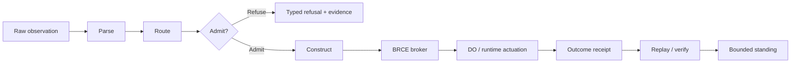
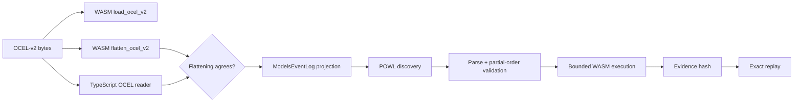
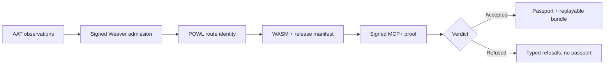

<!-- wasm4pm-doc-status: active; reviewed: 2026-08-02; original: docs/explanation/architecture_overview.md; source-sha256: 7d2c1bf91e2daf2d17e5a50e476f44176463b4ac5a7156fb1dfb2f2e89e29fb9; reason: canonical implemented architecture -->

# Architecture overview

wasm4pm is an evidence-oriented process-mining system with a Rust/WASM computational core and a TypeScript product surface. The architecture is organized around admission, lawful actuation, receipts, and replay—not around file proximity or optimistic status flags.

## Governing path

SELECT chooses a lawful route. CONSTRUCT manufactures a reversible plan or artifact. DO changes machine or external state. Only the BRCE boundary may authorize DO, and it must persist a pending receipt before actuation and an outcome receipt after the attempt.

## Implementation layers

| Layer | Primary paths | Responsibility |
|---|---|---|
| Rust/WASM core | `wasm4pm/`, selected `crates/` | Parsers, process algorithms, OCEL, POWL, conformance, runtime authority. |
| WASM loading | `packages/engine/` | Build-specific module initialization and exact export access. |
| Product kernel | `packages/kernel/` | Public algorithm dispatch, registry interpretation, validation, and typed results. |
| Public CLI | `apps/wasm4pm/` | Noun/verb routing, configuration, human/JSON projection, receipts, evidence workflows. |
| Development CLI | `crates/wasm4pm-cli/` | Rust development commands; not the complete public CLI contract. |
| Evidence and release | `apps/wasm4pm/src/receipts/`, `apps/wasm4pm/src/release/`, `scripts/release/` | Canonical hashes, receipt persistence, artifact identity, release replay. |
| Generated cognition surfaces | `ggen/`, `crates/wasm4pm-cognition/`, `packages/cognition/` | Ontology-derived breed registration and generated projections. |

A TypeScript wrapper cannot overturn a Rust/WASM refusal. A registry entry cannot prove dispatcher reachability. An emitted receipt cannot prove its own validity. Each claim must be verified at the real owning boundary.

## Capability calculus

`wpm system doctor capabilities` groups executable checks into twelve capability rails and returns one of:

- `UNKNOWN`
- `PARTIAL_ALIVE`
- `ALIVE`
- `BLOCKED`
- `BUILD_BROKEN`
- `UNSUPPORTED`

A capability can impose a ceiling when checks prove only a route declaration rather than complete execution. The report excludes wall-clock time from its deterministic evidence hash.

## Structured repair

The doctor repair broker replaces arbitrary shell-string fixes with registered actions:

- ensure a directory exists;
- write a file only when absent;
- spawn an executable with an explicit argument vector and `shell: false`.

Unknown repair identities are refused. Dry-run constructs a plan but does not become `ALIVE` when work remains. Process actions preserve `changed: null` when the exact filesystem consequence is not knowable.

## OCEL-v2 session composition

`wpm evidence session` is the executable composition root for object-centric process evidence:

The session hashes input bytes, normalized OCEL, event-log projection, model, execution output, and the complete evidence envelope. Missing exact exports, ungrouped events, empty episodes, flatten disagreement, validation failure, and replay drift are typed failures.

## AAT-Live admission

`wpm evidence live` composes external authority evidence with wasm4pm identities:

The five observation stages must be ordered. Weaver and MCP+ envelopes use canonical hashes and Ed25519 signatures. The admitted session, trace, POWL route, WASM bytes, release certificate, certificate verification, and Git commit must refer to the same subject graph.

## Release certificate

The release certificate verifier recomputes:

1. Package manifest identity.
2. Exact Git commit and deterministic commit timestamp.
3. Reachability evidence hash and counts.
4. Behavior evidence hash, case counts, and per-algorithm receipts.
5. Example file manifest.
6. Npm tarball identity, contents, SHA-1/SHA-256/SHA-512 integrity.
7. Node-target WASM bundle hash.
8. Canonical certificate self-hash.

The generator writes pending and outcome receipts, retains the actual tarball, writes the certificate atomically, and immediately runs the independent verifier.

## Generated surfaces

Generated cognition files are projections, not editing surfaces. The ontology and generation policy identified by the nearest `AGENTS.md` remain authoritative. Changes flow from admitted graph to generator to generated source to formal/runtime verification to receipts.

## Portability and deployment

WASM build target and feature set are part of artifact identity. Browser, Node, edge, or constrained deployment labels do not prove size or capability equivalence. Measure the exact emitted bundle and test the exact host boundary.

## Architecture standing

This document describes implemented routes present in source. Repository-wide `ALIVE` still requires execution of the complete claimed boundaries against one immutable commit. The crown conditions and falsifiers are defined in [`../VISION_2030.md`](../VISION_2030.md).
