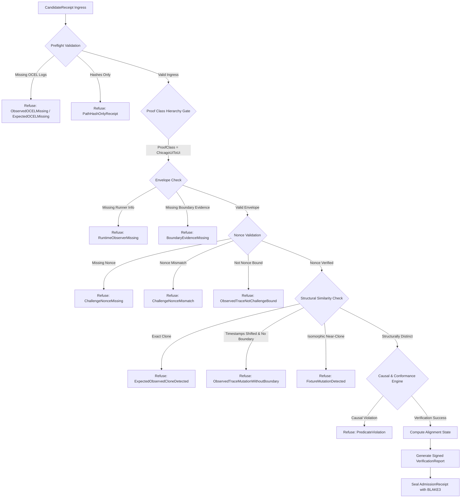

# PRD & ARD: Cryptographic Receipt Truth Verification & Adversarial Ingress Gates

This document establishes the Product Requirements Document (PRD) and Architecture Requirements Document (ARD) for the Receipt Truth Verification system in `wasm4pm`. It specifies the cryptographic, mathematical, and procedural boundaries that prevent synthetic or post-facto mutated receipts from being admitted into the execution history.

---

## 1. Product Requirements Document (PRD)

### 1.1 Problem Statement & Background
Under naive verification protocols, execution receipts assert verification status by presenting summaries (e.g., hash values, simple state assertions). This creates a critical loophole where a testing agent or malicious producer can bypass runtime UI testing by taking a golden expected fixture, shifting timestamps, changing metadata identifiers (e.g., `test_id`), and claiming a successful execution match. Because the resulting file has a different cryptographic hash from the expected fixture, simple hash-difference checks are bypassed, yet no real-world runtime execution occurred.

To address this, `wasm4pm` mandates **Adversarial Ingress Gates**. We establish a core axiom:
> **A receipt that contains only expected hash, observed hash, alignment state, and receipt hash is not a receipt. It is an unverifiable claim.**

### 1.2 Core Product Requirements

#### Requirement 1: Mandatory Embedded or Content-Addressable OCEL 2.0 Logs
The verification engine must have access to the actual sequence of event paths. Hashes are insufficient for admission. The receipt must embed the complete expected and observed Object-Centric Event Log (OCEL) 2.0 structures or reference immutable content-addressable storage (CAS) locations where they are retrieved and re-evaluated by the verifier.
- *Refusal Conditions:* `ObservedOCELMissing`, `ExpectedOCELMissing`, `PathHashOnlyReceipt`.

#### Requirement 2: Structural Mutation Detection (Anti-Tampering)
If the observed trace deviates from the expected model only by uniform time-shifting and metadata mutations (without runtime boundary evidence), the system must detect and reject it.
- *Refusal Condition:* `ObservedTraceMutationWithoutBoundary`.

#### Requirement 3: Mandatory Runtime Observer Envelope
For any receipt claiming execution on a live runner (e.g., `ChicagoProof.UIToUI`), the observed OCEL must include an envelope detailing the physical runner execution parameters (runner ID, runner kind, physical/simulator device ID, build ID, runtime session nonces, and start/end timestamps).
- *Refusal Condition:* `RuntimeObserverMissing`.

#### Requirement 4: Nonce-Bound Challenge-Response Loop
Before a test executes, a challenge nonce (128-bit cryptographically secure random value) must be minted and recorded. The runner must inject this nonce into the live execution stream, embedding it within the observed OCEL log events and raw output. The verifier checks that the nonce appears in the challenge manifest, the raw runner evidence, and the observed log events.
- *Refusal Conditions:* `ChallengeNonceMissing`, `ChallengeNonceMismatch`, `ObservedTraceNotChallengeBound`.

#### Requirement 5: Raw Runner Evidence Binding
Receipts must cryptographically bind the raw stdout, stderr, exit code, and reports of the test executor (e.g., Maestro, Detox, Playwright). Every event in the observed OCEL log that represents a UI interaction must point to corresponding events in this raw execution report.
- *Refusal Condition:* `BoundaryEvidenceMissing`.

#### Requirement 6: UI Event Provenance Logs
Observed OCEL logs must contain explicit lifecycle events representing the physical actions performed by the test runner (e.g., tap, visibility checks, input text entry) rather than domain-level process transitions.
- *Refusal Condition:* `SummaryOnlyReceipt`.

#### Requirement 7: Banned Self-Authored Alignment
Receipt producers are forbidden from self-certifying alignment. The field `alignment_state: "Passed"` is banned in candidate receipts. Alignment is computed dynamically by the verifier and sealed via a cryptographic signature.
- *Refusal Condition:* `SelfCertifiedAlignment`.

#### Requirement 8: Canonical OCEL 2.0 Serialization
The verifier must parse and canonicalize the OCEL 2.0 structures prior to hash calculation. This guarantees byte-for-byte reproducibility regardless of structural key ordering or whitespace formatting.
- *Refusal Condition:* `PathHashOnlyReceipt`.

#### Requirement 9: Near-Clone Fixture Mutation Detection
The verifier must perform structural isomorphism and temporal offset checks to identify when an observed log is a "near-clone" of an expected fixture.
- *Refusal Condition:* `FixtureMutationDetected`.

#### Requirement 10: Proof Class Hierarchy Enforcement
The system must enforce a strict, non-bypassable proof class hierarchy. A receipt cannot claim a high-integrity proof class (e.g., `ChicagoProof.UIToUI`) unless all boundary and runtime envelope conditions are met.
- *Refusal Condition:* `ProofClassOverclaimed`.

---

## 2. Refusal States Reference Manual

The following table defines the complete, non-overlapping refusal codes that the `wasm4pm` verification engine enforces.

| Refusal Code | Category | Description | Severity |
|---|---|---|---|
| `ObservedOCELMissing` | Ingress Validation | The observed OCEL 2.0 event log is absent from the receipt and cannot be retrieved from CAS. | **DENY** |
| `ExpectedOCELMissing` | Ingress Validation | The expected golden OCEL 2.0 path is absent from the receipt and cannot be retrieved from CAS. | **DENY** |
| `PathHashOnlyReceipt` | Ingress Validation | The receipt contains only expected and observed hash strings without the backing event data. | **DENY** |
| `ObservedTraceMutationWithoutBoundary` | Adversarial Detection | The observed trace has changed timestamps or identifiers but lacks any runtime runner boundary evidence. | **DENY** |
| `RuntimeObserverMissing` | Envelope Verification | The runner metadata block (runner_id, session_nonce, runtime environment) is missing. | **DENY** |
| `ChallengeNonceMissing` | Cryptographic Check | The pre-minted challenge nonce is missing from the receipt context. | **DENY** |
| `ChallengeNonceMismatch` | Cryptographic Check | The nonce found in the observed trace does not match the challenge nonce minted prior to the run. | **DENY** |
| `ObservedTraceNotChallengeBound` | Cryptographic Check | The challenge nonce is not dynamically bound into the observed event payload or raw runner logs. | **DENY** |
| `BoundaryEvidenceMissing` | Evidence Validation | The raw test executor logs (exit code, command hash, stdout/stderr hashes) are absent. | **DENY** |
| `SummaryOnlyReceipt` | Event Provenance | The observed OCEL contains only a summary or domain transition without granular UI interaction events. | **DENY** |
| `SelfCertifiedAlignment` | Authority Check | The receipt contains an alignment state asserted by the producer rather than calculated by the verifier. | **DENY** |
| `FixtureMutationDetected` | Adversarial Detection | Structural similarity analysis indicates the observed log is an isomorphic mutation of the expected fixture. | **DENY** |
| `ProofClassOverclaimed` | Hierarchy Check | The receipt claims a high proof class (e.g., `ChicagoProof.UIToUI`) but only satisfies lower bounds. | **DENY** |

---

## 3. Architecture Requirements Document (ARD)

### 3.1 Data Structures & Schemas

The verifier consumes a `CandidateReceipt` and outputs a signed `VerificationReport` which compiles into the final `AdmissionReceipt`.

#### 3.1.1 Candidate Receipt Schema (JSON)
```json
{
  "$schema": "https://wasm4pm.org/schemas/candidate-receipt.v1.json",
  "receipt_class": "CandidateReceipt",
  "proof_class": "ChicagoProof.UIToUI",
  "challenge_nonce": "9f8a7b6c5d4e3f2a1b0c9d8e7f6a5b4c",
  "expected_ocel2": {
    "ocel": "2.0",
    "events": [
      {
        "id": "evt_001",
        "activity": "pastor.auth.started",
        "timestamp": "2026-05-21T12:00:00Z",
        "objects": ["obj_pastor"]
      }
    ],
    "objects": [
      {
        "id": "obj_pastor",
        "type": "user",
        "attributes": {
          "role": "pastor"
        }
      }
    ]
  },
  "observed_ocel2": {
    "ocel": "2.0",
    "events": [
      {
        "id": "evt_obs_001",
        "activity": "pastor.auth.started",
        "timestamp": "2026-05-21T15:45:00Z",
        "objects": ["obj_pastor"]
      }
    ],
    "objects": [
      {
        "id": "obj_pastor",
        "type": "user",
        "attributes": {
          "role": "pastor"
        }
      }
    ]
  },
  "runtime_observer": {
    "runner_id": "maestro-runner-8f2e9",
    "runner_kind": "Maestro",
    "simulator_id": "ios-sim-iphone15-9c8d",
    "app_build_id": "zoela-ios-1.0.42-release",
    "runtime_session_id": "d7c8b9a0-e1f2-3d4c-5b6a-7f8e9d0c1b2a",
    "run_started_at": "2026-05-21T15:44:50Z",
    "run_completed_at": "2026-05-21T15:45:30Z"
  },
  "boundary_evidence": {
    "runner": "maestro",
    "command_hash": "2f65dc9dd706203462ef92bc4815f24bec61159f8c8d8f8e8a8b8c8d8e8f8a8b",
    "stdout_hash": "8c8d8f8e8a8b8c8d8e8f8a8b2f65dc9dd706203462ef92bc4815f24bec61159f",
    "stderr_hash": "e3b0c44298fc1c149afbf4c8996fb92427ae41e4649b934ca495991b7852b855",
    "exit_code": 0,
    "raw_report_hash": "a1b2c3d4e5f6a7b8c9d0e1f2a3b4c5d6e7f8a9b0c1b2c3d4e5f6a7b8c9d0e1f2",
    "screenshots_hash": "c3d4e5f6a7b8c9d0e1f2a3b4c5d6e7f8a9b0c1b2c3d4e5f6a7b8c9d0e1f2a1b2"
  }
}
```

### 3.2 Rust Kernel Verification Constructs

```rust
use serde::{Serialize, Deserialize};
use std::collections::BTreeMap;

#[derive(Debug, Clone, Copy, PartialEq, Eq, Serialize, Deserialize)]
pub enum ProofClass {
    FixtureProof,
    PredicateProof,
    #[serde(rename = "ChicagoProof.UIToUI")]
    ChicagoUiToUi,
    BoundaryProof,
}

#[derive(Debug, Clone, Serialize, Deserialize)]
pub struct Ocel2Log {
    pub ocel: String,
    pub events: Vec<OcelEvent>,
    pub objects: Vec<OcelObject>,
}

#[derive(Debug, Clone, Serialize, Deserialize)]
pub struct OcelEvent {
    pub id: String,
    pub activity: String,
    pub timestamp: String,
    pub objects: Vec<String>,
    #[serde(default)]
    pub attributes: BTreeMap<String, serde_json::Value>,
}

#[derive(Debug, Clone, Serialize, Deserialize)]
pub struct OcelObject {
    pub id: String,
    pub r#type: String,
    #[serde(default)]
    pub attributes: BTreeMap<String, serde_json::Value>,
}

#[derive(Debug, Clone, Serialize, Deserialize)]
pub struct RuntimeObserverEnvelope {
    pub runner_id: String,
    pub runner_kind: String,
    pub simulator_id: Option<String>,
    pub device_id: Option<String>,
    pub app_build_id: String,
    pub runtime_session_id: String,
    pub run_started_at: String,
    pub run_completed_at: String,
}

#[derive(Debug, Clone, Serialize, Deserialize)]
pub struct BoundaryEvidence {
    pub runner: String,
    pub command_hash: String,
    pub stdout_hash: String,
    pub stderr_hash: String,
    pub exit_code: i32,
    pub raw_report_hash: String,
    pub screenshots_hash: String,
}

#[derive(Debug, Clone, Serialize, Deserialize)]
pub struct CandidateReceipt {
    pub receipt_class: String,
    pub proof_class: ProofClass,
    pub challenge_nonce: Option<String>,
    pub expected_ocel2: Option<Ocel2Log>,
    pub observed_ocel2: Option<Ocel2Log>,
    pub runtime_observer: Option<RuntimeObserverEnvelope>,
    pub boundary_evidence: Option<BoundaryEvidence>,
}
```

### 3.3 The Verification Pipeline

The verification engine enforces transitions through a sequence of validation stages:



### 3.4 Mathematical Formulations

#### 3.4.1 Challenge Nonce Chain Binding
Let $C_N$ be the 128-bit random challenge nonce generated prior to test execution:
$$C_N \in \{0, 1\}^{128}$$

Let $R_{run\_id}$ be the runner identifier generated by hashing the route identifier ($ID_{route}$), the challenge nonce ($C_N$), and the start timestamp ($T_{start}$):
$$R_{run\_id} = \text{BLAKE3}(ID_{route} \parallel C_N \parallel T_{start})$$

The observed OCEL log $L_{obs}$ is a set of events $E$. The challenge binding constraint requires that there exists at least one event $e_{bind} \in E$ representing the injection interface and containing $C_N$ within its attributes:
$$\exists e \in E \text{ s.t. } \text{Attr}(e)[\text{"challenge\_nonce"}] = C_N$$

Furthermore, the raw runner output hash ($H_{stdout}$) must cryptographically bind the nonce string representation:
$$\text{Contains}(StdoutRaw, \text{Hex}(C_N)) \implies \text{BLAKE3}(StdoutRaw) = H_{stdout}$$

#### 3.4.2 Structural Similarity Index ($S_{sim}$) for Near-Clone Detection
To catch post-facto mutated fixtures, the verifier transforms an OCEL log into a canonical topological structure $G = (V, A, R)$ where:
- $V$ is the set of events, stripped of their unique UUIDs, test IDs, and absolute timestamps.
- $A$ is the array of activities corresponding to $V$.
- $R$ is the set of object-centric relations.

Let the timeline transformation function $\phi(e)$ represent the event timestamp relative to the first event $e_0$ in the sequence:
$$\phi(e_i) = t(e_i) - t(e_0)$$

For two logs, Expected ($G_{exp}$) and Observed ($G_{obs}$), we define structural similarity $S_{sim}$ based on sequence isomorphism. Let $A_{exp}$ and $A_{obs}$ be the ordered sequence of activities.
Let $D_{\Delta t}$ be the set of relative time intervals between consecutive events:
$$\Delta t_i = \phi(e_{i}) - \phi(e_{i-1})$$

A structural similarity check calculates the Jaccard distance of the activity sequence:
$$J(A_{exp}, A_{obs}) = \frac{|A_{exp} \cap A_{obs}|}{|A_{exp} \union A_{obs}|}$$

If $J(A_{exp}, A_{obs}) = 1.0$, and the object relation maps are isomorphic, the verifier checks the variance of the relative time intervals $\Delta t$.
Let $\delta_i = \Delta t_i^{obs} - \Delta t_i^{exp}$. If the variance of $\delta$ is zero ($\text{Var}(\delta) = 0$), it implies that timestamps were shifted by a uniform constant offset:
$$t(e_i^{obs}) = t(e_i^{exp}) + \Delta T_{\text{offset}}$$

If a uniform constant offset is detected ($Var(\delta) = 0$), and no real runner boundary evidence is present in the envelope, the verifier triggers:
- `FixtureMutationDetected` if $J(A_{exp}, A_{obs}) = 1.0$ and object graphs match.
- `ObservedTraceMutationWithoutBoundary` if timestamps are mutated but the runtime observer envelope is absent.

#### 3.4.3 Canonicalization of OCEL 2.0 Logs
To ensure deterministic verification, the OCEL 2.0 object must be canonicalized before hashing:
1. All events must be sorted lexicographically by their activity name, then by their timestamp, and then by event ID.
2. All objects must be sorted lexicographically by their object ID.
3. Whitespace must be stripped, formatting the JSON as a minified string.
4. Cryptographic hashes must be calculated over the canonicalized byte stream using BLAKE3.

---

## 4. CLI Tool Surface & Command Specifications

The `wasm4pm` CLI (`wpm`) implements receipt audit commands under the `wpm receipt` subcommand hierarchy.

### 4.1 CLI Commands Reference

#### `wpm receipt doctor`
Audits a candidate receipt against all Adversarial Ingress Gates.
- **Syntax:** `wpm receipt doctor <file> [--strict] [--format <format>] [--audience <audience>]`
- **Options:**
  - `--strict`: Terminate with exit code `1` if any warning or deny finding is identified.
  - `--format <format>`: Output results in `human` or `json`.
  - `--audience <audience>`: Partition output detail based on user profile:
    - `producer`: Sanitized diagnostic reports containing action recommendations (hides forensics).
    - `operator`: Complete trace forensics and adversarial findings reports.
- **Refusal Code Mapping:** Returns the exact refusal code string (e.g., `FixtureMutationDetected`) on failure.

#### `wpm receipt verify-ocel2`
Validates that the embedded expected and observed OCEL 2.0 logs are structurally valid, follow schema constraints, and recompute to match their declared hashes.
- **Syntax:** `wpm receipt verify-ocel2 <file>`
- **Refusal Code:** `PathHashOnlyReceipt` if logs are not present.

#### `wpm receipt detect-fixture-mutation`
Runs the structural similarity index engine ($S_{sim}$) and temporal variance analysis over the expected and observed paths.
- **Syntax:** `wpm receipt detect-fixture-mutation <file>`
- **Refusal Code:** `FixtureMutationDetected` or `ObservedTraceMutationWithoutBoundary`.

#### `wpm receipt verify-boundary-evidence`
Verifies that the `boundary_evidence` block exists, matches physical execution output, and matches the runner's exit parameters.
- **Syntax:** `wpm receipt verify-boundary-evidence <file>`
- **Refusal Code:** `BoundaryEvidenceMissing`.

#### `wpm receipt verify-proof-class`
Validates that the declared `proof_class` corresponds to the level of evidence supplied in the receipt.
- **Syntax:** `wpm receipt verify-proof-class <file>`
- **Refusal Code:** `ProofClassOverclaimed`.

#### `wpm receipt verify-challenge`
Checks that the challenge nonce exists, is cryptographically bound to the observed events and runner logs, and matches the pre-run challenge manifest.
- **Syntax:** `wpm receipt verify-challenge <file>`
- **Refusal Code:** `ChallengeNonceMissing`, `ChallengeNonceMismatch`, `ObservedTraceNotChallengeBound`.

#### `wpm receipt canonicalize-ocel2`
Outputs the canonicalized, sorted, and minified representation of the embedded OCEL logs alongside their BLAKE3 hashes.
- **Syntax:** `wpm receipt canonicalize-ocel2 <file>`

#### `wpm receipt producer-safe-report`
Generates a sanitized report for external integration, hiding structural internals while showing verification outcome and correction steps.
- **Syntax:** `wpm receipt producer-safe-report <file>`

#### `wpm receipt operator-private-report`
Generates the internal forensics report including raw hash comparisons, Jaccard similarity metrics, and structural deviation steps.
- **Syntax:** `wpm receipt operator-private-report <file>`

---

## 5. Architectural Closure Checklist

For this specification to be complete and admitted:
1. **Implementation of All Refusal Enums:** The Rust kernel's `ReceiptTruthRefusal` enum must contain all 13 mapped refusal states.
2. **Cli Subcommand Dispatching:** The clap command parser in `crates/wasm4pm-cli` must route all 9 commands defined in Section 4.
3. **Pure Verification Logic:** The `ReceiptDoctor::audit` engine must execute the structural similarity check, challenge nonce check, and boundary checks in sequence.
4. **No Suppressions:** Verification logic must contain zero placeholder bypasses or suppressed checks.
