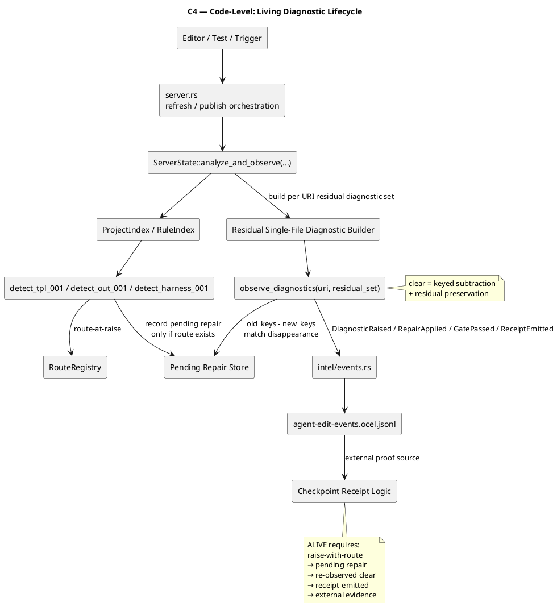

# ggen + wasm4pm C4 Architecture

This document contains the complete C4 model for the **ggen Living LSP + Open Ontology + receipts + wasm4pm** architecture.

## 1) C1 — System Context
```plantuml
@startuml C1_GGEN_Living_LSP_Context
!include https://raw.githubusercontent.com/plantuml-stdlib/C4-PlantUML/master/C4_Context.puml

title C1 — ggen Living LSP / Open Ontology / Receipted Manufacturing

Person(author, "Author / Architect", "Edits source-law surfaces and reviews diagnostics")
Person(agent, "Autonomous Workcell / Agent", "Performs bounded repairs under checkpoint law")

System_Ext(editor, "Editor / IDE", "LSP client surface")
System_Ext(git, "Git / GitHub", "Version control, PRs, branch history")
System_Ext(wasm4pm, "wasm4pm / wpm", "Process-mining, discovery, conformance, OCEL analysis authority")
System_Ext(ci, "CI / Build Gates", "Repository-wide verification and policy gates")

System_Boundary(ggen_boundary, "ggen") {
  System(ggen, "ggen CodeManufactory", "Receipted software manufacturing system. Open-ontology source law, Living LSP, actuation boundary, receipts, replay.")
}

Rel(author, editor, "Authors ggen.toml, SPARQL, templates, ontology, proof surfaces")
Rel(agent, editor, "Operates through bounded author-time surfaces")
Rel(editor, ggen, "LSP requests / diagnostics / code actions")
Rel(author, git, "Commits / reviews / merges")
Rel(agent, git, "Works through bounded branch / PR flow")
Rel(ggen, git, "Reads repository state, receipts, source-law surfaces")
Rel(ggen, ci, "Runs verification gates and checks")
Rel(ggen, wasm4pm, "Emits OCEL/process evidence for external mining and conformance")
Rel(wasm4pm, ggen, "Returns external conformance / process-law judgment")
Rel(git, ggen, "Provides stable source graph O*")

@enduml
```

## 2) C2 — Container Diagram
```plantuml
@startuml C2_GGEN_Living_LSP_Containers
!include https://raw.githubusercontent.com/plantuml-stdlib/C4-PlantUML/master/C4_Container.puml

title C2 — ggen Containers

Person(author, "Author / Architect")
Person(agent, "Autonomous Workcell / Agent")
System_Ext(editor, "Editor / IDE")
System_Ext(wasm4pm, "wasm4pm / wpm")
System_Ext(git, "Git / GitHub")
System_Ext(ci, "CI / Build Gates")

System_Boundary(ggen_boundary, "ggen") {

  Container(lsp, "ggen-lsp", "Rust", "Read-only Living LSP. Project-relation diagnostics, lifecycle observation, route law, residual-preserving clears, headless check.")
  Container(sync, "ggen sync", "Rust CLI", "Only lawful actuation boundary. Materializes outputs from admitted source law.")
  Container(core, "ggen-core", "Rust", "Rule loading, orchestration, sync execution, repository work laws.")
  Container(ontology, "Open Ontology / Source-Law Layer", "RDF / SPARQL / SHACL / PROV-O / DCTERMS / SKOS", "Public-footed source law, ontology surfaces, query logic, validation footing.")
  Container(graph, "ggen-graph", "Rust", "Indexes project relations and holds OCEL/event-related domain structures.")
  Container(intel, "Receipt / Intel / OCEL Log", "NDJSON / OCEL stream", "Externalized process evidence and receipt chain emitted by Living LSP and related work.")
  Container(receipts, "Checkpoint Receipts", "Markdown / files", "Checkpoint verdicts, gate outcomes, scope audit, external proof references.")
}

Rel(author, editor, "Uses")
Rel(agent, editor, "Uses")
Rel(editor, lsp, "LSP protocol")
Rel(lsp, ontology, "Reads and evaluates source-law relations")
Rel(lsp, graph, "Builds relation indexes / diagnostic context")
Rel(lsp, intel, "Appends process-evidence events")
Rel(lsp, receipts, "References proof obligations / prior receipts")
Rel(lsp, core, "Uses shared project loading and rule discovery")
Rel(sync, core, "Uses")
Rel(sync, ontology, "Consumes admitted source law")
Rel(sync, graph, "Reads indexed rules / graph context")
Rel(sync, receipts, "Emits or updates boundary receipts")
Rel(sync, intel, "May append actuation-related evidence")
Rel(git, lsp, "Repository source graph O*")
Rel(git, sync, "Repository source graph O*")
Rel(ci, lsp, "Runs headless ggen lsp check")
Rel(ci, sync, "Runs verification / integration gates")
Rel(intel, wasm4pm, "Provided as external OCEL/process evidence")
Rel(wasm4pm, receipts, "Provides external process-law judgment usable in receipts")

@enduml
```

## 3) C3 — Component Diagram for `ggen-lsp`
```plantuml
@startuml C3_GGEN_LSP_Components
!include https://raw.githubusercontent.com/plantuml-stdlib/C4-PlantUML/master/C4_Component.puml

title C3 — ggen-lsp Components

Container_Boundary(lsp, "ggen-lsp") {

  Component(server, "Language Server Surface", "server.rs", "LSP entry points, request handling, refresh triggers, republish flow")
  Component(state, "ServerState / Living Lifecycle Core", "state.rs", "observe_diagnostics, keyed subtraction, residual preservation, pending repair tracking, analyze_and_observe seam")
  Component(check, "Headless Check Surface", "check.rs", "Stateless repository validation; invalid fails / repaired passes")
  Component(project_index, "ProjectIndex / RuleIndex", "indexing", "Project-wide relation indexing across rules, queries, templates, output declarations")
  Component(tera_analyzer, "Tera Analyzer", "analyzers/tera_analyzer.rs", "Consumer-set extraction from templates")
  Component(harness_analyzer, "Harness / Proof Analyzer", "future or active species analyzer", "Proof-topology / harness relation checking")
  Component(detectors, "Diagnostic Detectors", "detect_tpl_001, detect_out_001, detect_harness_001", "Project-relation diagnostics over indexed source-law surfaces")
  Component(species, "Diagnostic Species Registry", "route/diagnostic_species.rs", "Declares active, dormant, and checkpoint-gated species")
  Component(routes, "Route Registry", "route/registry.rs", "Maps diagnostics to source-law repair families and routes")
  Component(law_surfaces, "Law Surface Discovery", "surface discovery", "Maps files and URIs to source-law roles")
  Component(events, "Event Builders", "intel/events.rs", "Builds DiagnosticRaised, RouteSelected, RepairApplied, GatePassed, ReceiptEmitted, etc.")
  Component(log, "Intel Log Writer", "intel/log.rs", "Append-only OCEL/NDJSON emission")
  Component(receipt_logic, "Receipt / Gate Correlation", "state + intel integration", "Correlates clear-through-lifecycle with receipt-worthy closure")
}

Rel(server, state, "Delegates live observation to")
Rel(server, check, "Triggers or parallels")
Rel(check, project_index, "Builds relation context from")
Rel(state, project_index, "Builds / refreshes relation context from")
Rel(project_index, tera_analyzer, "Uses")
Rel(project_index, harness_analyzer, "Uses")
Rel(project_index, law_surfaces, "Uses")
Rel(detectors, project_index, "Reads producer/consumer relation state from")
Rel(detectors, species, "Uses species definitions from")
Rel(detectors, routes, "Resolves route-at-raise through")
Rel(check, detectors, "Executes")
Rel(state, detectors, "Executes through live orchestration")
Rel(state, events, "Builds lifecycle events through")
Rel(events, log, "Writes events to")
Rel(state, receipt_logic, "Uses")
Rel(receipt_logic, log, "Emits receipt-related evidence to")
Rel(state, routes, "Matches pending repairs to routes")
Rel(state, species, "Checks active/dormant status")

@enduml
```

## 4) C3 — Open Ontology / Source-Law Subsystem
```plantuml
@startuml C3_Open_Ontology_Subsystem
!include https://raw.githubusercontent.com/plantuml-stdlib/C4-PlantUML/master/C4_Component.puml

title C3 — Open Ontology / Source-Law Subsystem

Container_Boundary(ontology, "Open Ontology / Source-Law Layer") {

  Component(ggen_toml, "ggen.toml Rule Surface", "TOML", "Declares project, ontology, generation rules, query/template/output bindings")
  Component(ontology_docs, "Ontology Sources", "TTL / RDF", "Public-footed domain and source-law definitions")
  Component(sparql_queries, "SPARQL Query Surfaces", ".rq", "Producer-set declarations")
  Component(templates, "Template Surfaces", ".tera", "Consumer-set declarations")
  Component(outputs, "Output Path Declarations", "output_file", "Declared artifact path law")
  Component(shacl, "Validation Shapes", "SHACL", "Graph constraint and structural validation")
  Component(provenance, "Provenance / Public Vocabulary Layer", "PROV-O / DCTERMS / SKOS", "Meaning-bearing public footing for provenance, labeling, and relation context")
}

Rel(ggen_toml, sparql_queries, "Binds")
Rel(ggen_toml, templates, "Binds")
Rel(ggen_toml, outputs, "Declares")
Rel(ggen_toml, ontology_docs, "References")
Rel(ontology_docs, shacl, "Validated by / constrained through")
Rel(ontology_docs, provenance, "Framed with")
Rel(sparql_queries, provenance, "Interpreted in public footing")
Rel(templates, provenance, "Interpreted in public footing")
Rel(outputs, provenance, "Interpreted in public footing")

@enduml
```

## 5) C3 — Receipt / OCEL / Process-Evidence Subsystem
```plantuml
@startuml C3_Receipt_OCEL_ProcessEvidence
!include https://raw.githubusercontent.com/plantuml-stdlib/C4-PlantUML/master/C4_Component.puml

title C3 — Receipt / OCEL / Process-Evidence Subsystem

Container_Boundary(evidence, "Receipt / OCEL / Process Evidence") {

  Component(event_builders, "Event Builders", "intel/events.rs", "Constructs object-centric events for diagnostic lifecycle")
  Component(ocel_stream, "OCEL Event Stream", ".ggen/ocel/agent-edit-events.ocel.jsonl", "Append-only NDJSON event stream")
  Component(receipt_docs, "Checkpoint Receipts", "docs/receipts/*.md", "Checkpoint verdicts and boundary receipts")
  Component(replay_packets, "Replay / Process Memory Packets", "future artifact", "Receipted process slices used for few-shot/build-shot continuation")
}

System_Ext(wasm4pm, "wasm4pm / wpm", "External process-law oracle")
System_Ext(ocel_core, "ocel-core", "Shared OCEL types")
System_Ext(ci, "CI / gates", "Verification runner")

Rel(event_builders, ocel_core, "Uses shared event/object types from")
Rel(event_builders, ocel_stream, "Appends to")
Rel(ocel_stream, wasm4pm, "Imported / mined / conformed by")
Rel(wasm4pm, receipt_docs, "Provides process-law judgment for")
Rel(receipt_docs, replay_packets, "Used to derive")
Rel(ocel_stream, replay_packets, "Used to derive")
Rel(ci, receipt_docs, "Reads / validates")
Rel(ci, ocel_stream, "Uses as external evidence surface")

@enduml
```

## 6) C4 — Code-Level Diagram for the Living Diagnostic Lifecycle


## Interpretation Compression
```text
ggen.toml says what should be built.
Open Ontology says what it means.
ggen-lsp says whether the relation is lawful.
observe_diagnostics says whether repair really happened.
OCEL says what the work actually did.
wasm4pm says whether the trace was lawful.
ggen sync is the only thing allowed to materialize outputs.
receipts prove what became alive.
```
