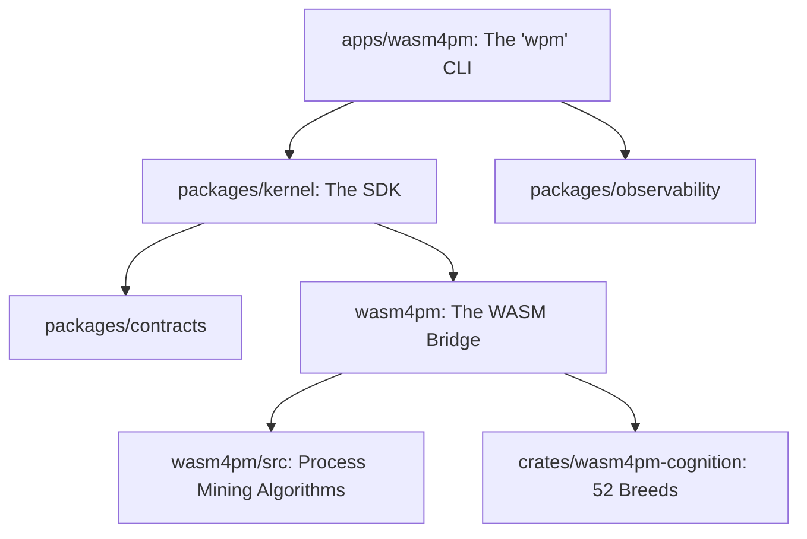

# Phase 0: Repository Inventory

| Area | Evidence | Files | Confidence | Notes |
|------|----------|-------|------------|-------|
| Package Manager | `pnpm-workspace.yaml` | `pnpm-lock.yaml`, `package.json` | High | PNPM Workspaces |
| Monorepo Structure | Defined packages & apps | `apps/`, `packages/`, `crates/` | High | Segregated logic |
| Rust Core | Process mining algorithms (`wasm4pm/`) + 52 PARTIAL_ALIVE cognition breeds (`crates/wasm4pm-cognition/`) | `wasm4pm/src/`, `crates/wasm4pm-cognition/`, `Cargo.toml` | High | High-performance core; two distinct subsystems |
| WASM Bridge | `wasm-bindgen` annotations | `wasm4pm/src/lib.rs` | High | FFI Boundary |
| CLI Surface | `wpm` command definitions | `apps/wasm4pm/src/commands/` | High | The user entry point |
| SDK boundary | Node.js TS interface | `packages/kernel/` | High | Abstracts WASM memory |
| Observability | OTLP telemetry spans | `packages/observability/` | High | |
| E2E Testing | Parity verification & Unit Tests | `scripts/examples/`, `tests/` | High | |
| Documentation | Diátaxis structure | `docs/` | High | |
| CI/CD | Combinatorial Maximalism bounds | `Makefile`, `release-gate.sh` | High | |

## Tech Stack

| Area | Component |
|------|-----------|
| Mathematical Core | Rust (2024 edition compat) |
| Runtime Target | WebAssembly (WASM) |
| CLI & SDK | TypeScript / Node.js |
| Data Model | OCEL 2.0 / XES |
| Cryptography | BLAKE3 |

## Package Dependency Graph

