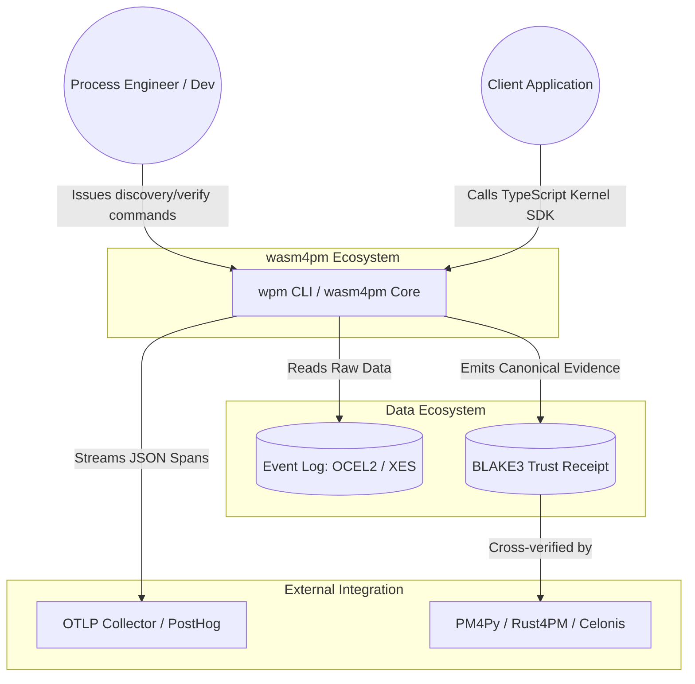

<!-- wasm4pm-doc-status: active; reviewed: 2026-08-02; original: .claude/worktrees/wf_99470ccd-c7b-1/docs/orientation/01-c4-system-context.md; source-sha256: 65e77b0370a9b9ec94a3ffdac1d891bd18268beb6e603dd7c043f064311943f0; reason: tooling or agent control surface -->

# Phase 1: C4 System Context

The System Context diagram shows how the `wasm4pm` framework fits into the broader process mining, execution, and observability ecosystems.

## Confidence Level: High

## Context Boundaries

1. **Local-First / Zero-Egress**: `wasm4pm` processes all logs entirely in-memory on the host machine (Browser, Edge, or CLI). It does not send event log data to a SaaS backend.
2. **OTLP Telemetry**: The kernel emits W3C/OTLP JSON spans for performance tracking, but strips raw process semantics before emission.
3. **Truex Equivalence**: The emitted `Receipt` is designed as a universal cryptographic artifact that PM4Py or other ecosystem tools can natively verify.
