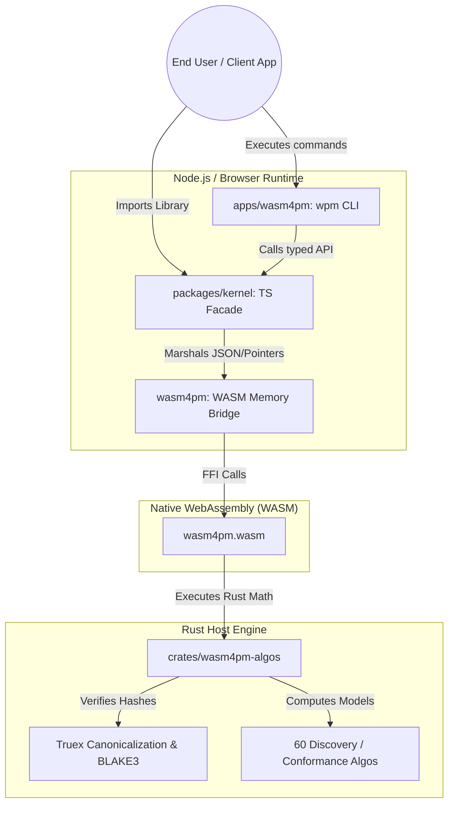

# Phase 2: C4 Container

The Container diagram shows the internal architectural blocks mapping the `wasm4pm` stack from the mathematical Rust kernel up to the CLI.

## Confidence Level: High

## Data Boundary (The WASM Bridge)
- **Serialization**: Heavy payloads (like an OCEL 2.0 log) are currently serialized to JSON and passed across the FFI boundary as `String` parameters.
- **Zero-Copy Trajectory**: Future optimizations will utilize `SharedArrayBuffer` or raw pointer manipulation to avoid the serialization tax.
- **Panic Boundary**: The `wasm-bindgen` layer traps Rust panics and translates them into structural `VerificationResult` errors (e.g. `InvalidTransition`) to prevent the host Node process from crashing.
