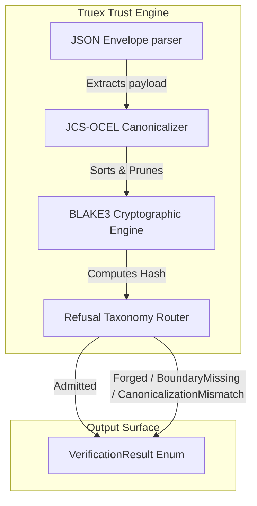
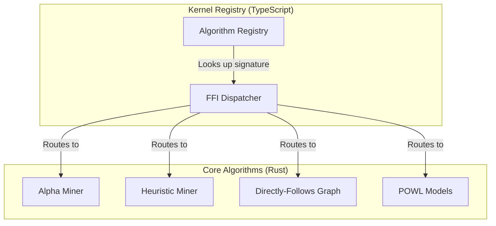
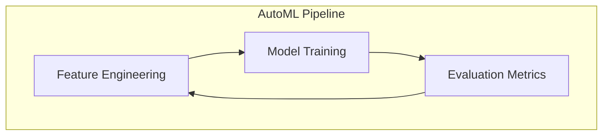

<!-- wasm4pm-doc-status: active; reviewed: 2026-08-02; original: .claude/worktrees/wf_99470ccd-c7b-1/docs/orientation/03-c4-components.md; source-sha256: e9cb287f796311da44a0869129377e86f0865a74733296cdfc713eeb837ce5d5; reason: tooling or agent control surface -->

# Phase 3: C4 Components

This phase details the internal components of the primary feature areas inside the mathematical kernel.

## Confidence Level: High

### Component Area: Truex Execution Trust Layer
**Source Files**: `crates/wasm4pm-algos/src/truex/verify.rs`, `crates/wasm4pm-algos/src/truex/canonicalize.rs`

### Component Area: Algorithm Discovery Engine
**Source Files**: `crates/wasm4pm-algos/src/discovery/`, `packages/kernel/src/registry.ts`

### Component Area: Machine Learning (AutoML)
**Source Files**: `crates/wasm4pm-algos/src/automl/`

