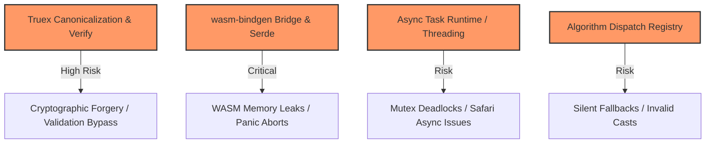

# Phase 4: Code Hotspots

This diagram identifies high-complexity or high-risk areas in the `wasm4pm` codebase. These are the areas most prone to memory panics, FFI boundary failures, or trust breaches.

## Confidence Level: High

## Hotspot Details

| Hotspot | Risk Factor | Mitigation | Source Files |
|---------|-------------|------------|--------------|
| **Truex Engine** | Complex UTF-16 sorting and stringification. A single whitespace mismatch alters the BLAKE3 digest, breaking parity. | Exhaustive integration testing in `scripts/examples/truex-cross-tool-parity.ts`. Strict BLAKE3 adoption. | `crates/wasm4pm-algos/src/truex/` |
| **FFI Bridge** | Passing large JSON buffers into WASM linear memory. Node.js `OOM` or Rust `panic=abort` crashes the host process. | Using the `Result<T, E>` pattern in Rust and trapping panics inside the TS wrapper (`packages/kernel/src/errors.ts`). | `wasm4pm/src/lib.rs` |
| **Algorithm Dispatch** | Maintaining a 1:1 mapping between TypeScript signatures and Rust structs. Out-of-sync bindings cause invisible bugs. | `AGENTS.md` strictly bans bypassing the TypeScript boundary. The Registry Audit validates the mapping. | `packages/kernel/src/registry.ts` |
| **Observability Sinks** | Emitting massive volumes of telemetry from a hot loop can choke the main thread. | Sampling, asynchronous buffering, and OTLP optimization. | `packages/observability/src/` |
