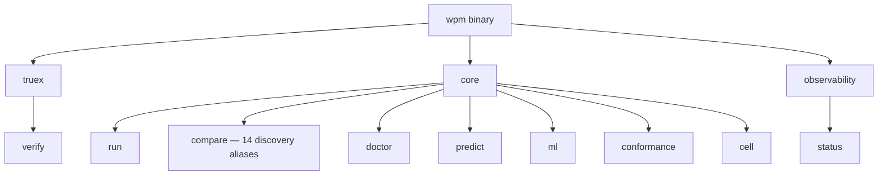

<!-- wasm4pm-doc-status: active; reviewed: 2026-08-02; original: .claude/worktrees/wf_99470ccd-c7b-1/docs/orientation/05-cli-and-api-map.md; source-sha256: 6d5c922a0d794ae9a52b2191900b19423c1ab40d18997a9a0a63435a8830b3a6; reason: tooling or agent control surface -->

# Phase 5: CLI and API Map

The `wasm4pm` application exposes its functionality primarily through the `wpm` CLI, which under the hood maps 1:1 with the `packages/kernel` SDK API.

## Confidence Level: High

## Core CLI Command Tree

`wpm run -a <id>` dispatches all kernel registry algorithms. `wpm compare` benchmarks a fixed subset of discovery aliases (dfg, simd_streaming_dfg, inductive, …); the default algorithm is `simd_streaming_dfg`. Every `wpm run` emits a mandatory BLAKE3 receipt to `.wasm4pm/receipts/latest.json` with `output_hash`, `run_id`, and `replay_pointer`; `wpm truex verify` validates those receipts.

## The TypeScript SDK Boundary (`packages/kernel`)

If developers embed `wasm4pm` natively in a Node.js or Browser context, they interact directly with the `Kernel` class.

### Main SDK Exports
1. `new Kernel(wasm); await kernel.init()`: Initializes the WASM module.
2. `kernel.discover(algo, logHandle, params)`: Dispatches to the registered discovery engines.
3. `kernel.truexVerify(envelope)`: The programmatic equivalent of `wpm truex verify`. Parses the JCS-OCEL payload and computes the BLAKE3 digest.

## Architecture Rules
1. **Never Call WASM Directly**: The `apps/wasm4pm` CLI logic MUST NOT import from `wasm4pm/src/lib.rs` directly. It must go through `packages/kernel/src/api.ts` to ensure OTEL spans, validation, and error taxonomies are correctly applied.
2. **Synchronous Math, Async Bridge**: Rust algorithms execute synchronously and trap the thread. The TypeScript Kernel offloads these computations to async promises, and future web-worker configurations will completely decouple the UI/Main thread.
