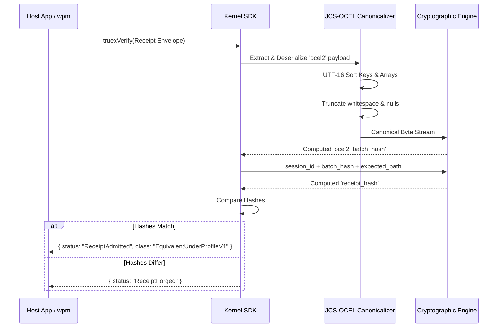

<!-- wasm4pm-doc-status: active; reviewed: 2026-08-02; original: .claude/worktrees/wf_99470ccd-c7b-1/docs/orientation/06-state-and-data-flow.md; source-sha256: 3a58944ccdd418aeb96408175aecee329a097ade59a228f576e8ad2f028f60ba; reason: tooling or agent control surface -->

# Phase 6: State and Data Flow

The `wasm4pm` Truex Execution pipeline is designed for strict deterministic data flow. Object-centric data moves from raw files into immutable BLAKE3 receipts.

## Confidence Level: High

## Truex Execution Data Flow

## The Data Object Contract (OCEL 2.0)
- The Truex pipeline expects standard OCEL 2.0 JSON elements (`events`, `objects`, `objectChanges`).
- Data is strictly pass-by-value. Mutating the raw source file immediately triggers a `ReceiptForged` taxonomy error because the resulting BLAKE3 mathematical digest diverges.
