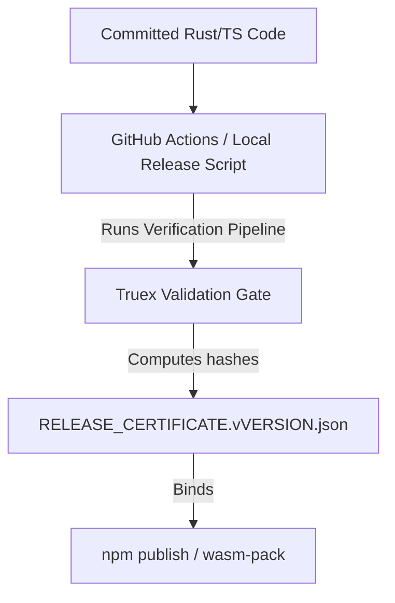

<!-- wasm4pm-doc-status: active; reviewed: 2026-08-02; original: .claude/worktrees/wf_99470ccd-c7b-1/docs/orientation/07-evidence-and-proof.md; source-sha256: 52698c10d415bb0d5f5bbe6252b8feb01ce642519f3926138867b4ae67cde2b7; reason: tooling or agent control surface -->

# Phase 7: Evidence and Proof

The `wasm4pm` architecture is rigidly bound to the **Combinatorial Maximalism** proof discipline. It is built under the thesis that *enumeration is not execution, and summary is not receipt.* 

## Confidence Level: High

## The Release Certificate Constraint

Before any package is pushed to the npm registry or compiled to an executable, it must pass the release gate logic.

## Claim-Evidence Matrix

| Claim | Proof Artifact | Location | Confidence |
|-------|----------------|----------|------------|
| Truex correctly enforces Canonical profiles | `examples/out/truex_ocel2_valid.json` | Disk | High |
| Truex traps semantic mutations with BLAKE3 | `examples/out/truex_ocel2_forged.json` | Disk | High |
| Codebase passes Rust Clippy with ZERO warnings | `Makefile: make clippy` | CI Output | High |
| Cross-tool parity hash identical | `scripts/examples/truex-cross-tool-parity.ts` | Test suite | High |

## The One-Line Law

The execution paradigm of the repository forbids deferred work:
> *No receipt, no claim. No real boundary, no proof. No correct refusal, no closure.*

Every bug fix or feature addition must emit a verifiable artifact demonstrating its execution consequence across the FFI boundary.

### CI/CD Enforcement
- `run-validation.sh` and `release-gate.sh` are explicitly designed to block build progression if a single JCS-OCEL canonical discrepancy is detected by the Truex verifier.
