# Architecture

wasm4pm is a process mining platform with a real Rust cognition kernel. This document describes the corrected architecture — the shape that emerged after the false-start of TS scaffolding with mock cognition was rejected and replaced with Rust-first authority.

## The product: a software fab cell

The cognition kernel is a manufacturing cell, not a conversation system. Every input passes through structured stages with proof gates. Nothing leaves without a signed receipt.

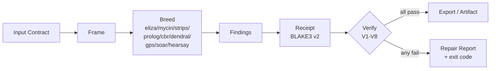

Diagram 37: Input Contract to Frame to Breed to Findings to Receipt to Verify to either Export or Repair.

## Wrong shape vs right shape

### Wrong (rejected)

The wrong architecture had TypeScript making decisions, mock breeds returning stub data, and human-written text standing in as authoritative evidence. This architecture appears to work when tests are green, but produces no machine-verifiable proof that cognition actually occurred.

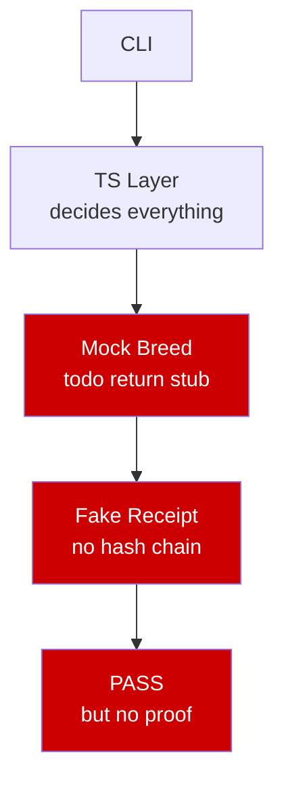

### Right (current)

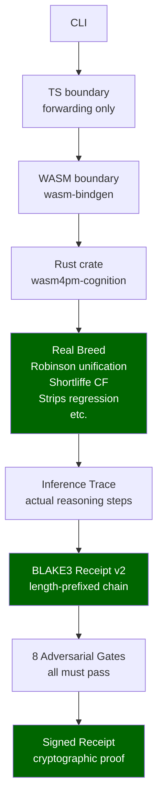

Diagram 2: Wrong TS-scaffolding shape vs Right Rust-first shape.

## Authority boundary

The Rust crate is the authority. The TypeScript boundary is a thin forwarding layer. This boundary is enforced by CI gates — any TS code that makes a cognitive decision (chooses an action, interprets evidence, validates output) is a violation.

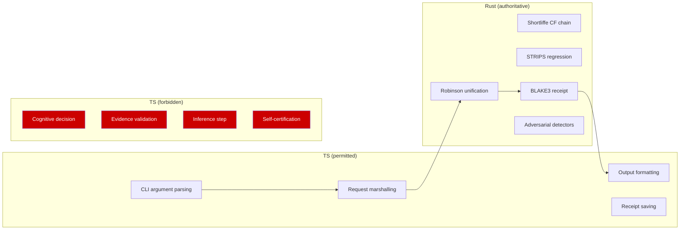

Diagram 9: Authority boundary. Rust is authoritative; TS boundary cannot make cognitive decisions.

## Full corrected architecture

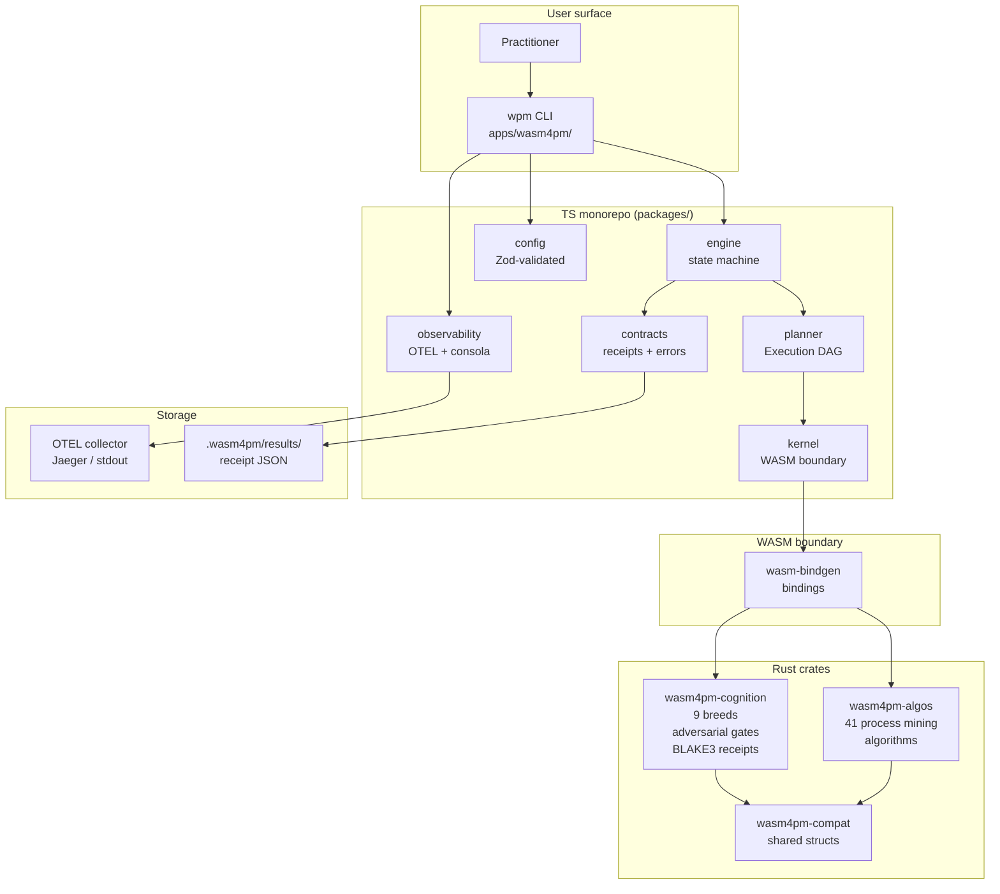

Diagram 40: The full corrected architecture.

## Cognition runtime flow

The sequence for a single `wpm cognition run` invocation:

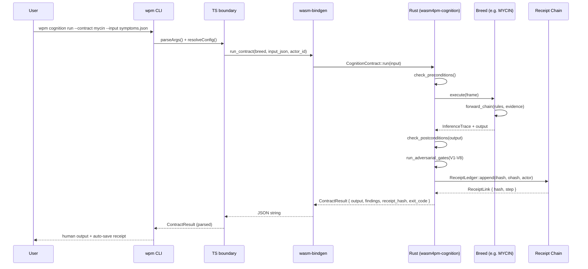

Diagram 13: CLI to TS to WASM to Rust to Breed to Receipt.

## Multi-breed pipeline

When multiple breeds are chained (e.g. GPS for planning, CBR for case retrieval, MYCIN for evaluation):

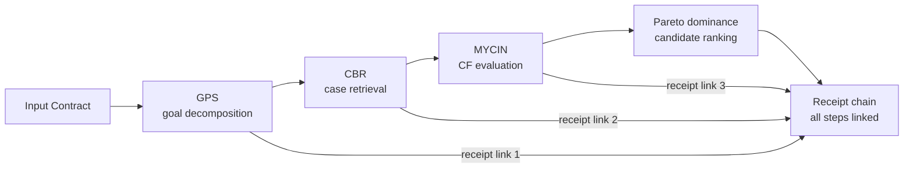

Diagram 14: Multi-breed pipeline. Each breed appends a link to the shared receipt chain; the chain is traversable and replay-verifiable.

## Receipt generation and replay

### Generation (v2 encoding)

Each link in the receipt chain is hashed over a length-prefixed byte sequence to prevent canonicalization attacks:

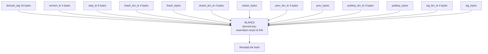

Diagram 34: BLAKE3 v2 receipt link encoding. Length prefixes prevent the canonicalization attack present in v1 string-concat encoding.

### Replay

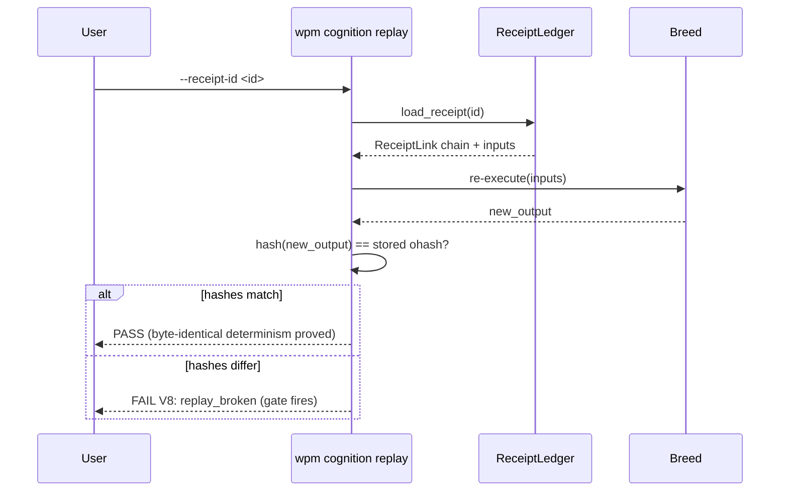

Diagram 35: Receipt replay. Byte-identical re-execution proves determinism. Hash mismatch fires V8 (broken replay detector).

## The no-stub law

Any PR introducing the following patterns in cognition source paths is rejected by CI without review:

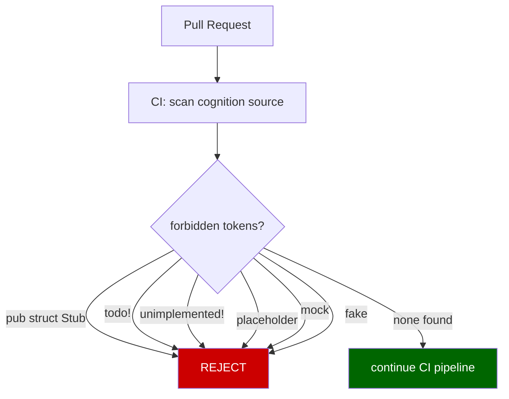

Source paths subject to the no-stub law:
- `crates/wasm4pm-cognition/src/**`
- `apps/wasm4pm/src/commands/cognition*`
- `packages/cognition/src/**`

Diagram 10: No stub law. CI scans for forbidden tokens in cognition source files and rejects the PR if any are found.

## The no-placeholder CI gate

A CI gate that always passes (regardless of actual evidence) is itself a false-pass. The adversarial detector V1 (stub gate) detects this pattern at the code level. The CI gate itself must not be a stub.

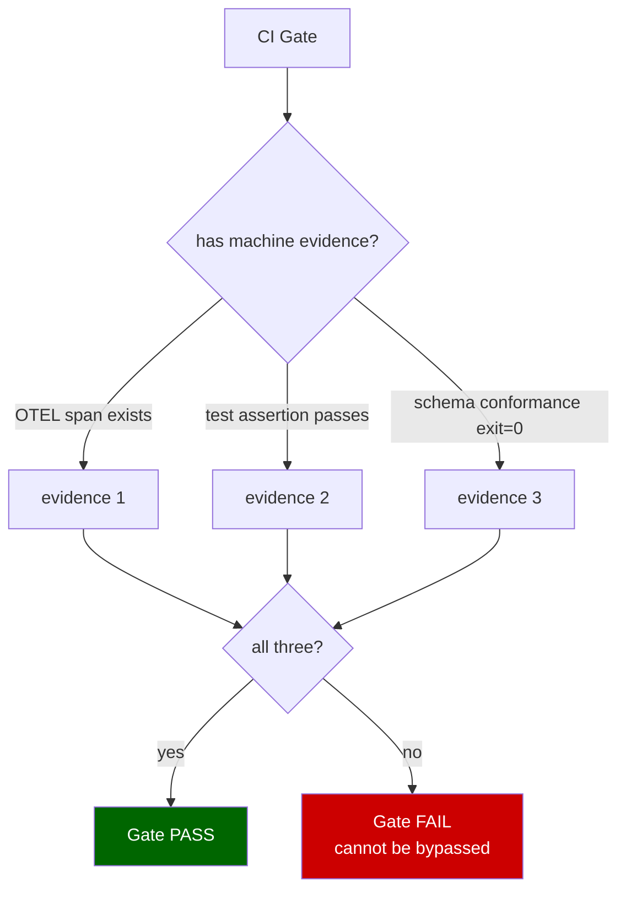

Diagram 24: No placeholder CI gate. Three-layer evidence is required (AND logic, not OR).

## Cognition Verify Gate V1-V8

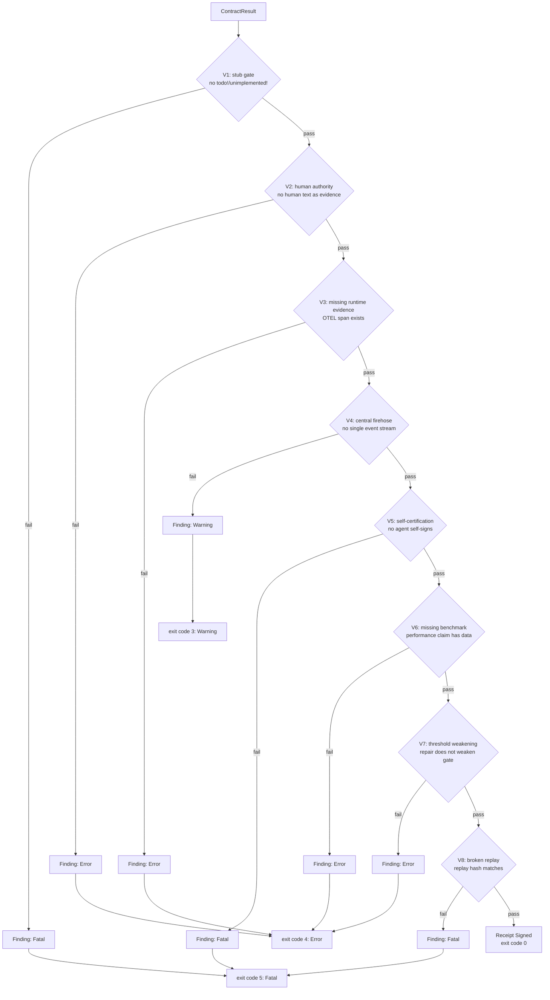

Diagram 25: V1-V8 adversarial gate flow. Fatal findings (V1, V5, V8) produce exit code 5. Error findings produce exit code 4. All must be clean for exit code 0 and a signed receipt.

## Cognition Build Definition of Done

A cognition breed is done when all of the following are true:

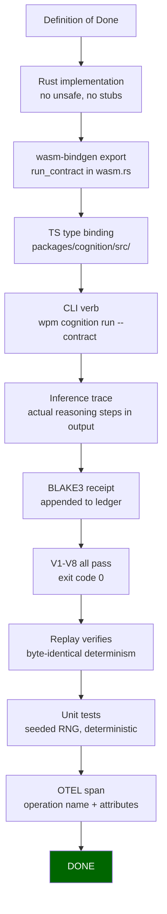

Diagram 39: Cognition breed definition of done.

## Repository layout

```
wasm4pm/                          # Rust workspace root
├── Cargo.toml
├── crates/
│   ├── wasm4pm-cognition/        # Cognition kernel (9 breeds + adversarial + receipts)
│   │   └── src/
│   │       ├── breeds/           # eliza.rs mycin.rs strips.rs prolog.rs cbr.rs
│   │       │                     # dendral.rs gps.rs soar.rs hearsay.rs
│   │       ├── autosystems/      # cost_law.rs dominance.rs receipt.rs adversarial/
│   │       ├── authority.rs      # authority boundary enforcement
│   │       ├── evidence.rs       # EvidenceSource trait
│   │       └── registry.rs       # breed registry
│   ├── wasm4pm-algos/            # 41 process mining algorithms
│   └── wasm4pm-compat/            # shared structs (EventLog, Trace, etc.)
├── wasm4pm/                      # Original WASM crate (41 algorithms, Node.js target)
│   └── src/                      # 114 modules
├── packages/                     # TypeScript monorepo (10 packages)
│   ├── contracts/                # receipts, errors, plans, hashing
│   ├── engine/                   # state machine
│   ├── kernel/                   # WASM boundary
│   ├── config/                   # Zod-validated config
│   ├── planner/                  # execution DAG
│   ├── observability/            # OTEL + consola
│   ├── testing/                  # parity, determinism, CLI harnesses
│   ├── ml/                       # ML analysis (6 algorithms)
│   └── swarm/                    # multi-worker convergence
├── apps/
│   └── wasm4pm/                  # CLI tool (@wasm4pm/cli)
│       └── src/commands/         # run.ts compare.ts predict.ts cognition*.ts
├── docs/
│   ├── cognition-overview.md     # standalone primer
│   └── cognition-doctrine.md     # architecture manifesto with all diagrams
├── ARCHITECTURE.md               # this file
├── CONTRIBUTING.md
└── README.md
```

## Key invariants

1. **Authority in Rust.** The TypeScript layer holds no authoritative state and makes no cognitive decisions. Violation is detected by CI.

2. **No receipt, no proof.** A run that produced no BLAKE3-linked receipt produced no provable output. "It passed the test" is not evidence. The receipt is evidence.

3. **Replay proves determinism.** Same inputs must produce byte-identical outputs. If `wpm cognition replay` produces a different hash, the breed is non-deterministic and V8 fires.

4. **All 8 gates.** A receipt with exit code > 0 is a proof of failure, not a partial proof of success. There is no partial pass.

5. **OTEL span or it did not happen.** Every operation must emit an OTEL span with `status: "ok"` or `status: "error"`. Missing spans are a V3 violation (missing runtime evidence).

6. **No stub law.** `todo!()`, `unimplemented!()`, `pub struct Stub`, `placeholder`, `mock`, and `fake` are forbidden in cognition source paths. CI rejects the PR.
