# Cognition Doctrine: Old AI is the Factory. LLMs are the Brochure.

## The principle

LLMs are great at producing **human-readable projections** — memos, reports, interview transcripts, summaries. They are not cognition. They cannot:

- Verify a constraint deterministically
- Produce a hash chain that proves a run happened
- Detect their own self-certification
- Reject a receipt that diverges from an external trust anchor
- Run Robinson unification with the occur check
- Guarantee that the same input produces the same output

Real cognition — the kind that runs a manufacturing line — uses old-AI algorithms with mathematical guarantees: Robinson unification (sound and complete for Horn clauses), Shortliffe CF combining (bounded, commutative), Pareto dominance (irreflexive, asymmetric, transitive), BLAKE3 receipts (collision-resistant, length-prefixed).

wasm4pm's cognition kernel is built from these primitives. LLMs render the result for humans **after** the receipt is signed. This is the doctrine: **Old AI is the factory. LLMs are the brochure.**

---

## What this is NOT

- It is not a chat agent
- It is not RAG (retrieval-augmented generation)
- It is not embeddings + nearest-neighbor
- It is not "LLM with tools"
- It is not a prompt template with a function call wrapper
- It is not a mock breed that returns stub data and calls it inference

## What this IS

- A real Rust crate with 9 implemented old-AI algorithms
- A wasm-bindgen bridge to a thin TypeScript boundary
- A CLI surface (`wpm cognition`) that emits machine-canonical receipts
- An adversarial detector framework that catches false-pass patterns
- A BLAKE3 receipt chain with cryptographic actor identity and external trust anchors

---

## The 40-diagram architecture

### Diagram 1: The doctrine statement

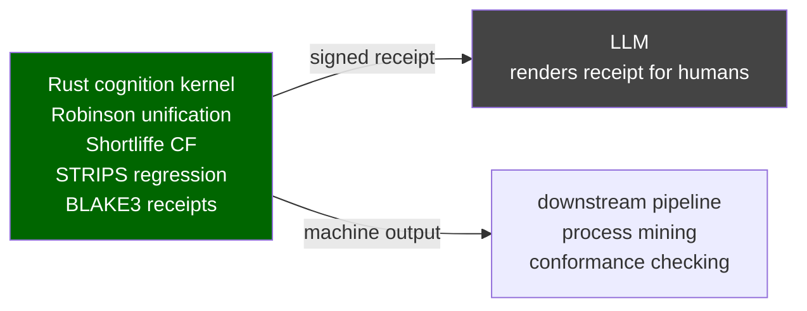

Old AI is the factory. LLMs are the brochure. The factory produces receipts. The brochure renders receipts for humans.

---

### Diagram 2: Wrong vs right shape

```mermaid
flowchart TD
    subgraph "WRONG (rejected)"
        W_CLI[CLI] --> W_TS[TS decides everything]
        W_TS --> W_MOCK[Mock breed\ntodo return stub]
        W_MOCK --> W_FAKE[Fake receipt\nno hash chain]
        W_FAKE --> W_PASS[PASS — no proof]
    end

    subgraph "RIGHT (current)"
        R_CLI[CLI] --> R_TS[TS boundary\nforwarding only]
        R_TS --> R_WASM[WASM boundary]
        R_WASM --> R_RUST[Rust breed\nreal inference]
        R_RUST --> R_RECEIPT[BLAKE3 receipt\ncryptographic proof]
        R_RECEIPT --> R_PASS[PASS — receipt proves it]
    end

    style W_MOCK fill:#c00,color:#fff
    style W_FAKE fill:#c00,color:#fff
    style W_PASS fill:#c00,color:#fff
    style R_RUST fill:#060,color:#fff
    style R_RECEIPT fill:#060,color:#fff
    style R_PASS fill:#060,color:#fff
```

---

### Diagram 3: The 9 breeds and their origins

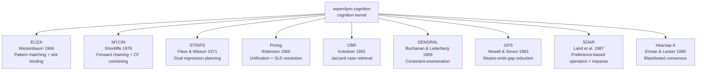

---

### Diagram 4: ELIZA pattern-matching flow

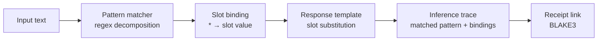

---

### Diagram 5: MYCIN forward-chain with CF combining

```mermaid
flowchart TD
    EV[Evidence\ncf values 0..1] --> RULES[Rule set\nIF evidence THEN hypothesis cf=w]
    RULES --> CHAIN[Forward chain\niterate to fixpoint]
    CHAIN --> CF_COMBINE[Shortliffe CF combining\ncf1+cf2*(1-cf1) if both positive\ncf1+cf2*(1+cf1) if both negative\n(cf1+cf2)/(1-min(|cf1|,|cf2|)) if mixed]
    CF_COMBINE --> HYPO[Hypothesis set\nhypothesis:cf pairs]
    HYPO --> RANK[Ranked output\nhighest CF first]
    RANK --> TRACE2[Inference trace\nall fired rules]
```

---

### Diagram 6: STRIPS goal regression

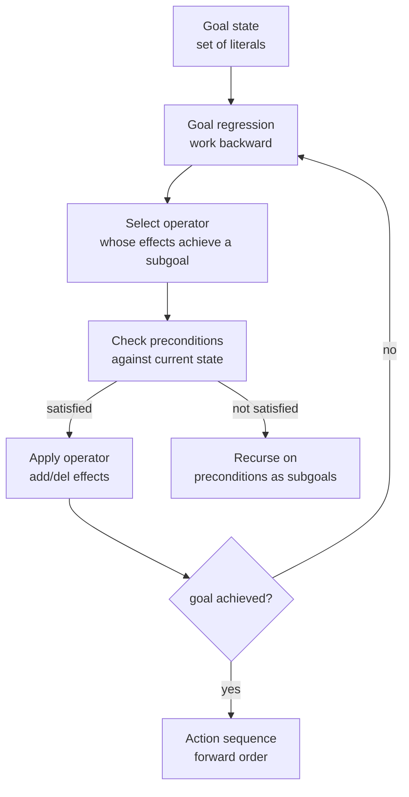

---

### Diagram 7: Prolog SLD resolution with Robinson unification

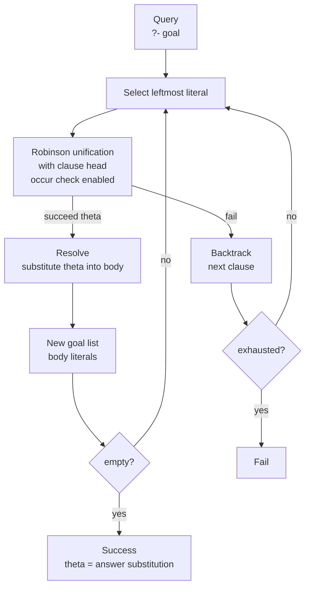

---

### Diagram 8: CBR Jaccard retrieval

```mermaid
flowchart LR
    QUERY2[Query case\nfeature set Q] --> LEDGER[Case ledger\ncases C1..Cn]
    LEDGER --> JACCARD[Jaccard similarity\n|Q ∩ Ci| / |Q ∪ Ci| for each Ci]
    JACCARD --> RANK2[Rank by similarity]
    RANK2 --> TOPK[Top-k cases\nwith scores]
    TOPK --> ADAPT[Adapt closest case\nto query context]
    ADAPT --> OUTPUT[Adapted solution\n+ similarity score]
```

---

### Diagram 9: Authority boundary

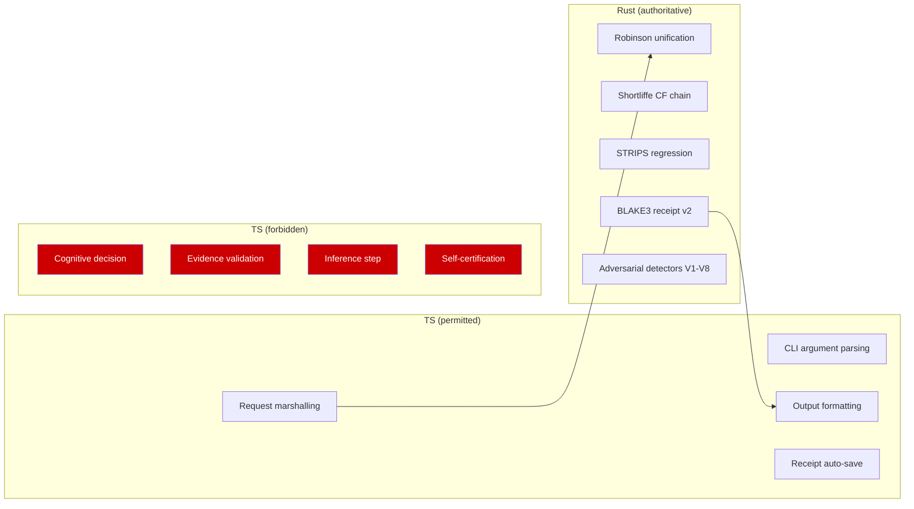

---

### Diagram 10: No-stub law enforcement

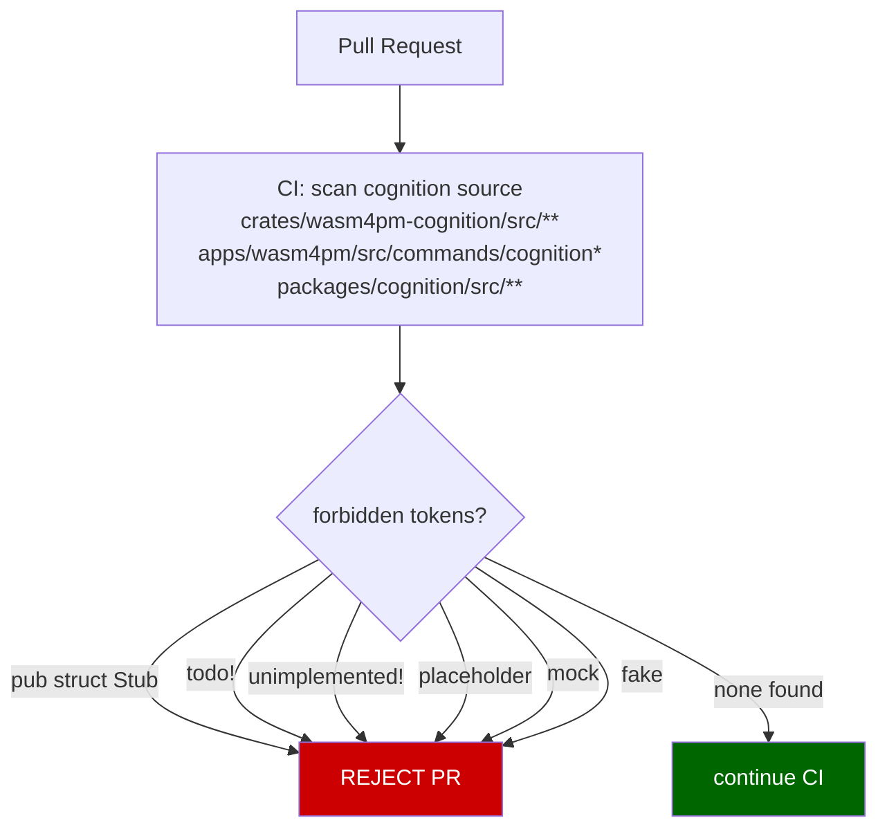

---

### Diagram 11: Forbidden lexicon in cognition source

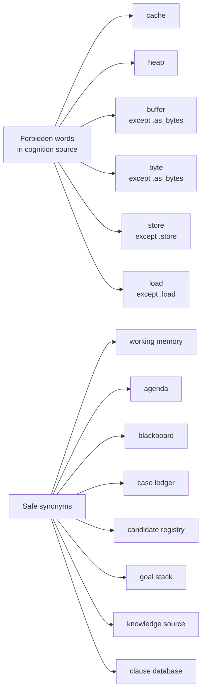

---

### Diagram 12: Three-layer evidence requirement

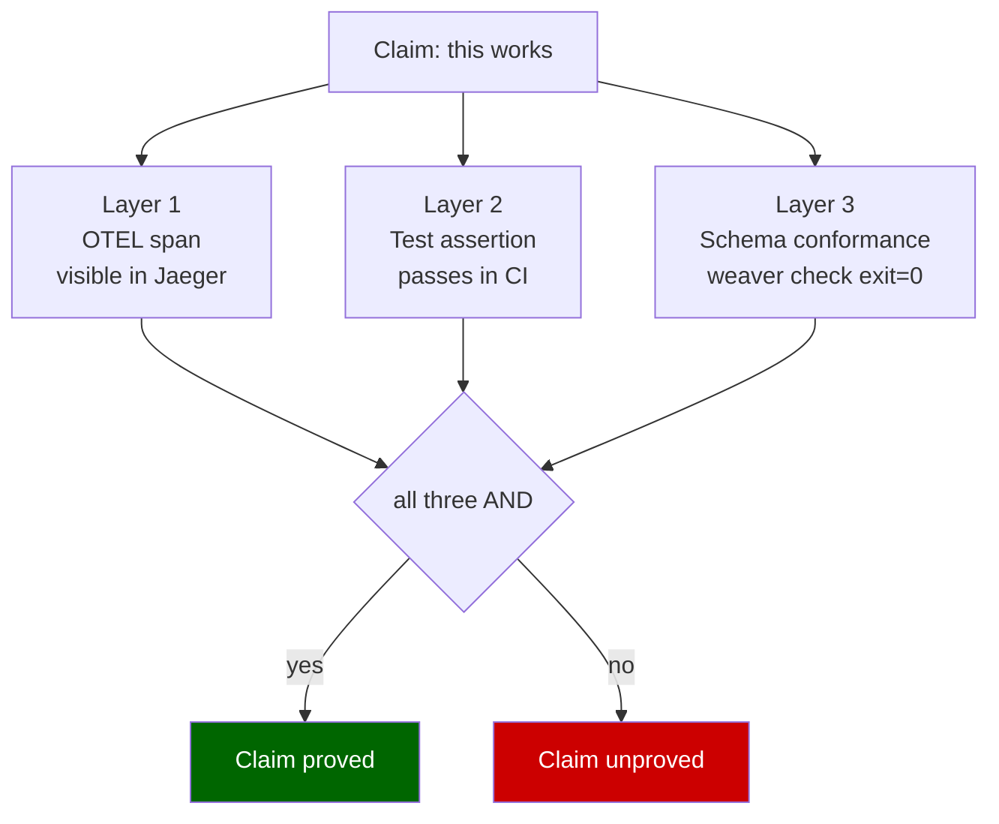

---

### Diagram 13: Cognition runtime sequence

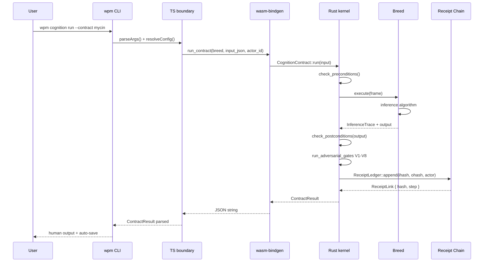

---

### Diagram 14: Multi-breed pipeline

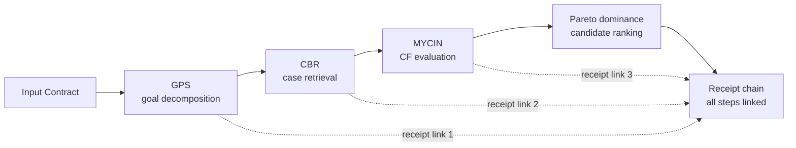

---

### Diagram 15: DENDRAL constraint-driven enumeration

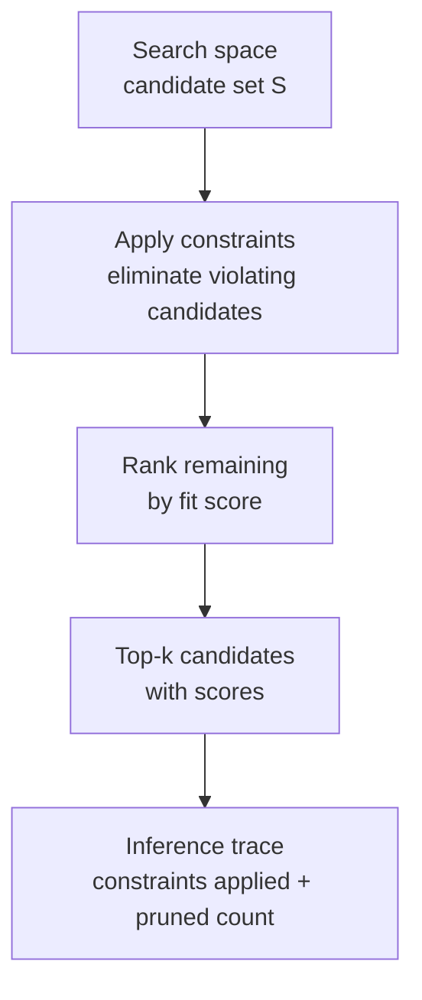

---

### Diagram 16: GPS means-ends analysis

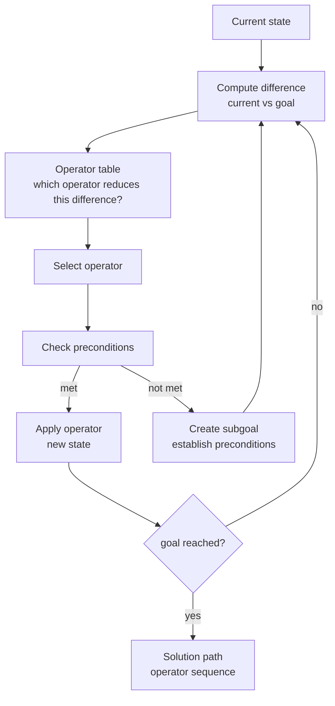

---

### Diagram 17: SOAR preference-based selection with impasse

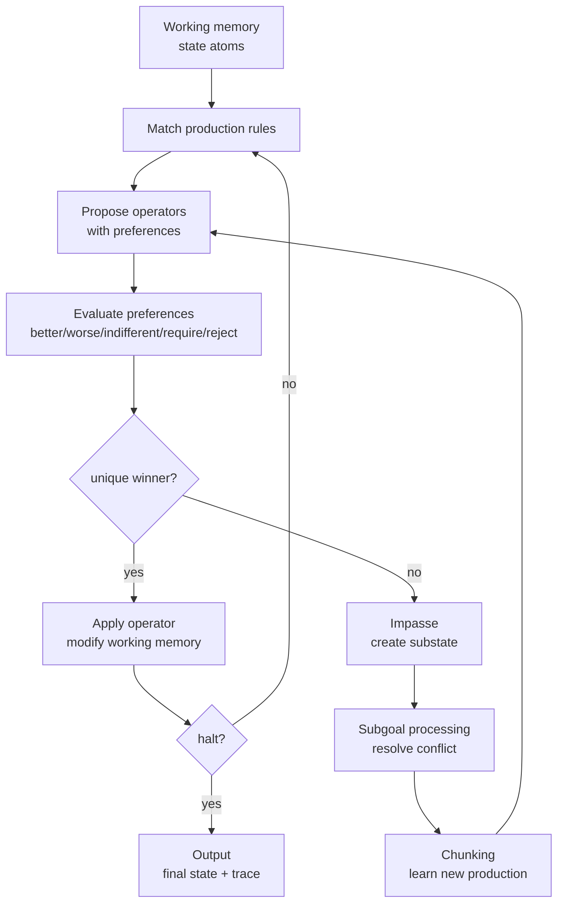

---

### Diagram 18: Hearsay-II blackboard consensus

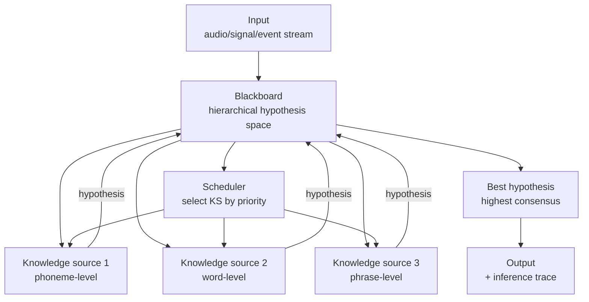

---

### Diagram 19: BLAKE3 receipt v1 vs v2

```mermaid
flowchart TD
    subgraph "v1 (removed, vulnerable)"
        V1S[BLAKE3(input_hash || output_hash\n|| prev_hash || pubkey || sig)]
        V1S --> V1BUG[Canonicalization attack:\nab+cd == a+bcd\ndifferent inputs, same hash]
    end

    subgraph "v2 (current, safe)"
        V2S[BLAKE3 derived key:\nwasm4pm.recpt.v2.link\nover length-prefixed fields]
        V2S --> V2SAFE[Length prefixes prevent\ncanonicalization attack\ntest: autosystems_receipt_v2_collision.rs]
    end

    style V1BUG fill:#c00,color:#fff
    style V2SAFE fill:#060,color:#fff
```

---

### Diagram 20: Actor identity binding

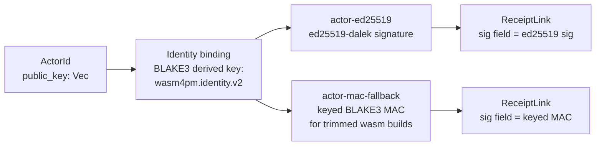

---

### Diagram 21: Pareto dominance candidate ranking

```mermaid
flowchart TD
    CANDIDATES[Candidate set\nC1..Cn with cost vectors] --> DOM2[Pareto dominance check\nCi dominates Cj iff:\nall dimensions i <= j AND\nat least one dimension i < j]
    DOM2 --> FRONT[Pareto front\nnon-dominated candidates]
    FRONT --> RANK4[Rank within front\nby cost-law evaluation]
    RANK4 --> BEST2[Best candidate\noptimal under Pareto + cost]
```

---

### Diagram 22: Cost law evaluation

```mermaid
flowchart LR
    CAND[Candidate] --> TRAD[Traditional cost law\noperational + maintenance + opportunity]
    CAND --> REPLACE[Replacement cost law\ncapital + transition + risk]
    TRAD --> COMBINED[Combined score\nweighted sum]
    REPLACE --> COMBINED
    COMBINED --> RANK5[Rank candidates]
```

---

### Diagram 23: EvidenceSource trait

```mermaid
flowchart LR
    DETECTOR[Adversarial detector\nV1-V8] --> ESOURCE[&dyn EvidenceSource\ntrait object]
    ESOURCE --> OTEL[OtelEvidence\nreads OTEL spans]
    ESOURCE --> FILE2[FileEvidence\nreads receipt files]
    ESOURCE --> RUNTIME[RuntimeEvidence\nreads live state]

    subgraph "Forbidden"
        CALLER_FLAG[caller-supplied flag\ntrust_me: true]
    end

    style CALLER_FLAG fill:#c00,color:#fff
```

All detectors read from `&dyn EvidenceSource` — they never trust caller-supplied flags.

---

### Diagram 24: No placeholder CI gate

```mermaid
flowchart TD
    GATE2[CI Gate] --> E1[OTEL span exists?]
    GATE2 --> E2[Test assertion passes?]
    GATE2 --> E3[Schema conformance exit=0?]
    E1 --> AND2{all three AND}
    E2 --> AND2
    E3 --> AND2
    AND2 -->|yes| GPASS[Gate PASS]
    AND2 -->|no| GFAIL[Gate FAIL\ncannot be bypassed]

    style GFAIL fill:#c00,color:#fff
    style GPASS fill:#060,color:#fff
```

---

### Diagram 25: V1-V8 gate flow

```mermaid
flowchart TD
    CONTRACT2[ContractResult] --> V1G{V1: stub gate}
    V1G -->|fail| F1G[Fatal]
    V1G -->|pass| V2G{V2: human authority}
    V2G -->|fail| F2G[Error]
    V2G -->|pass| V3G{V3: missing evidence}
    V3G -->|fail| F3G[Error]
    V3G -->|pass| V4G{V4: central firehose}
    V4G -->|fail| F4G[Warning]
    V4G -->|pass| V5G{V5: self-certify}
    V5G -->|fail| F5G[Fatal]
    V5G -->|pass| V6G{V6: bench missing}
    V6G -->|fail| F6G[Error]
    V6G -->|pass| V7G{V7: repair weakens}
    V7G -->|fail| F7G[Error]
    V7G -->|pass| V8G{V8: replay broken}
    V8G -->|fail| F8G[Fatal]
    V8G -->|pass| SIGNED2[Receipt signed\nexit 0]

    F1G --> EXIT5G[exit 5]
    F5G --> EXIT5G
    F8G --> EXIT5G
    F2G --> EXIT4G[exit 4]
    F3G --> EXIT4G
    F6G --> EXIT4G
    F7G --> EXIT4G
    F4G --> EXIT3G[exit 3]
```

---

### Diagram 26: Receipt ledger structure

```mermaid
flowchart TD
    LEDGER2[ReceiptLedger] --> GENESIS[Genesis link\nstep=0, prev=empty]
    GENESIS --> LINK1[Link 1\nstep=1, ihash, ohash, prev=genesis]
    LINK1 --> LINK2F[Link 2\nstep=2, ihash, ohash, prev=link1]
    LINK2F --> LINKN[Link N\nstep=N, ihash, ohash, prev=link(N-1)]
    LINKN --> VERIFY2[Verify: traverse chain\neach prev hash matches]
```

---

### Diagram 27: BLAKE3 length-prefixed encoding detail

```mermaid
flowchart TD
    DT2[domain_tag 16B] --> ENC[byte sequence]
    VER2[version_le u32 4B] --> ENC
    STEP2[step_le u64 8B] --> ENC
    IHL[ihash_len_le u32 4B] --> ENC
    IHB[ihash_bytes nB] --> ENC
    OHL[ohash_len_le u32 4B] --> ENC
    OHB[ohash_bytes nB] --> ENC
    PHL[prev_len_le u32 4B] --> ENC
    PHB[prev_bytes nB] --> ENC
    PKL2[pubkey_len_le u32 4B] --> ENC
    PKB2[pubkey_bytes nB] --> ENC
    SL2[sig_len_le u32 4B] --> ENC
    SB2[sig_bytes nB] --> ENC

    ENC --> BLAKE3V2[BLAKE3\nderived key: wasm4pm.recpt.v2.link] --> HASH[link hash 32B]
```

---

### Diagram 28: Replay determinism proof

```mermaid
sequenceDiagram
    participant U as User
    participant CLI as wpm cognition replay
    participant L2 as ReceiptLedger
    participant B2 as Breed

    U->>CLI: --receipt-id id
    CLI->>L2: load_receipt(id)
    L2-->>CLI: chain + inputs
    CLI->>B2: re-execute(inputs)
    B2-->>CLI: new_output
    CLI->>CLI: hash(new_output) == stored ohash?
    alt match
        CLI-->>U: PASS determinism proved
    else mismatch
        CLI-->>U: FAIL V8 replay_broken
    end
```

---

### Diagram 29: wasm-bindgen surface

```mermaid
flowchart LR
    subgraph "Rust (wasm feature)"
        RUN[run_contract\nbreed: &str, input: &str, actor_id: &str\n→ Result<String, JsValue>]
        VERIFY3[verify_receipt\nreceipt_id: &str\n→ Result<String, JsValue>]
        REPLAY2[replay_receipt\nreceipt_id: &str\n→ Result<String, JsValue>]
        LIST[list_breeds\n→ String JSON array]
    end

    subgraph "TypeScript"
        TS_RUN[runContract(breed, input, actorId)\n→ ContractResult]
        TS_VER[verifyReceipt(receiptId)\n→ VerifyResult]
        TS_REP[replayReceipt(receiptId)\n→ ReplayResult]
        TS_LIST[listBreeds()\n→ BreedInfo[]]
    end

    RUN --> TS_RUN
    VERIFY3 --> TS_VER
    REPLAY2 --> TS_REP
    LIST --> TS_LIST
```

---

### Diagram 30: Inference trace structure

```mermaid
flowchart TD
    TRACE4[InferenceTrace] --> BREED_NAME[breed: &str]
    TRACE4 --> STEPS2[steps: Vec<TraceStep>]
    TRACE4 --> FINAL[final_output: Value]
    TRACE4 --> META[metadata: duration_ms, step_count]

    STEPS2 --> STEP1[TraceStep\nstep_id, description, inputs, outputs]
    STEPS2 --> STEP2[TraceStep\n...]
    STEPS2 --> STEPN[TraceStep\n...]
```

---

### Diagram 31: Integration with process mining pipeline

```mermaid
flowchart LR
    XES[event log .xes] --> PM[wpm run\nprocess discovery]
    PM --> MODEL[process model\nPetri net / DFG]
    MODEL --> CONF[wpm conformance\nfitness + deviations]
    CONF --> DEVIATIONS[deviation report\nmissing activities]
    DEVIATIONS --> MYCIN_INT[wpm cognition run\n--contract mycin\nroot-cause diagnosis]
    MYCIN_INT --> FINDINGS2[Findings\nhypotheses + CF scores]
    FINDINGS2 --> STRIPS_INT[wpm cognition run\n--contract strips\nrepair planning]
    STRIPS_INT --> PLAN2[Repair plan\naction sequence]
    PLAN2 --> RECEIPT_CHAIN[Receipt chain\nall steps linked]
```

---

### Diagram 32: Shortliffe CF combining formula

```mermaid
flowchart TD
    CF1[CF1] --> COMBINE[Shortliffe combining]
    CF2[CF2] --> COMBINE
    COMBINE --> POS{both positive?}
    POS -->|yes| POSF[CF1 + CF2 * (1 - CF1)]
    COMBINE --> NEG{both negative?}
    NEG -->|yes| NEGF[CF1 + CF2 * (1 + CF1)]
    COMBINE --> MIXED{mixed signs?}
    MIXED -->|yes| MIXF[(CF1 + CF2) / (1 - min(|CF1|, |CF2|))]

    POSF --> BOUNDED[Result bounded to [-1, +1]]
    NEGF --> BOUNDED
    MIXF --> BOUNDED
```

---

### Diagram 33: Robinson unification with occur check

```mermaid
flowchart TD
    T1[Term 1] --> UNIFIER[Robinson unifier]
    T2[Term 2] --> UNIFIER
    UNIFIER --> OCCUR{occur check\nX in T2?}
    OCCUR -->|yes| FAIL2[Fail\ncircular term]
    OCCUR -->|no| CHECK2{variable binding?}
    CHECK2 -->|X = t| BIND2[Bind X to t\ncheck consistency]
    CHECK2 -->|f(a) = f(b)| RECURSE2[Recurse on a, b]
    CHECK2 -->|constants equal| SUCCESS2[Success]
    CHECK2 -->|constants differ| FAIL3[Fail]
    BIND2 --> THETA[Substitution theta]
    RECURSE2 --> THETA
    SUCCESS2 --> THETA
```

---

### Diagram 34: Receipt v2 link encoding (full detail)

```mermaid
flowchart LR
    DOMAIN[domain_tag\nwasm4pm.recpt.v2\n16 bytes fixed] --> BUF[byte buffer]
    VERSION[version u32 LE\n= 2] --> BUF
    STEP3[step u64 LE] --> BUF
    IHASH[ihash_len u32 + ihash_bytes] --> BUF
    OHASH[ohash_len u32 + ohash_bytes] --> BUF
    PREV[prev_len u32 + prev_bytes] --> BUF
    PUBKEY2[pubkey_len u32 + pubkey_bytes] --> BUF
    SIG2[sig_len u32 + sig_bytes] --> BUF
    BUF --> B3DK[BLAKE3\nderive_key(wasm4pm.recpt.v2.link, buffer)]
    B3DK --> LHASH[link_hash: [u8; 32]]
```

---

### Diagram 35: Replay sequence

```mermaid
sequenceDiagram
    participant CLI2 as wpm cognition replay
    participant LEDGER3 as ReceiptLedger
    participant BREED3 as Breed

    CLI2->>LEDGER3: load(receipt_id)
    LEDGER3-->>CLI2: ReceiptChain { links, inputs }
    loop for each link in chain
        CLI2->>BREED3: re_execute(link.step, inputs[step])
        BREED3-->>CLI2: output_value
        CLI2->>CLI2: compute ohash(output_value)
        CLI2->>CLI2: compare ohash to link.ohash
    end
    alt all hashes match
        CLI2-->>CLI2: PASS determinism
    else any mismatch
        CLI2-->>CLI2: FAIL V8 broken replay
    end
```

---

### Diagram 36: Cognition crate module tree

```mermaid
flowchart TD
    ROOT[wasm4pm-cognition\nlib.rs] --> AUTH[authority.rs\nboundary enforcement]
    ROOT --> AUTO[autosystems/\nmod.rs]
    ROOT --> BREEDS[breeds/\nmod.rs]
    ROOT --> EV[evidence.rs\nEvidenceSource trait]
    ROOT --> OBS[observability.rs\nOTEL spans]
    ROOT --> REG[registry.rs\nbreed registry]
    ROOT --> WASM3[wasm/\nwasm.rs]

    AUTO --> COST[cost_law.rs]
    AUTO --> DOM3[dominance.rs]
    AUTO --> REC2[receipt.rs + ledger.rs]
    AUTO --> ADV[adversarial/\nV1-V8 detectors]
    AUTO --> CONTR[contract.rs]
    AUTO --> CAND[candidates.rs]
    AUTO --> FIND[findings.rs]

    BREEDS --> ELIZA2[eliza.rs]
    BREEDS --> MYCIN2[mycin.rs]
    BREEDS --> STRIPS2[strips.rs]
    BREEDS --> PROLOG2[prolog.rs]
    BREEDS --> CBR2[cbr.rs]
    BREEDS --> DENDRAL2[dendral.rs]
    BREEDS --> GPS2[gps.rs]
    BREEDS --> SOAR2[soar.rs]
    BREEDS --> HEARSAY2[hearsay.rs]
```

---

### Diagram 37: The fab cell (input to export)

```mermaid
flowchart LR
    IC2[Input Contract] --> FR2[Frame\nMinsky-style struct]
    FR2 --> BR2[Breed\ninference algorithm]
    BR2 --> FN2[Findings\nInferenceTrace]
    FN2 --> RC3[Receipt\nBLAKE3 v2 chain]
    RC3 --> VF2{Verify V1-V8}
    VF2 -->|all pass| EX2[Export\nartifact + receipt]
    VF2 -->|any fail| RP2[Repair Report\nexit code 3/4/5]
```

---

### Diagram 38: LLM as projection layer

```mermaid
flowchart LR
    RECEIPT2[Signed Receipt\nBLAKE3 hash\ninference trace\nhypotheses + scores] --> LLM2[LLM\nproject receipt\ninto human text]
    LLM2 --> MEMO[Memo for analyst\nprocess diagnosis summary]
    LLM2 --> REPORT[Report for manager\nhigh-level findings]
    LLM2 --> TICKET[JIRA ticket\nrepair action items]

    RECEIPT2 --> MACHINE[Machine pipeline\ndownstream algorithms\nno LLM needed]

    style RECEIPT2 fill:#060,color:#fff
```

The receipt is the authoritative artifact. LLMs are one rendering path — not the authority.

---

### Diagram 39: Cognition breed definition of done

```mermaid
flowchart TD
    DOD2[Definition of Done] --> R1B[Rust: no unsafe, no stubs\nno todo!/unimplemented!]
    R1B --> R2B[wasm-bindgen export\nrun_contract in wasm.rs]
    R2B --> R3B[TS type binding\npackages/cognition/src/]
    R3B --> R4B[CLI verb\nwpm cognition run --contract name]
    R4B --> R5B[Inference trace\nactual reasoning steps]
    R5B --> R6B[BLAKE3 receipt\nappended to ledger]
    R6B --> R7B[V1-V8 all pass\nexit code 0]
    R7B --> R8B[Replay verifies\nbyte-identical]
    R8B --> R9B[Unit tests\nseeded RNG, deterministic]
    R9B --> R10B[OTEL span\noperation + attributes]
    R10B --> DONE2[DONE]

    style DONE2 fill:#060,color:#fff
```

---

### Diagram 40: The full corrected architecture

```mermaid
flowchart TD
    subgraph "User surface"
        USER2[Practitioner]
        CLI4[wpm CLI]
    end

    subgraph "TS monorepo"
        ENGINE2[engine\nstate machine]
        KERNEL2[kernel\nWASM boundary]
        CONFIG2[config\nZod-validated]
        PLANNER2[planner\nDAG]
        OBS2[observability\nOTEL]
        CONTRACTS2[contracts\nreceipts + errors]
    end

    subgraph "WASM boundary"
        WB2[wasm-bindgen]
    end

    subgraph "Rust"
        PM2[wasm4pm-algos\n41 algorithms]
        COG2[wasm4pm-cognition\n9 breeds\nadversarial gates\nBLAKE3 receipts]
        TYPES2[wasm4pm-compat]
    end

    subgraph "Storage"
        RES[.wasm4pm/results/]
        OTELSINK[OTEL collector]
    end

    USER2 --> CLI4
    CLI4 --> ENGINE2
    CLI4 --> CONFIG2
    ENGINE2 --> PLANNER2
    PLANNER2 --> KERNEL2
    KERNEL2 --> WB2
    WB2 --> PM2
    WB2 --> COG2
    PM2 --> TYPES2
    COG2 --> TYPES2
    CLI4 --> OBS2
    OBS2 --> OTELSINK
    ENGINE2 --> CONTRACTS2
    CONTRACTS2 --> RES
```

---

## Summary

The 40 diagrams above document:

1. The doctrine (diagram 1)
2. The wrong vs right shape (diagram 2)
3. The 9 breeds and their origins (diagram 3)
4-8. Individual breed inference flows (ELIZA, MYCIN, STRIPS, Prolog, CBR)
9. Authority boundary (diagram 9)
10. No-stub law enforcement (diagram 10)
11. Forbidden lexicon (diagram 11)
12. Three-layer evidence requirement (diagram 12)
13. Cognition runtime sequence (diagram 13)
14. Multi-breed pipeline (diagram 14)
15-18. Remaining breed flows (DENDRAL, GPS, SOAR, Hearsay-II)
19. BLAKE3 v1 vs v2 (diagram 19)
20. Actor identity binding (diagram 20)
21. Pareto dominance (diagram 21)
22. Cost law evaluation (diagram 22)
23. EvidenceSource trait (diagram 23)
24. No placeholder CI gate (diagram 24)
25. V1-V8 gate flow (diagram 25)
26. Receipt ledger structure (diagram 26)
27. BLAKE3 encoding detail (diagram 27)
28. Replay determinism proof (diagram 28)
29. wasm-bindgen surface (diagram 29)
30. Inference trace structure (diagram 30)
31. Integration with process mining (diagram 31)
32. Shortliffe CF combining (diagram 32)
33. Robinson unification (diagram 33)
34-35. Receipt generation and replay (diagrams 34-35)
36. Cognition crate module tree (diagram 36)
37. The fab cell (diagram 37)
38. LLM as projection layer (diagram 38)
39. Breed definition of done (diagram 39)
40. Full corrected architecture (diagram 40)

The system is a manufacturing cell. Every run produces a signed receipt. Receipts can be replayed. LLMs render receipts for humans. The factory does not need the brochure to function.
