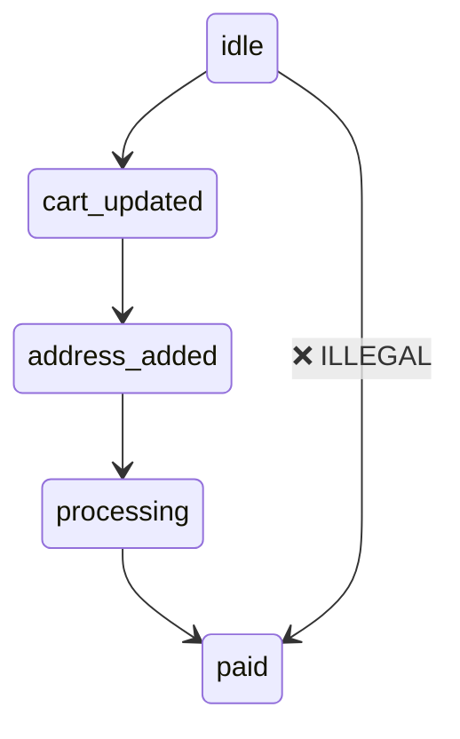

<!-- wasm4pm-doc-status: active; reviewed: 2026-08-02; original: .claude/worktrees/wf_99470ccd-c7b-1/examples/out/truex_replay_fraudulent.md; source-sha256: 221ee4d8054aa81f836a876e1544ee31e1485760edbf0f6cf83758e49f87d681; reason: tooling or agent control surface -->

# Truex Capture: App State to Admitted Execution Receipt
**Run**: fraudulent  
**Status**: `ReceiptRefused`  
**Trace ID**: `49401bec9177422b2a35bdee1f165a7e`  
**Receipt Hash**: `9d0499bba65a75835b6073a70d74863da85a6ed15dcd597f80caba1d0f8fbe77`  

## Expected Path Constraints
Hash: `5548b5fcac3109bcc176bad6f91e1408cbef34e87b1cba6cdf55a672f64b5694`

## State Diagram Replay

## OTLP Payload Details
This payload was wrapped in a Truex envelope and egressed via OpenTelemetry.
    