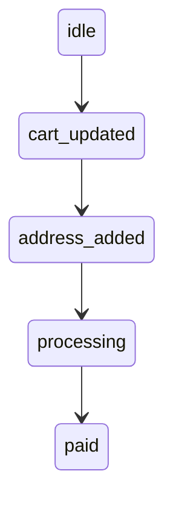

# Truex Capture: App State to Admitted Execution Receipt
**Run**: valid  
**Status**: `ReceiptAdmitted`  
**Trace ID**: `b04fe629005a0601cea1c1c1b7263983`  
**Receipt Hash**: `5347576487730d716e0d3998547f2d8eae77caeb1d44a570f2fc023e725b62a9`  

## Expected Path Constraints
Hash: `5548b5fcac3109bcc176bad6f91e1408cbef34e87b1cba6cdf55a672f64b5694`

## State Diagram Replay

## OTLP Payload Details
This payload was wrapped in a Truex envelope and egressed via OpenTelemetry.
    